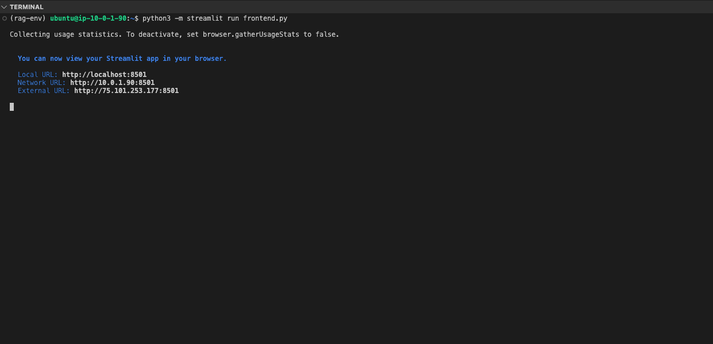

## Frontend Script for RAG-based LLM Server

After activating the virtual environment in a new terminal, you can use the following `frontend.py` script to input documents or PDFs and interact with the backend. This script uses the Streamlit framework to create a web interface for the RAG-based LLM server.

Create a `frontend.py` script with the following content:

```python
import os
import requests
import time
import streamlit as st
from PIL import Image
from typing import Dict, Any

# Configure paths and URLs
BASE_PATH = "$HOME"
API_URL = "http://localhost:5000"

# Page config
st.set_page_config(
    page_title="LLM RAG on Arm Neoverse CPU"
)

# Title
st.title("LLM RAG on Arm Neoverse CPU")

# Sidebar
with st.sidebar:
    st.write("## Model Settings")
    model = st.selectbox('Select LLM', ["llama3.1-8b-instruct.Q4_0_arm.gguf"])
    use_vectordb = st.checkbox("Use Vector Database")

# Initialize session state
if 'messages' not in st.session_state:
    st.session_state.messages = []
if 'vectordb_path' not in st.session_state:
    st.session_state.vectordb_path = None

# Vector Database Creation
if use_vectordb:
    st.sidebar.write("## Vector Database")
    # First select vector store type
    vector_store = st.sidebar.selectbox("Vector Storage Type", ["FAISS"])

    # Then select action
    action = st.sidebar.radio("Action", ["Create New Store", "Load Existing Store"])

    if action == "Create New Store":
        source = st.sidebar.radio("Source", ["PDF"])
        if source == "PDF":
            uploaded_file = st.sidebar.file_uploader("Upload PDF", type="pdf")
            if uploaded_file:
                files = {'file': uploaded_file}
                response = requests.post(f"{API_URL}/upload_file", files=files)
                if response.ok:
                    st.sidebar.success("File uploaded successfully")

                    db_name = st.sidebar.text_input("Vector Index Name")
                    if st.sidebar.button("Create Index"):
                        response = requests.post(
                            f"{API_URL}/create_vectordb",
                            json={
                                "vector_name": db_name,
                                "chunk_size": 400,
                                "doc_type": "PDF"
                            }
                        )
                        if response.ok:
                            st.session_state.vectordb_path = response.json()['path']
                            st.sidebar.success("Vector Index created!")
                        else:
                            st.sidebar.error("Failed to create vector Index")

    else:  # Load Existing
        # Updated directory handling
        vector_dir = os.path.join(BASE_PATH, "vector")  # Remove vector_store from path
        if os.path.exists(vector_dir):
            # Get all directories that contain FAISS index files
            dbs = []
            for root, dirs, files in os.walk(vector_dir):
                if "index.faiss" in files:  # Check for FAISS index file
                    # Get relative path from vector_dir
                    rel_path = os.path.relpath(root, vector_dir)
                    dbs.append(rel_path)
            if dbs:
                selected_db = st.sidebar.selectbox("Select Index", dbs)
                st.session_state.vectordb_path = os.path.join(vector_dir, selected_db)
                st.sidebar.success(f"Loaded index: {selected_db}")
            else:
                st.sidebar.warning("No existing indexes found. Please create a new one.")
        else:
            # Create vector directory if it doesn't exist
            os.makedirs(vector_dir, exist_ok=True)
            st.sidebar.warning("No indexes found. Please create a new one.")

# Chat interface
if use_vectordb and action == "Load Existing Store" and dbs:
    if prompt := st.chat_input("Ask a question"):
        st.session_state.messages.append({"role": "user", "content": prompt})

        # Display messages
        for msg in st.session_state.messages:
            with st.chat_message(msg["role"]):
                st.write(msg["content"])

        # Get response
        with st.chat_message("assistant"):
            response = requests.post(
                f"{API_URL}/query",
                json={
                    "question": prompt,
                    "vector_path": st.session_state.vectordb_path,
                    "use_vectordb": use_vectordb
                }
            )

            if response.ok:
                answer = response.json()['answer']
                st.write(answer)
                st.session_state.messages.append({"role": "assistant", "content": answer})
            else:
                st.error("Failed to get response from the model")
```

## Run the Frontend Server

You are now ready to run the frontend server for the RAG Chatbot.
Use the following command in a new terminal to start the Streamlit frontend server:

```python
python3 -m streamlit run frontend.py
```

You should see output similar to the image below when the frontend server starts successfully:

