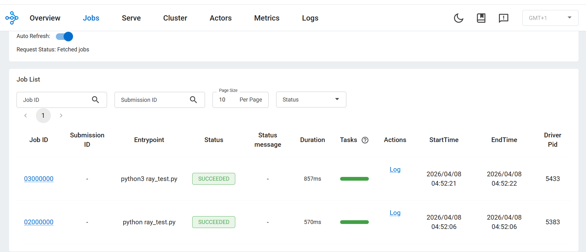

## Run distributed workloads with Ray

This section demonstrates how to execute parallel tasks and distributed training workloads using Ray on Arm.

You'll run distributed functions and then scale to multi-worker training using Ray.

## Run distributed tasks

Create a Python script to execute parallel tasks:

```bash
vi ray_test.py
```

```python
import ray
ray.init()

@ray.remote
def square(x):
    return x * x

results = ray.get([square.remote(i) for i in range(10)])
print("Results:", results)
```

### Code explanation

* `ray.init()` → connects to the running Ray cluster
* `@ray.remote` → converts a function into a distributed task
* `square.remote(i)` → submits tasks asynchronously
* `ray.get()` → collects results from all workers

### Execute the script

```bash
python3 ray_test.py
```

The output is similar to:
```output
Results: [0, 1, 4, 9, 16, 25, 36, 49, 64, 81]
```

This confirms parallel execution across CPU cores.

## Run distributed training

Create a script for distributed model training:

```bash
vi ray_train.py
```

```python
import ray
from ray.train.torch import TorchTrainer
from ray.train import ScalingConfig
import torch

def train_func():
    x = torch.randn(100, 10)
    y = torch.randn(100, 1)

    model = torch.nn.Linear(10, 1)
    loss_fn = torch.nn.MSELoss()
    optimizer = torch.optim.Adam(model.parameters(), lr=0.01)

    for epoch in range(5):
        optimizer.zero_grad()
        loss = loss_fn(model(x), y)
        loss.backward()
        optimizer.step()
        print(f"Loss: {loss.item()}")

trainer = TorchTrainer(
    train_func,
    scaling_config=ScalingConfig(
        num_workers=2,
        use_gpu=False
    )
)

trainer.fit()
```

### Run the training script

```bash
python3 ray_train.py
```

The output is similar to:
```output
(TrainController pid=5522) Attempting to start training worker group of size 2 with the following resources: [{'CPU': 1}] * 2
(TrainController pid=5522) Started training worker group of size 2: 
(TrainController pid=5522) - (ip=10.0.0.19, pid=5563) world_rank=0, local_rank=0, node_rank=0
(TrainController pid=5522) - (ip=10.0.0.19, pid=5564) world_rank=1, local_rank=1, node_rank=0
(RayTrainWorker pid=5563) Setting up process group for: env:// [rank=0, world_size=2]
(RayTrainWorker pid=5563) Loss: 0.9711737036705017
(RayTrainWorker pid=5563) Loss: 0.9491967558860779
(RayTrainWorker pid=5563) Loss: 0.9295402765274048
(RayTrainWorker pid=5563) Loss: 0.911673903465271
(RayTrainWorker pid=5563) Loss: 0.895072340965271
(RayTrainWorker pid=5564) Loss: 1.635019063949585 [repeated 5x across cluster] (Ray deduplicates logs by default. Set RAY_DEDUP_LOGS=0 to disable log deduplication, or see https://docs.ray.io/en/master/ray-observability/user-guides/configure-logging.html#log-deduplication for more options.)
```

This confirms distributed training across multiple workers.

## Training code explanation

* `TorchTrainer` → handles distributed training execution
* `ScalingConfig(num_workers=2)` → runs training on 2 workers
* Each worker executes training in parallel
* Logs can appear from multiple processes

## Ray Jobs view (tasks and training)



* Each script execution appears as a job
* Status shows **SUCCEEDED**
* Confirms correct distributed execution

## What you've learned and what's next

You have successfully:

* Executed parallel tasks using Ray Core
* Converted functions into distributed workloads
* Performed distributed training using multiple workers
* Observed execution in the Ray Dashboard

Next, you'll perform hyperparameter tuning, deploy models, and benchmark performance.
