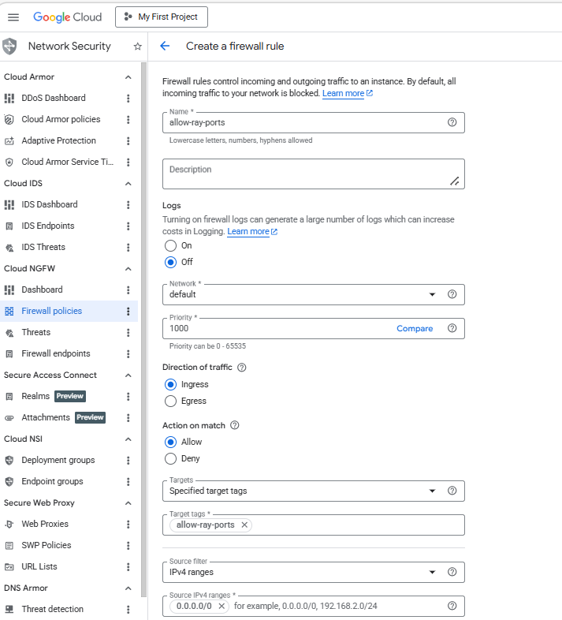
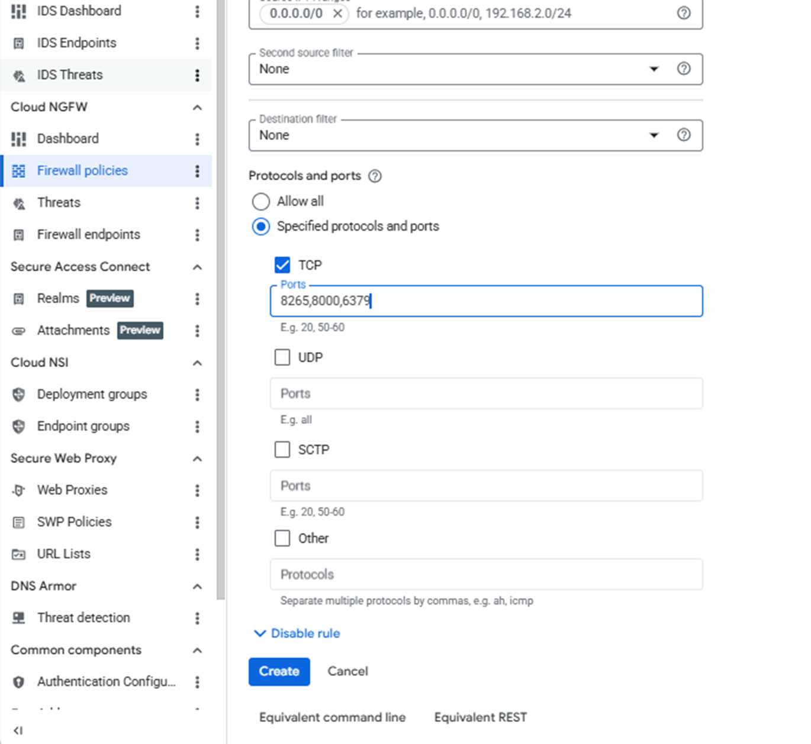

Create a firewall rule in Google Cloud Console to expose required ports for the Ray Dashboard and Ray Serve API.

{}
For help with GCP setup, see the Learning Path [Getting started with Google Cloud Platform](/learning-paths/servers-and-cloud-computing/csp/google/).
{}

## Configure the firewall rule

Navigate to the [Google Cloud Console](https://console.cloud.google.com/), go to **VPC Network > Firewall**, and select **Create firewall rule**.


Next, create the firewall rule that exposes required ports for Ray.

Set the **Name** of the new rule to "allow-ray-ports". Select your network that you intend to bind to your VM.

Set **Direction of traffic** to "Ingress". Set **Allow on match** to "Allow" and **Targets** to "Specified target tags". Enter "allow-ray-ports" in the **Target tags** text field. Set **Source IPv4 ranges** to "0.0.0.0/0".



Finally, select **Specified protocols and ports** under the **Protocols and ports** section. Select the **TCP** checkbox and enter:

```text
8265,8000,6379
```

* **8265** → Ray Dashboard
* **8000** → Ray Serve API
* **6379** → Ray Head Node

Then select **Create**.



## What you've accomplished and what's next

In this section, you:

* Created a firewall rule to expose Ray Dashboard and Serve API
* Enabled external access to monitor jobs and access deployed services

Next, you'll deploy and run Ray workloads on your Arm-based virtual machine.
