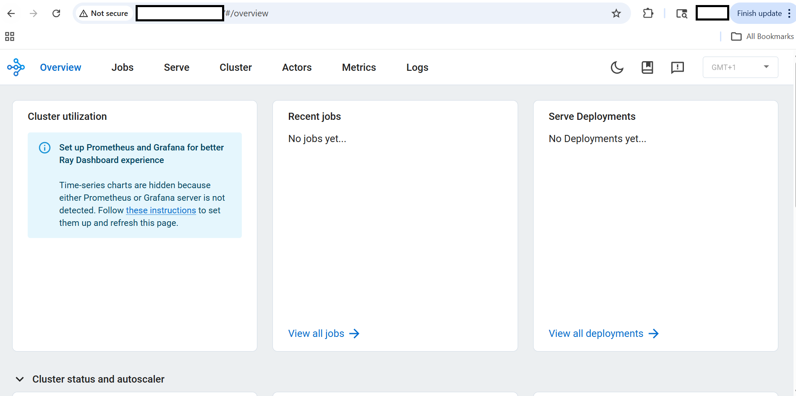

## Deploy Ray on GCP SUSE Arm64

This section guides you through installing Ray on a GCP Arm64 (Axion) virtual machine and setting up a single-node distributed computing cluster.

You'll configure the environment, install dependencies, and initialize a Ray cluster optimized for Arm-based infrastructure.

## Update your system

Update the system package index and upgrade all installed packages to the latest versions:

```console
sudo zypper refresh
sudo zypper update -y
```

## Install required dependencies

Install Python, development tools, and utilities required for building and running Ray:

```bash
sudo zypper install -y python311 python311-devel python311-pip git curl gcc gcc-c++ make
```

* `python311` → Python 3.11 runtime
* `python311-devel` → required for compiling Python packages
* `pip` → Python package manager
* `gcc/g++/make` → build tools for dependencies

## Create Python environment

Create an isolated Python environment to avoid conflicts with system packages:

```bash
python3.11 -m venv ray-env
source ray-env/bin/activate
```

* `venv` creates a virtual environment named `ray-env`
* `source` activates the environment

Upgrade Python packaging tools:

```bash
pip install --upgrade pip setuptools wheel
```

* Ensures compatibility with modern Python packages

## Install Ray and ML dependencies

Install Ray with all required modules:

```bash
pip install "ray[default]" "ray[train]" "ray[tune]" "ray[serve]"
```

* `ray[default]` → core distributed framework
* `ray[train]` → distributed training
* `ray[tune]` → hyperparameter tuning
* `ray[serve]` → model serving

Install common ML libraries:

```bash
pip install torch torchvision pandas scikit-learn
```

## Verify the installation

Check that Ray is installed correctly:

```bash
python -c "import ray; print(ray.__version__)"
```

The output is similar to:

```output
2.54.1
```

## Start the Ray cluster

Start a Ray cluster in single-node mode:

```bash
ray start --head --dashboard-host=0.0.0.0 --num-cpus=4
```

* `--head` → starts the main node (scheduler)
* `--dashboard-host=0.0.0.0` → allows external Ray Dashboard access
* `--num-cpus=4` → allocates 4 CPU cores

The output is similar to:

```output
Local node IP: 10.0.0.19

--------------------
Ray runtime started.
--------------------

Next steps
  To add another node to this Ray cluster, run
    ray start --address='10.0.0.19:6379'
  
  To connect to this Ray cluster:
    import ray
    ray.init()
  
  To submit a Ray job using the Ray Jobs CLI:
    RAY_API_SERVER_ADDRESS='http://10.0.0.19:8265' ray job submit --working-dir . -- python my_script.py
  
  See https://docs.ray.io/en/latest/cluster/running-applications/job-submission/index.html 
  for more information on submitting Ray jobs to the Ray cluster.
  
  To terminate the Ray runtime, run
    ray stop
  
  To view the status of the cluster, use
    ray status
  
  To monitor and debug Ray, view the dashboard at 
    10.0.0.19:8265
```

## Verify cluster status

Check cluster health and resource usage:

```bash
ray status
```

The output is similar to:

```output
Node status
---------------------------------------------------------------
Active:
 1 node_1819bcdd417a5b6945701142fdf1b90c68e8b4cfb6884d05e2e1be71
Pending:
 (no pending nodes)
Recent failures:
 (no failures)

Resources
---------------------------------------------------------------
Total Usage:
 0.0/4.0 CPU
 0B/10.48GiB memory
 0B/4.49GiB object_store_memory

From request_resources:
 (none)
Pending Demands:
 (no resource demands)
```

## Access the dashboard

Open in browser:

```
http://<VM-IP>:8265
```

The Ray Dashboard provides visibility into jobs, tasks, and resource utilization.

## Ray Dashboard Overview



The Ray Dashboard helps monitor distributed execution and debug workloads in real time.

## What you've learned and what's next

You have successfully:

* Installed Ray on an Arm-based SUSE VM
* Created an isolated Python environment
* Installed required dependencies
* Initialized a Ray cluster
* Verified cluster status and Ray Dashboard

Next, you'll run distributed workloads using Ray.
