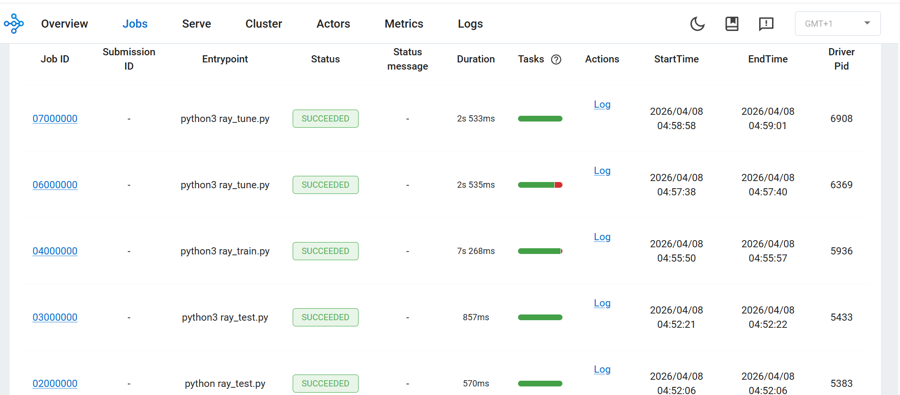

## Ray Tune, Serve, and Benchmarking

This section demonstrates hyperparameter tuning, model serving, and performance benchmarking using Ray.

## Hyperparameter tuning with Ray Tune

Create the tuning script:

```bash
vi ray_tune.py
```

```python
from ray import tune
from ray.air import session
import random

def trainable(config):
    score = 0
    for _ in range(10):
        score += random.random() * config["lr"]

    session.report({"score": score})

tuner = tune.Tuner(
    trainable,
    param_space={
        "lr": tune.grid_search([0.001, 0.01, 0.1])
    },
)

results = tuner.fit()

print("Best result:", results.get_best_result(metric="score", mode="max"))
```

### Explanation

* `tune.grid_search()` → tries multiple hyperparameter values
* Each value runs as a **separate parallel trial**
* `session.report()` → sends metrics back to Ray
* `Tuner.fit()` → executes all trials

### Execute tuning

```bash
python3 ray_tune.py
```

### Output
The output is similar to:

```output
Configuration for experiment trainable...

Number of trials: 3

Trial trainable_00000 (lr=0.001) → score = 0.00529
Trial trainable_00001 (lr=0.01)  → score = 0.04468
Trial trainable_00002 (lr=0.1)   → score = 0.28527

Trial status: 3 TERMINATED

Best result:
score = 0.28527 (lr = 0.1)
```

### Understanding the output

* Ray created **3 parallel trials** using different learning rates
* Each trial executed independently on available CPU cores
* Scores represent the performance of each configuration

| Learning Rate | Score |
| ------------- | ----- |
| 0.001         | 0.005 |
| 0.01          | 0.044 |
| 0.1           | 0.285 |

**Best configuration = learning rate 0.1**

* Total runtime ≈ **1 second** (parallel execution)
* Results stored in:

```bash
/home/gcpuser/ray_results/
```

## Deploy model using Ray Serve

Create the serving script:

```bash
vi ray_serve.py
```

```python
import ray
from ray import serve

ray.init()
serve.start(detached=True)

@serve.deployment
class Model:
    def __call__(self, request):
        return {"message": "Hello from Ray Serve on ARM VM!"}

app = Model.bind()
serve.run(app)
```

### Explanation

* `serve.start()` → initializes serving system
* `@serve.deployment` → defines deployable service
* `serve.run()` → launches API

### Run the service

```bash
python3 ray_serve.py
```

**Test the API:**

```bash
curl http://127.0.0.1:8000/
```

The output is similar to:

```output
{"message":"Hello from Ray Serve on ARM VM!"}
```

## Ray Tune Execution in Dashboard



The dashboard shows all jobs executed successfully, confirming correct Ray cluster operation.

## Benchmark distributed execution

Create benchmark script:

```bash
vi ray_benchmark.py
```

```python
import ray
import time

ray.init()

@ray.remote
def work(x):
    time.sleep(1)
    return x

start = time.time()
ray.get([work.remote(i) for i in range(20)])
end = time.time()

print("Execution Time:", end - start)
```


### Execute benchmark

```bash
ray stop
ray start --head --num-cpus=4

python3 ray_benchmark.py
```

Output:

```output
Execution Time: 5.171869277954102
```

## Understanding the benchmark

* 20 tasks executed in parallel
* Each task takes ~1 second
* With 4 CPUs → total time ≈ 5 seconds

**Sequential execution would take ~20 seconds**

* Confirms Ray parallel execution

## What you've learned

You have successfully:

* Performed hyperparameter tuning
* Identified the best configuration automatically
* Deployed a model using Ray Serve
* Validated parallel performance with benchmarking

You can now extend this setup to multi-node clusters, real ML pipelines, and production deployments.
