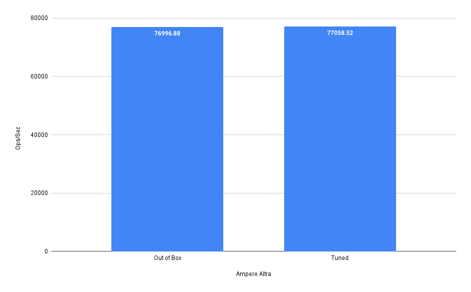

##  Importance of tuning

Application tuning allows you to gain performance without scaling your deployment up (bigger machines/nodes) or out (more machines/nodes). This gained performance can either be used, or traded for cost savings by reducing the amount of compute resources provisioned. The graphs below shows the performance gains of an Redis file server when it is tuned.

Requirements vary based on the use case. In the example shown above, the Ampere Altra E32ps v5 instance type could be down sized to a Ampere Altra E4ps v5 to gain cost savings.
