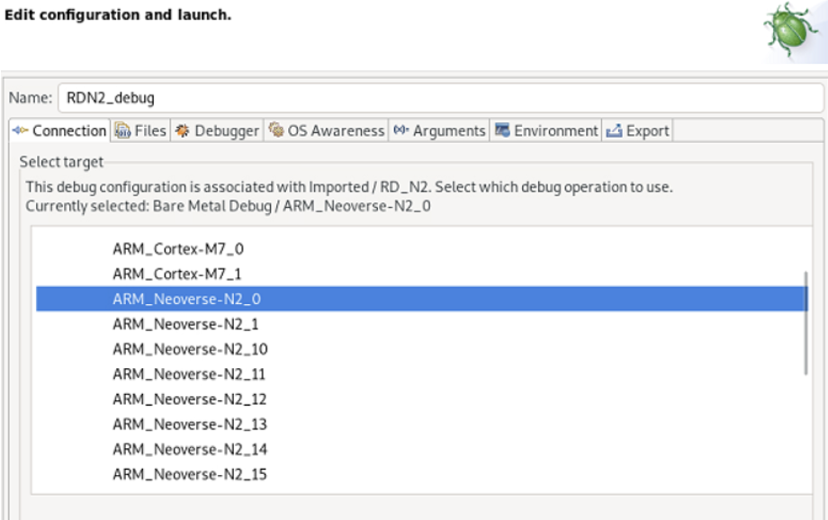
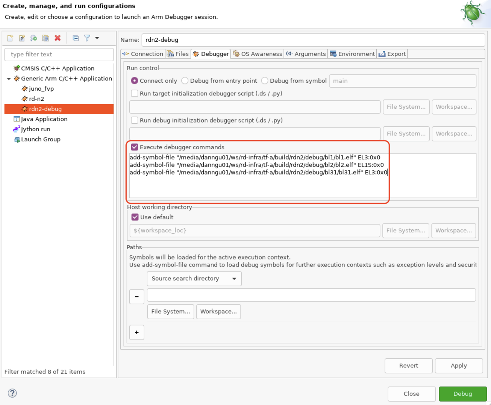
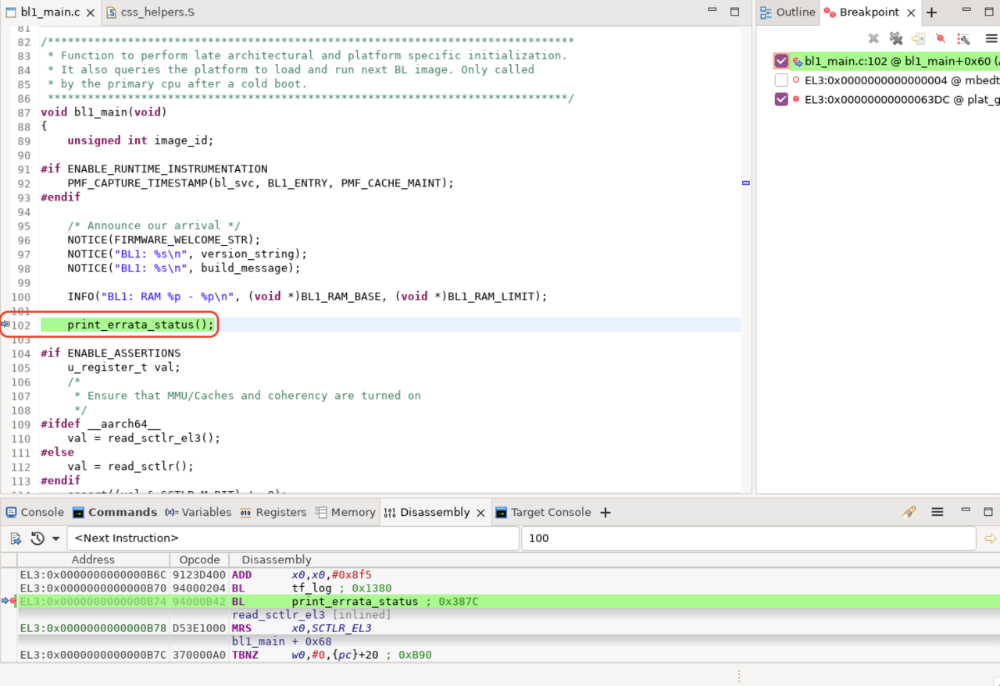

## Debugging BL1
Due to RSE CPU wait hold and the APs will be powered off. You will not be able to start the debugger until RSE has powered the AP cores.

A workaround is to modify BL1 to spin on entry.

Navigate to ``<workspace>/rd-infra/tf-a/bl1/aarch64/bl1_entrypoint.S``, find the ``bl1_entrypoint`` function, and add a ``b .`` instruction:

```asm
func bl1_entrypoint

    b   .   // <-- Branch-to-self added here

    /* ---------------------------------------------------------------------
    * If the reset address is programmable then bl1_entrypoint() is
    * executed only on the cold boot path. Therefore, we can skip the warm
    * boot mailbox mechanism.
    * ---------------------------------------------------------------------
    */
    el3_entrypoint_common                               \
        _init_sctlr=1                                   \
        _warm_boot_mailbox=!PROGRAMMABLE_RESET_ADDRESS  \
        _secondary_cold_boot=!COLD_BOOT_SINGLE_CPU      \
        _init_memory=1                                  \
        _init_c_runtime=1                               \
        _exception_vectors=bl1_exceptions   
```

In the **Edit configuration and launch** panel **Connection** tab, select the **ARM_Neoverse-N2_0**.



Add debug symbols. In the **Debugger** tab, check the **Execute debugger commands**, and add the following commands:

```
add-symbol-file "/<workspace>/rd-infra/tf-a/build/rdn2/debug/bl1/bl1.elf" EL3:0x0
add-symbol-file "/<workspace>/rd-infra/tf-a/build/rdn2/debug/bl2/bl2.elf" EL1S:0x0
add-symbol-file "/<workspace>/rd-infra/tf-a/build/rdn2/debug/bl31/bl31.elf" EL3:0x0
```

{}
If you would like to add platform-specific debug files, the memory locations are in the corresponding ``platform_h.def`` file.
{}



These commands load the symbol files and specify the memory address location, updating **workspace** to include the path to your own workspace directory.

The `EL` (Exception Level) and number at the end of each command, for example, `EL3:0`, ensure the symbols are loaded into the correct virtual address space and at the correct memory offset. ATF uses absolute addresses for its symbols so you can use an offset of 0.

When you connect the debugger, the primary CPU will be "spinning" on a ``b .`` instruction from the one you manually added to the ``bl1_entrypoint`` function.

In this debug panel, you can find common debugging functions like stepping and skipping.

Set a breakpoint in the function you would like to debug. In this example, you can set a breakpoint at ``bl1_main()``.

Simply interrupt the CPU and enter debug command `set $pc += 4'; you can now step through and debug the TF-A boot flow.



## Alternate break method
Another method of setting a breakpoint without modifying TF-A is by launching the model with ``--break``.
The general syntax for defining a breakpoint is:
```bash
--break <INST>=<MEMSPACE>@<ADDRESS>
```

- ``<INST>``: Processor identifier (e.g., AP0 in cluster 0).
- ``<MEMSPACE>``: Memory space identifier (e.g., id=1 for EL2 VA space).

To determine valid instance and memory space names, run: ``--list-instances`` or ``--list-memory``.

Example command:
```bash
./boot.sh -p rdv3r1cfg1 -a "--break RD_V3_R1_Cfg1.socket0.css0.lcp_app_group00.app0.cluster.cpu0=0@0x0"
```