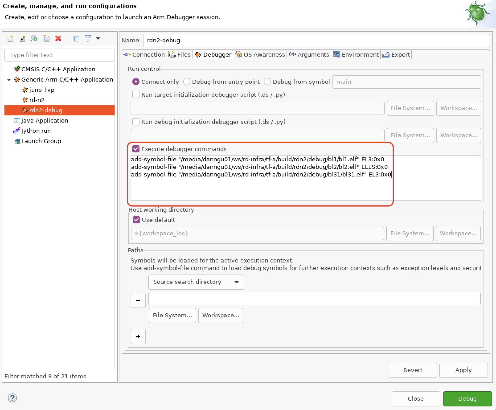
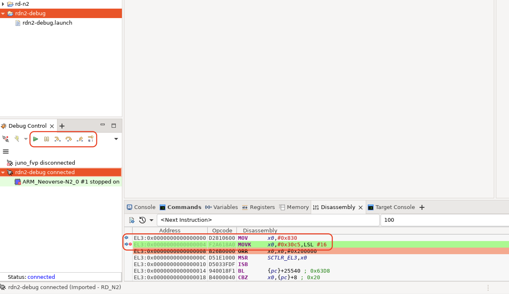
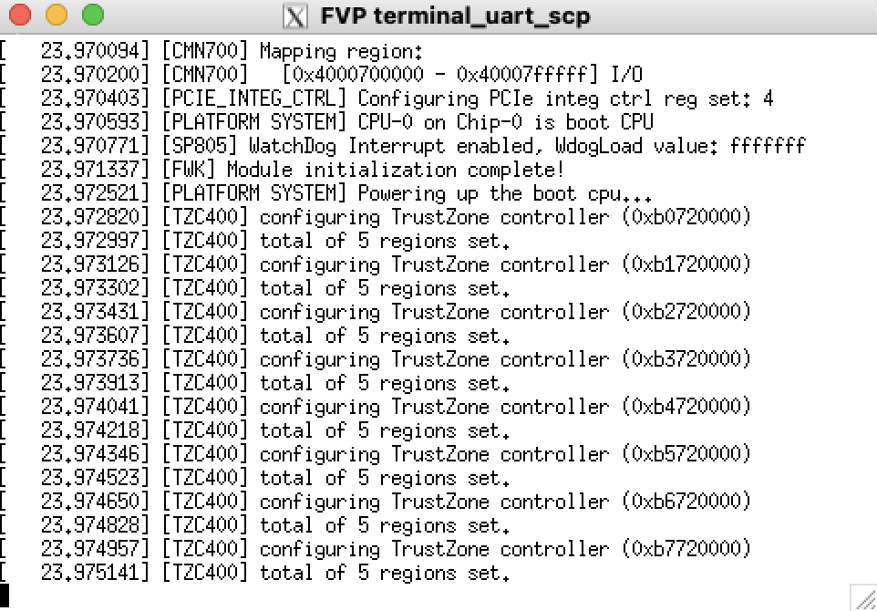
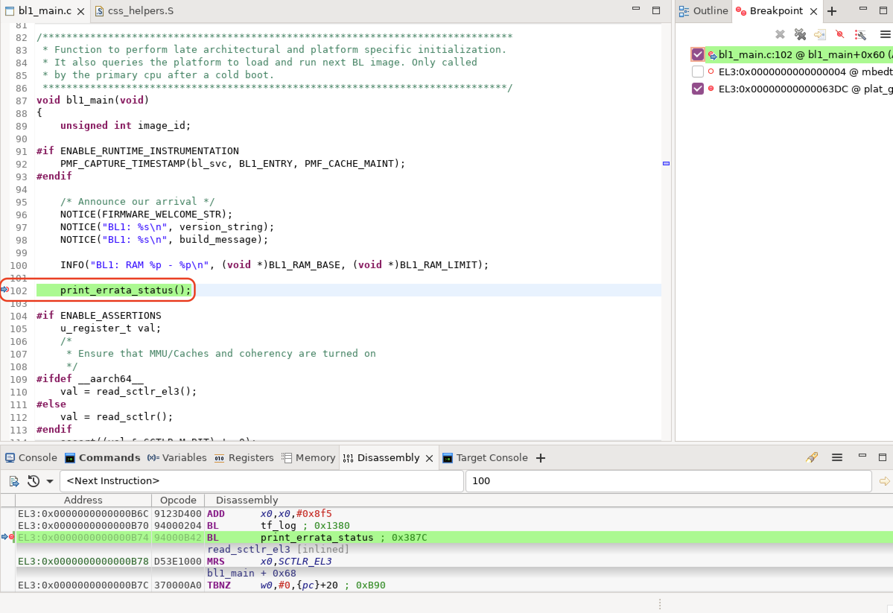

## Debugging BL1 
In the **Edit configuration and launch** panel **Connection** tab, select the **ARM_Neoverse-N2_0**.


Add debug symbols. In the **Debugger** tab, check the **Execute debugger commands**, and add the following commands:

```
add-symbol-file "/<workspace>/rd-infra/tf-a/build/rdn2/debug/bl1/bl1.elf" EL3:0x0
add-symbol-file "/<workspace>/rd-infra/tf-a/build/rdn2/debug/bl2/bl2.elf" EL1S:0x0
add-symbol-file "/<workspace>/rd-infra/tf-a/build/rdn2/debug/bl31/bl31.elf" EL3:0x0
```

{}
If you would like to add platform-specific debug files, the memory locations are in the corresponding ``platform_h.def`` file.
{}



These commands load the symbol files and specify the memory address location, updating **workspace** to include the path to your own workspace directory.

The `EL` (Exception Level) and number at the end of each command, for example, `EL3:0`, ensure the symbols are loaded into the correct virtual address space and at the correct memory offset. ATF uses absolute addresses for its symbols so we use an offset of 0.

After connecting to the running model, check that it has stopped. Set a breakpoint on the next instruction of
the TF-A and press **run**. In this debug panel, you can find common debugging functions like stepping and skipping.



Observe the SCP console output. After the SCP deasserts, reset for the Neoverse N2 Core 0, it stops on the breakpoint.




Finally, set a breakpoint in the function you would like to debug. In this example, we set a breakpoint at ``bl1_main()``and continue. 


