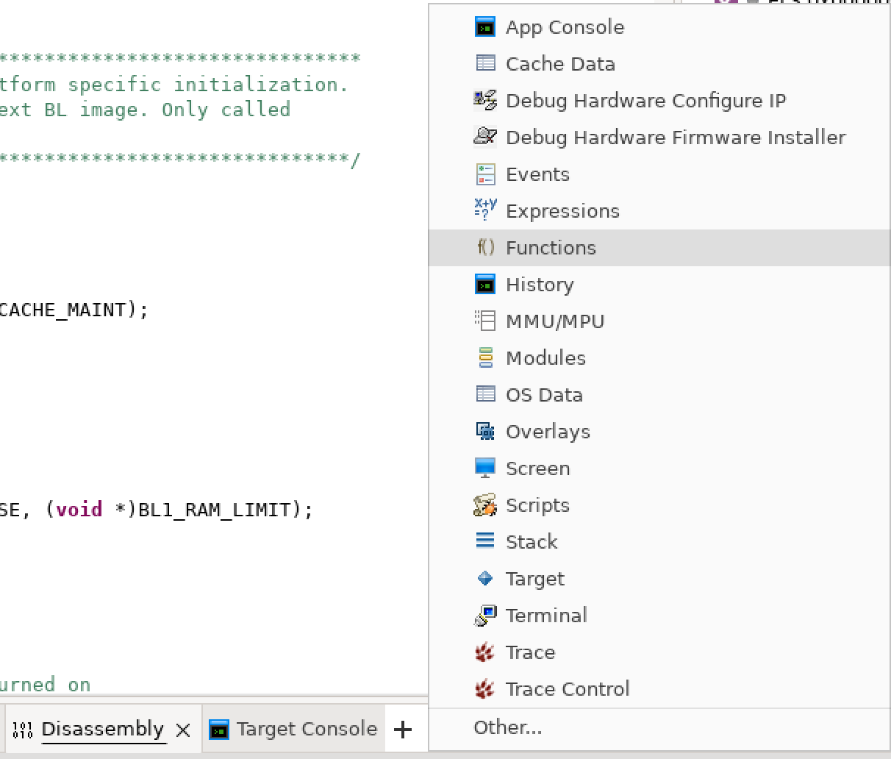
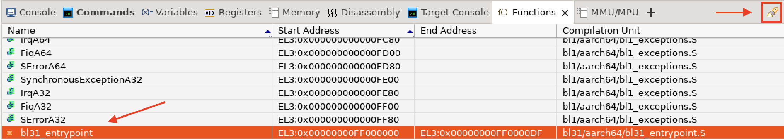
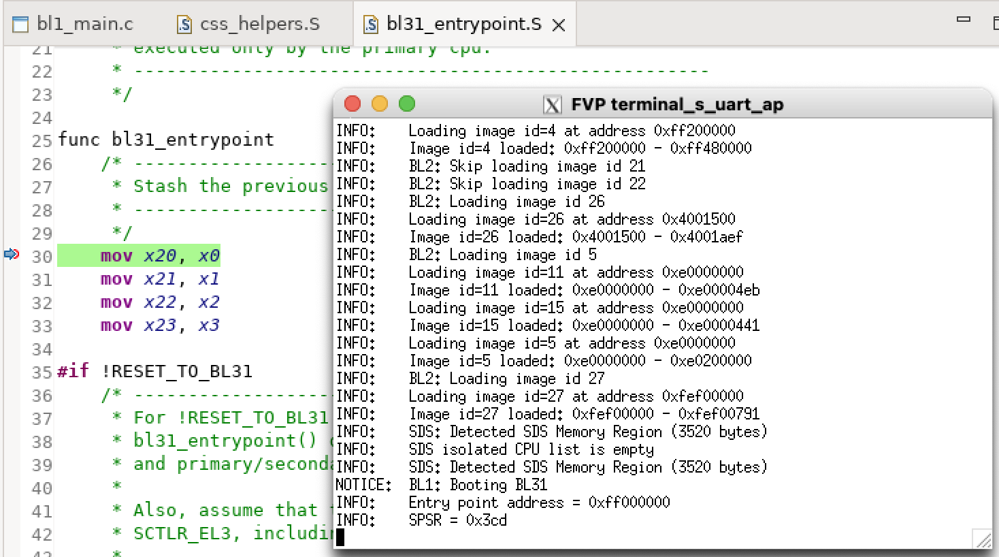

## Debugging BL31 
Setting a breakpoint for BL1 is simple, but how do we set a breakpoint for BL31?

In the tabs panel at the bottom, click the plus **(`+`)** and **add other views**. Here there are multiple views available such as **Register View** and **Memory View**.

For this example, we are only interested in the **Functions** view.

Search for ``bl31_entrypoint`` using the flashlight icon and set a breakpoint. Press **continue**.

Observe the application processor console output. TF-A proceeds from BL1 to BL2 to BL31.

After reaching BL31, Neoverse N2 Core 0 stops on the breakpoint.

