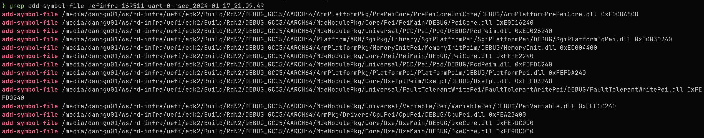
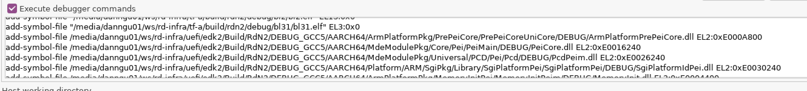
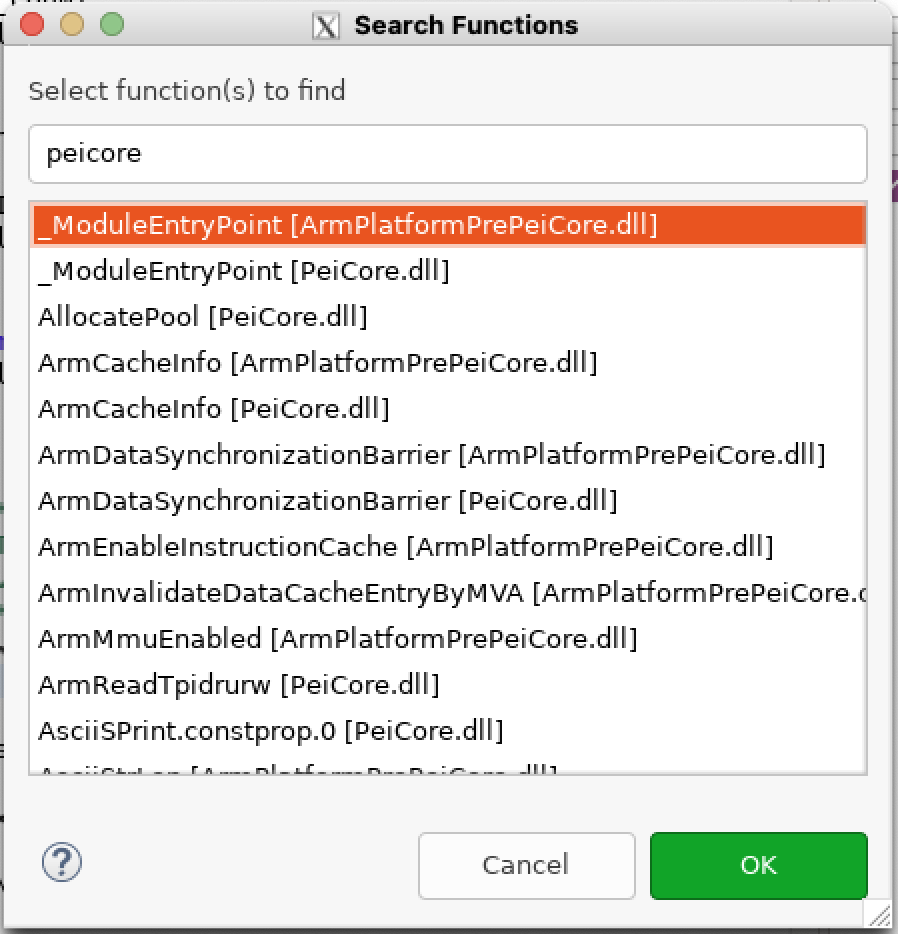

## Debugging BL33 / UEFI

Adding symbol files for UEFI requires you to boot the FVP once without debugging, so that you can retrieve the symbol file locations and memory addresses.

After booting the FVP, notice that in the Non-secure AP console output, the UEFI load system helpfully shows where each driver is relocated to. The UEFI load system pre-formats the output into `add-symbol-file` directives that can be copy-and-pasted.

The log files are stored in:
```bash
/<workspace>/rd-infra/model-scripts/rdinfra/platforms/rdn2/rdn2
```

As we focus on the ``uart-0-nsec`` console, we can use ``grep`` to find all the symbol files. 
```bash
grep add-symbol-file refinfra-*-uart-0-nsec-*
```



We can then copy these lines and append them to the list of symbol files, as before.

UEFI runs in EL2, so modify the end of each line to be ``EL2:<address>``.



Once the debugger is connected, see the **functions** tab. Here you can search for functions to
set breakpoints. For example, let's set a breakpoint at the entry point to PEI. 



You can see that it has stopped at the breakpoint.

### If using Arm Development Studio version <2023.1

Older versions of Arm Development Studio have Beta support for DWARF 5 formats. EDK2 builds the debug files in DWARF 5
format.

In order to load the debug files properly, follow the instructions [here](https://developer.arm.com/documentation/101470/2023-0/Reference/Standards-compliance-in-Arm-Debugger).

These instructions state that you must enable the LLVM DWARF parser to use DWARF 5 format. To enable the LLVM DWARF parser, do the following.

1. Select **Window**  > **Preferences**. 
2. Then, in the **Preferences** dialog box, navigate to **Arm DS** > **Debugger** > **DWARF Parser**. 
3. Select the **Use LLVM DWARF parser** checkbox and click **Apply and Close**.


