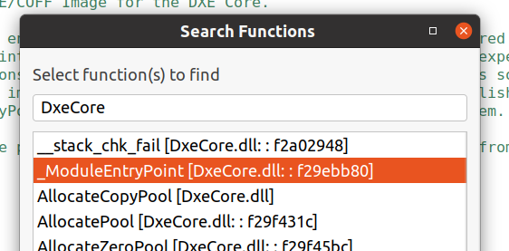

## Debugging BL33 / UEFI

Adding symbol files for UEFI requires you to boot the FVP once without debugging, so that you can retrieve the symbol file locations and memory addresses.

After booting the FVP, notice that in the Non-secure AP console output, the UEFI load system helpfully shows where each driver is relocated to.

**Do the same actions in the same order you will when you are debugging as this affects the locations of the modules. For example, open UEFI interface -> Enter UEFI Shell -> Load EFI driver in the same order each time.**

The log files are stored in:
```bash
<workspace>/rd-infra/model-scripts/rdinfra/platforms/rdn2/rdn2
```

Following the previous section, you should still be in TF-A. In the Commands window, execute the following command to break at the start of UEFI: ``break EL2N:0xE0000000``. Execute until we are in EL2N address space. This is because the script depends on the current address space when loading in symbols.

In Arm DS, go to the scripts tab and hit "Import a script or directory" then "Import a DS or Jython script"


Select the script ``~/rd-infra/uefi/edk2/ArmPlatformPkg/Scripts/Ds5/cmd_load_symbols.py``.

Enter the following parameters

``-f (<UEFI entry point>, 0x20000)`` The UEFI entry point was found earlier (0xE0000000). 0x20000 is the size which can be found in the UEFI build log.


```command
-a -v

-i <path to UART log file> This is the path to the UART log which was produced by a running the whole UEFI process

-o <path to objdump executable> This is the path to aarch64-none-linux-gnu-objdump. 
```

The script has now been setup.
All the debug symbols have loaded, you can now start debugging!

### Debugging Boot Process

Once the debugger is connected, see the **functions** tab. Here you can search for functions to
set breakpoints.
For example, let's set a breakpoint at the entry point to DxeCore.



You can see that it has stopped at the breakpoint.


### If using Arm Development Studio version <2023.1

Older versions of Arm Development Studio have Beta support for DWARF 5 formats. EDK2 builds the debug files in DWARF 5
format.

In order to load the debug files properly, follow the [Standards compliance in Arm Debugger](https://developer.arm.com/documentation/101470/2023-0/Reference/Standards-compliance-in-Arm-Debugger) instructions.

These instructions state that you must enable the LLVM DWARF parser to use DWARF 5 format. To enable the LLVM DWARF parser, do the following.

1. Select **Window**  > **Preferences**. 
2. Then, in the **Preferences** dialog box, navigate to **Arm DS** > **Debugger** > **DWARF Parser**. 
3. Select the **Use LLVM DWARF parser** checkbox and click **Apply and Close**.


