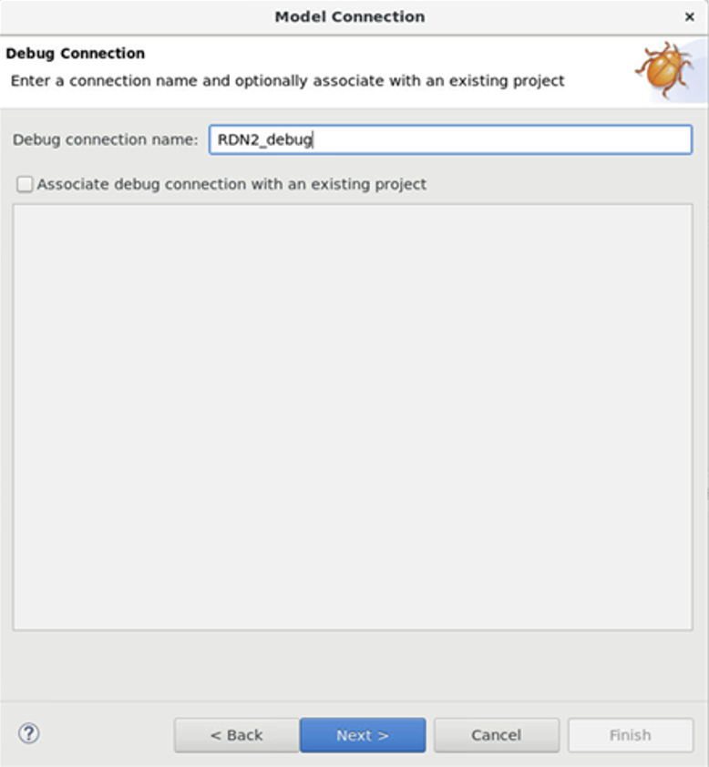

## Debugging SCP
{}
At the time of writing this guide, SCP firmware debug uses "-Og" argument. This optimizes some variables. That makes debugging difficult. To replace "-Og" with "-O0", do the following:
   
* Navigate to ``rd-infra/scp/cmake/Toolchain``
* See <compiler>_Baremetal.cmake files
* Modify the one for the compiler you use. For example, for GCC modify GNU-Baremetal.cmake:

``string(APPEND CMAKE_${language}_FLAGS_DEBUG_INIT "-Og")`` 

to 

``string(APPEND CMAKE_${language}_FLAGS_DEBUG_INIT "-O0")``
{}

After starting the model, click **Create a new debug connection...** from the **Debug Control** panel.

Create a connection name. You may choose any name you prefer.

Next, click on **Add a new model...**.

Make sure the Model Interface is selected to be **CADI**. 
Click **Browse for model running on local host**.
Select the correct model and click finish.

In the **Edit configuration and launch** panel, in the **Connection** tab, select the correct target. In this example, select **ARM_Cortex-M7_1**. 

In the **Files** panel, select **Load Symbols from file**, **File System**, and select the **SCP RAMFW ELF** file, located at ``rd-infra/scp/output/rdn2/0/scp_ramfw/bin/rdn2-bl2.elf``.

Select apply then debug. DS will now connect to the model and start debugging.

Once connected, we can set breakpoints in the source code. This can be done by searching for the function in the **Functions** tab, or by double clicking next to the line number.

Here, you can see that we've set a breakpoint at ``cmn700_discovery()``. You'll see that it has stopped at that breakpoint upon continuing the code.

 breakpoint")

We'll set another breakpoint at a debug print statement. 

You can see the output in the SCP UART window.

