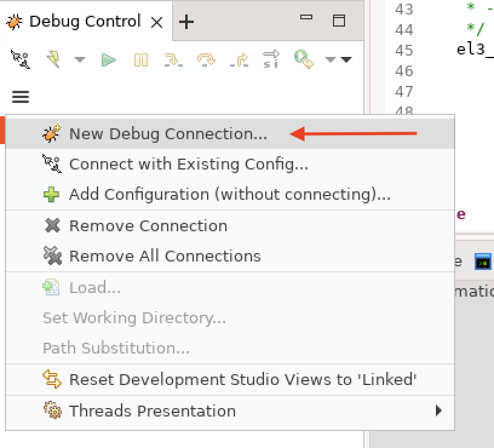
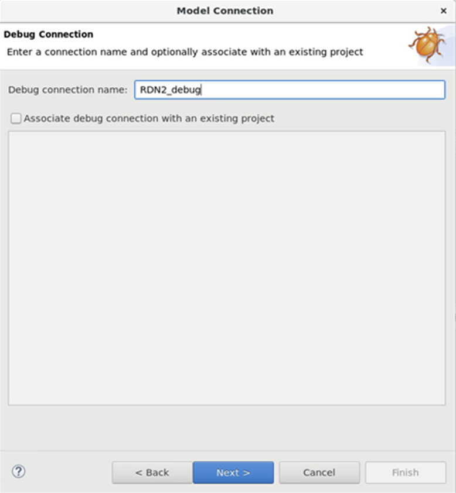
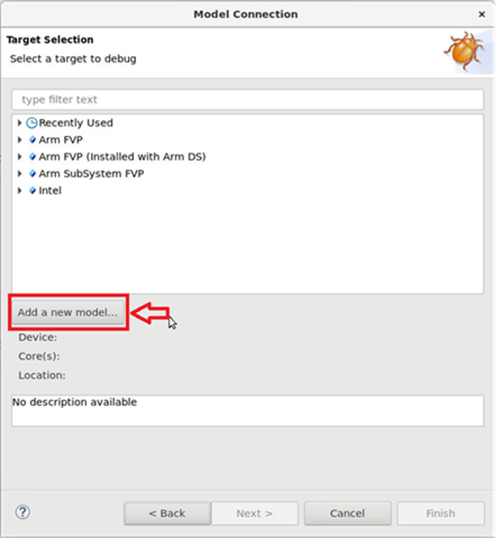
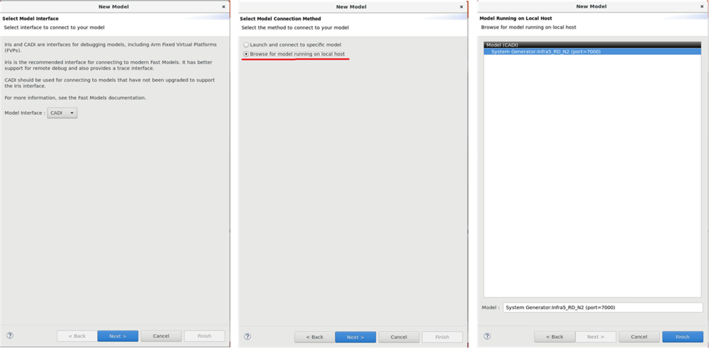
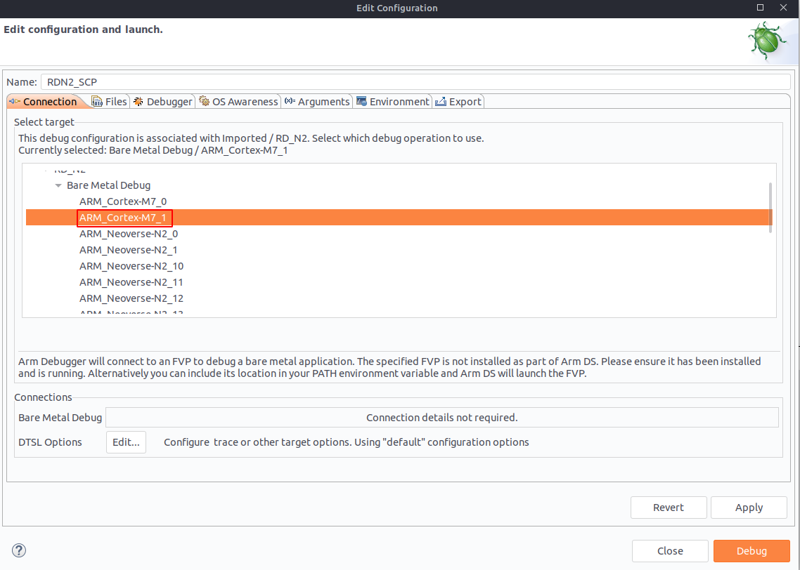
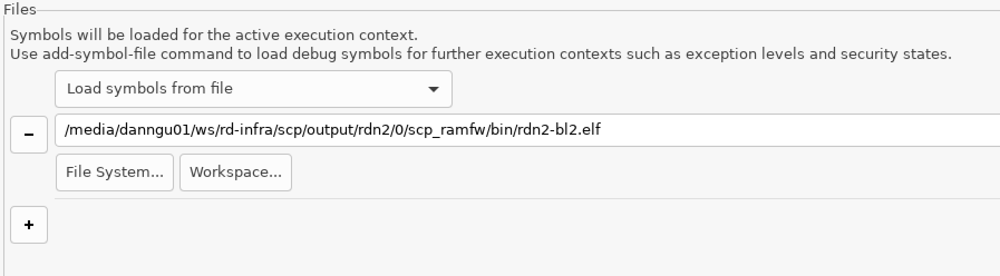
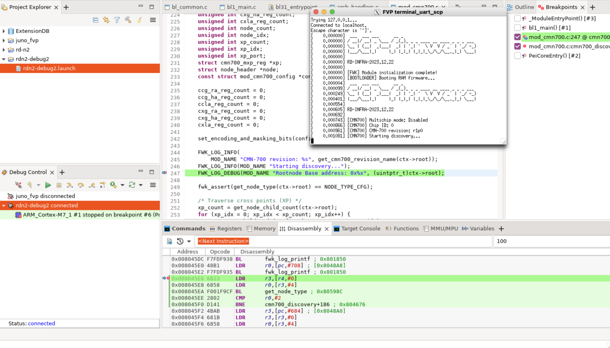

## Setting up a connection
{}
SCP firmware debug uses the `-Og` argument. This optimizes some variables that make debugging difficult. To replace `-Og` with `-O0`, do the following:

* Navigate to `rd-infra/scp/cmake/Toolchain`.
* Modify the appropriate `<compiler>-Baremetal.cmake` file for your toolchain.

For example, change `GNU-Baremetal.cmake`:

`string(APPEND CMAKE_${language}_FLAGS_DEBUG_INIT "-Og")`

to

`string(APPEND CMAKE_${language}_FLAGS_DEBUG_INIT "-O0")`
{}

After starting the model, click **New Debug Connection...** from the **Debug Control** panel.



Create a connection name. This can be whatever you prefer.



Next, click on **Add a new model...**.



Select the appropriate Model Interface, for example **CADI**.

Click **Browse for model running on local host**.

Select the correct model, and click **Finish**.



In the **Edit configuration and launch** panel, in the **Connection** tab, select the correct target.

For the `SCP` code, select **ARM_Cortex-M7_1**.

{}
For different platforms (e.g., RD-N2, RD-V3, etc.), you will see a list of numbered M7 and M55 cores. Typically, even-numbered M7 cores correspond to the MCP, while odd-numbered cores are assigned to the SCP. Additionally:

- `ARM_Cortex-M55_0` to `ARM_Cortex-M55_(N-1)` represent LCP cores.
- `ARM_Cortex-M55_N` represents the RSE.

To verify core assignments, you can set up alerts (e.g., print statements or store variables), connect to a debugger, and test the configuration.
{}



In the **Files** panel, select **Load Symbols from file**, **File System**, and select the **SCP RAMFW ELF** file, located at:

``rd-infra/scp/output/rdn2/0/scp_ramfw/bin/rdn2-bl2.elf``.

RSE debug symbol file location:
```command
rd-infra/tf-m/cmake_build/<plat>/<cfg>/bin/bl1_1.elf
rd-infra/tf-m/cmake_build/<plat>/<cfg>/bin/bl1_2.elf
rd-infra/tf-m/cmake_build/<plat>/<cfg>/bin/bl2.elf
```

LCP debug symbol file location:
```command
rd-infra/scp/output/<plat>/<cfg>/lcp_ramfw/rdv3-lcp-bl2.elf
```



Select **Apply** then **Debug**. The debugger now connects to the model.

## Setting breakpoints
Once connected, you can set breakpoints in the source code. This can be done by searching for the function in the **Functions** tab, double-clicking next to the line number, or in the **Command** view.

Set a breakpoint at ``cmn700_discovery()``. Continue execution and the code stops at the breakpoint you specify.
```command
break cmn700_discovery
continue
```

 breakpoint")

Set another breakpoint at a debug print statement.



Observe the output in the SCP UART window.

Disconnect from the FVP.

