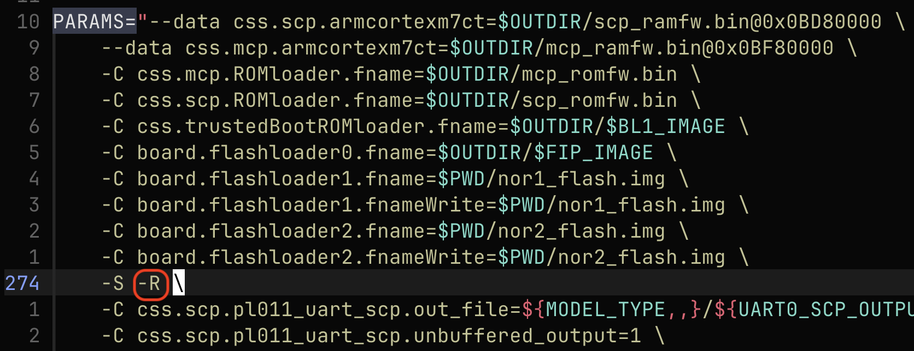

To follow this learning path, you need Arm Development Studio installed, and an appropriate license. See the [Arm Development Studio Install Guide](/install-guides/armds) for instructions. Screenshots in this tutorial are from Arm Development Studio 2023.0.

You also need the Neoverse RD-N2 Reference Design Software Stack set up, and an associated FVP (Fixed Virtual Platform). For further information, see [Get started with the Neoverse Reference Design Software Stack](/learning-paths/servers-and-cloud-computing/refinfra-quick-start/). 

## SCP/LCP/RSE debug

Modify this run script:

```bash
rdinfra/model-scripts/rdinfra/platforms/rdn2/run_model.sh
```
Remove the `–R` parameter from the `PARAMS=` section. 

In the original script, this option was used to allow the FVP to continue to execute and not wait for the debug connection.



{}
To start a `CADI` debug server, use the `-S` option. For an `Iris` debug server, change this to `-I` instead.
{}

Run the script to launch the model:
```bash
./run_model.sh
```

## AP debug

If you remove the -R flag, RSE CPU wait is on hold and the APs will be powered off. You will have to kick-off the run, then it starts booting from RSE to AP cores. In this case, do *not* remove the -R flag.

This will be explained further in BL1, BL31, and BL33 chapters.

{}
FVPS do not completely model the `IMP DEF` behavior that RTL does.

FVPs also do not model cycles, performance, or `AXI/ACE/AHB/CHI` bus-level transactions.
{}
