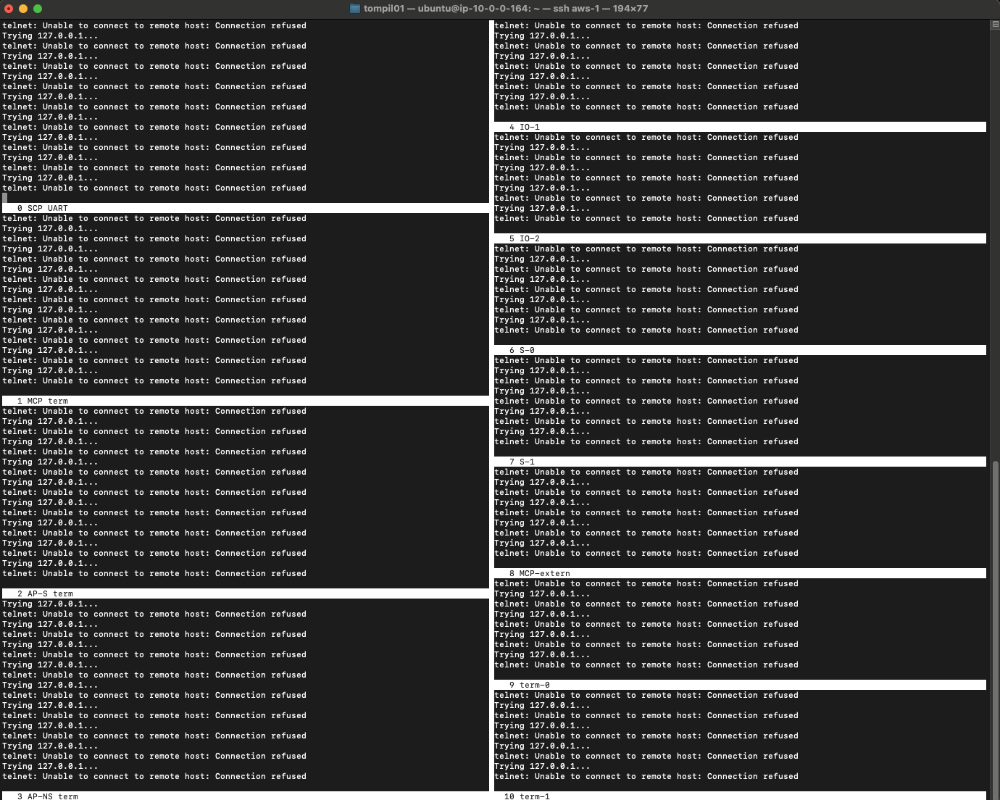
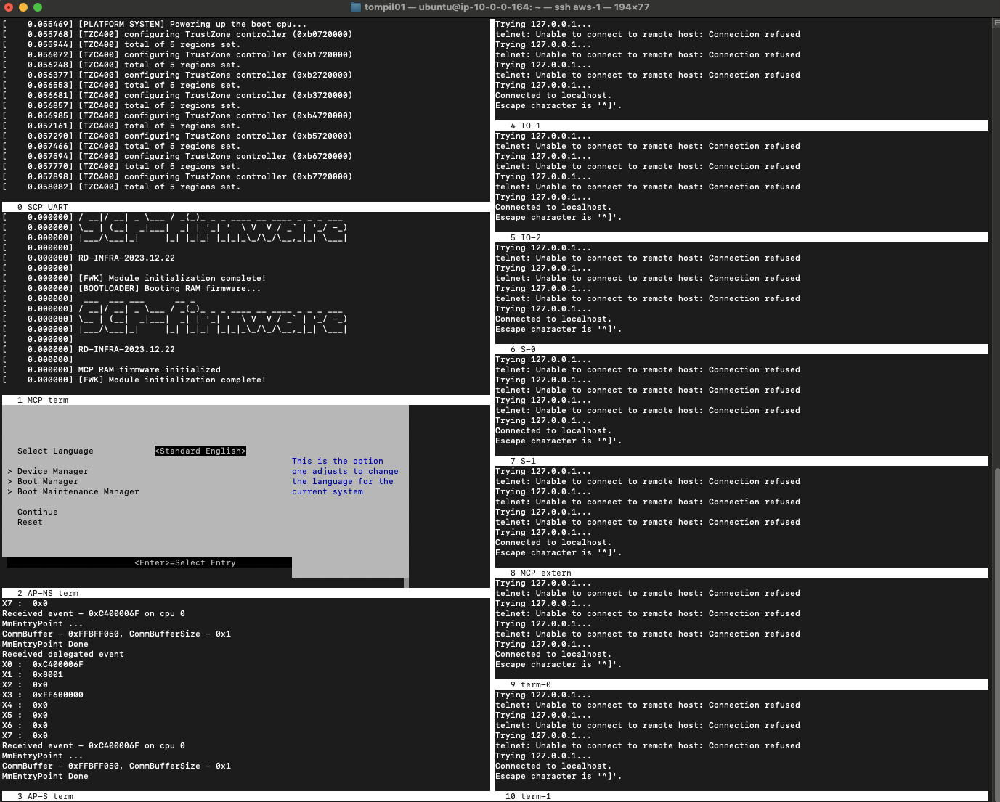
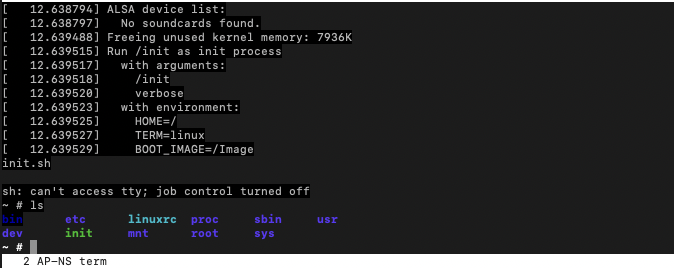

## FVP

The firmware build can be executed on the Neoverse N2 Reference Design FVP that you can download from [Arm Ecosystem FVPs](https://developer.arm.com/downloads/-/arm-ecosystem-fvps).


### Set up the FVP

Download the FVP from the previous page, or directly with:
```bash
wget https://developer.arm.com/-/media/Arm%20Developer%20Community/Downloads/OSS/FVP/Neoverse-N2/Neoverse-N2-11-24-12/FVP_RD_N2_11.24_12_Linux64.tgz
```

Unpack the tarball and run the install script:

```bash
tar -xf FVP_RD_N2_11.24_12_Linux64.tgz 
./FVP_RD_N2.sh --i-agree-to-the-contained-eula --no-interactive
```

Export the path to the `FVP_RD_N2` model binary as the `MODEL` environment variable.
```bash
export MODEL=/home/ubuntu/FVP_RD_N2/models/Linux64_GCC-9.3/FVP_RD_N2
```
### Screen configuration for UARTs
The model will output UARTs to local ports 5000..5010. If you were running the model on a local machine, or had X11 forwarding set up, the model opens a number of xterm terminals with the UART output piped to them, one per port. 

If you do not have X11 forwarding and you are executing on a remote server, you can use `screen` to spawn persistent terminals that listen on the ports and obtain the information that way.

Open a new terminal where you start a `screen` session and connect to it.

To install `screen` use:
```bash 
sudo apt-get install screen
```

Use a text editor to create the configuration file below, which will set up `screen` windows for each UART.

#### Create screen-uart.cfg
Create a config file so that when you start a session, there are ten windows and each periodically tries to connect to one of the local ports where a UART is running. You can change the titles of the windows so that you can identify each terminal. The resulting `screen-uart.cfg` file looks like this:
```bash
# Split horizontally into two
split -v

# Start the SCP UART telnet
screen -t  "SCP UART" run-one-constantly telnet localhost 5000

# Split screen and start MCP UART
split
focus
screen -t "MCP term" run-one-constantly telnet localhost 5001

# Split screen and start AP-NS UART
split
focus
screen -t "AP-NS term" run-one-constantly telnet localhost 5002

# Split screen and start AP-S UART
split
focus
screen -t "AP-S term" run-one-constantly telnet localhost 5003

# Focus on the second vertical pane
focus

# Start a second set of terminals
screen -t "IO-1" run-one-constantly telnet localhost 5004

# Split 
split
focus
screen -t "IO-2" run-one-constantly telnet localhost 5005

# Split 
split
focus
screen -t "S-0" run-one-constantly telnet localhost 5006

# Split 
split
focus
screen -t "S-1" run-one-constantly telnet localhost 5007

# Split 
split
focus
screen -t "MCP-extern" run-one-constantly telnet localhost 5008

# Split 
split
focus
screen -t "term-0" run-one-constantly telnet localhost 5009

# Split 
split
focus
screen -t "term-1" run-one-constantly telnet localhost 5010

# Focus back on the AP-NS UART
focus
focus
focus
```

Start the screen session with this configuration file:
```bash
screen -c screen-uart.cfg
```
The result should be similar to:


These errors are expected as there is nothing talking to the ports. You can quit from within the screen by the getting a prompt using `Ctrl+A:` key combination, followed by the `quit` command. Alternatively, `Ctrl+A D` will detach the screen session and send it to background. 

### Running the FVP

In your original terminal, launch the FVP using the supplied script:
```bash
./uefi.sh -p rdn2
```
Observe the platform is running successfully:


You can also boot into `busy-box`, using the command:
```bash
./boot.sh -p rdn2
```


You have successfully booted the reference software stack you built in the previous step onto the FVP.
