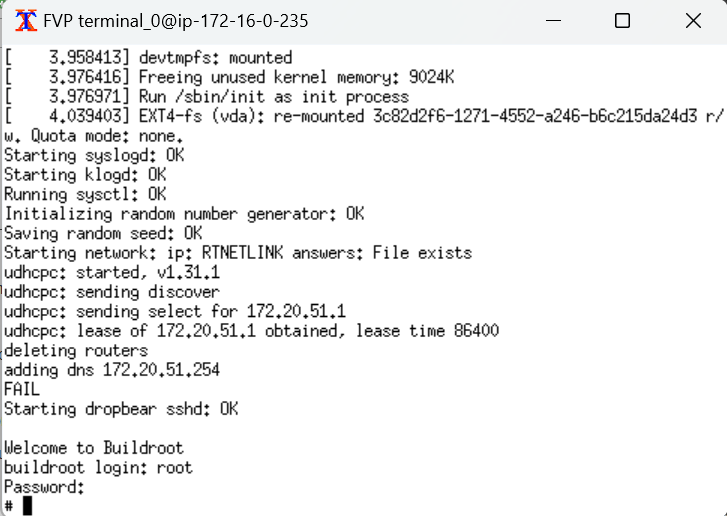

---
# User change
title: "Build and run the Arm CCA stack on an Arm FVP"

weight: 2 # 1 is first, 2 is second, etc.

# Do not modify these elements
layout: "learningpathall"
---


## Before you begin

You will need at least 30 GB of free disk space on your machine to build the Arm CCA reference software stack.

Install the necessary packages:

```console
sudo apt update && sudo apt install git gcc telnet xterm net-tools build-essential
```

## Overview

The Arm Confidential Compute Architecture (CCA) enables the construction of protected execution
environments called Realms. Realms allow lower-privileged software, such as an application or a virtual machine to
protect its content and execution from attacks by higher-privileged software, such as an OS or a hypervisor. Realms provide an environment for confidential computing, without requiring the Realm owner to trust the software components that manage the resources used by the Realm.

The Arm Realm Management Extension (RME) is an Arm v9-A architecture extension and defines the set of hardware features and properties that are required to comply with the Arm CCA architecture. RME introduces a new security state "Realm world", in addition to the traditional Secure and Non-Secure states.

In this learning path, you will learn how to build and run the reference integration software stack for Arm CCA which demonstrates support for Arm's RME architecture feature. You will also learn how to create a Realm that runs a guest Linux kernel. 

## Build the docker container

You can build the Arm CCA reference software stack in a docker container which contains all the build dependencies. 
Install [docker engine](/install-guides/docker/docker-engine) on your machine.

Clone the repository that contains the docker container file and utility scripts:

```console
git clone --branch AEMFVP-A-RME-2023.09.29 https://git.gitlab.arm.com/arm-reference-solutions/docker.git
```
Build the docker container:

```console
cd docker
./container.sh build
```
The script `container.sh` defines the docker file and image name used to create the container.

Confirm that the docker container image was built successfully:

```
docker image list
```

The expected output is:

```output
REPOSITORY        TAG       IMAGE ID       CREATED       SIZE
aemfvp-builder    latest    2fa7ce18f57a   7 mins ago    1.83GB
```

Create a directory on your host machine to store the software source files. Then run the container and mount this directory inside the container:

```console
mkdir ~/cca-stack
./container.sh -v ~/cca-stack run
```

You should see the following output:

```output
Running docker image: aemfvp-builder ...
ubuntu@ip-172-16-0-235:/$
```

You are now inside the root directory of the `aemfvp-builder` container and ready to build the software stack.

## Build the reference Arm CCA software stack

You can build the Arm CCA software stack in your running container using a manifest file. Inspect the [manifest file](https://git.gitlab.arm.com/arm-reference-solutions/arm-reference-solutions-manifest/-/blob/AEMFVP-A-RME-2023.09.29/pinned-aemfvp-a-rme.xml) to view all the component repositories needed to build this reference stack. 

Inside the running container, change directory into the mounted directory.
Use the repo tool and the manifest file to download the software stack:

```console
cd ~/cca-stack
repo init -u https://git.gitlab.arm.com/arm-reference-solutions/arm-reference-solutions-manifest.git -m pinned-aemfvp-a-rme.xml -b refs/tags/AEMFVP-A-RME-2023.09.29
repo sync -c -j $(nproc) --fetch-submodules --force-sync --no-clone-bundle
```

Patch the Linux kernel Kconfig file for arm64 targets. This patch enables extending the bootloader provided command line arguments. It is required to speed up execution of the software stack. 

```console
cd linux
wget https://raw.githubusercontent.com/ArmDeveloperEcosystem/arm-learning-paths/main/content/learning-paths/servers-and-cloud-computing/rme-cca-basics/kconfig.patch
git apply --ignore-space-change --whitespace=warn --inaccurate-eof -v kconfig.patch
```
The output should be similar to:

```output
Checking patch arch/arm64/Kconfig...
Hunk #1 succeeded at 2260 (offset 60 lines).
Applied patch arch/arm64/Kconfig cleanly.
```
Build the stack:

```console
cd ..
./build-scripts/aemfvp-a-rme/build-test-buildroot.sh -p aemfvp-a-rme all
```

{}
The build process can take a while to complete as it's building the entire collection of software components for the Arm CCA stack.
{}

The binary executables are built in the `~/cca-stack/output/aemfvp-a-rme` directory.
You can now exit the docker container.

```console
exit
```

## Run the software stack

The binary executables built in the previous step can run on an Armv-A Base Architecture Envelop Model (AEM) FVP with support for RME extensions. AEM FVPs are fixed configuration virtual platforms of Armv8-A and  Armv9-A architectures with comprehensive system IP. You can download and run the FVP on either x86_64 or aarch64 host machines.

Depending on the architecture of your host machine, run the steps below to download and extract this FVP, create an environment variable `MODEL` and set it to point to the FVP executable:

- host machine architecture: aarch64

  ```console
  cd ~/cca-stack
  wget https://developer.arm.com/-/media/Files/downloads/ecosystem-models/FVP_Base_RevC-2xAEMvA_11.23_9_Linux64_armv8l.tgz
  tar -xvzf FVP_Base_RevC-2xAEMvA_11.23_9_Linux64_armv8l.tgz
  export MODEL=~/cca-stack/Base_RevC_AEMvA_pkg/models/Linux64_armv8l_GCC-9.3/FVP_Base_RevC-2xAEMvA
  ```

- host machine architecture: x86_64

  ```console
  cd ~/cca-stack
  wget https://developer.arm.com/-/media/Files/downloads/ecosystem-models/FVP_Base_RevC-2xAEMvA_11.23_9_Linux64.tgz
  tar -xvzf FVP_Base_RevC-2xAEMvA_11.23_9_Linux64.tgz
  export MODEL=~/cca-stack/Base_RevC_AEMvA_pkg/models/Linux64_GCC-9.3/FVP_Base_RevC-2xAEMvA
  ```

Launch the `boot.sh` script to run the binaries on the FVP:

```console
./model-scripts/aemfvp-a-rme/boot.sh -p aemfvp-a-rme shell
```

{}
A number of `Info` and `Warning` messages will be emitted by the FVP. These can safely be ignored.

If you see an error of the form `xterm: Xt error: Can't open display:`, ensure that your terminal application (e.g. `PuTTY`) has `X11 forwarding` enabled.
{}

The FVP boots up with four terminal windows. 

You should see the host Linux kernel boot on `terminal_0`. You will be prompted to login to buildroot. Enter `root` as both the username and password.




`terminal_3` of the FVP is connected to the Realm Management Monitor (RMM). The RMM is the software component of Arm CCA that is responsible for the management of Realms.

The output from the RMM should look like:


You have successfully booted four worlds (Root, Secure, Non-secure and Realm) on the FVP at this point. Trusted Firmware-A is running in root, RMM in Realm, host Linux in non-secure and Hafnium in secure. 

## Create a virtual guest in a Realm

Guest VMs can be launched in a Realm using `kvmtool` from your host Linux prompt. The kernel `Image` and filesystem `realm-fs.ext4` for the Realm are packaged into the buildroot host file system.

```console
lkvm run --realm -c 2 -m 256 -k /realm/Image -d /realm/realm-fs.ext4 -p earlycon
```

You should see the guest Linux kernel starting to boot in a Realm. This step can take several minutes.

During this time, you should see output messages on the RMM console `terminal_3` that indicate that the Realm is being created and activated.

```console
SMC_RMM_REC_CREATE            88232d000 8817b2000 88231a000 > RMI_SUCCESS
SMC_RMM_REALM_ACTIVATE        8817b2000 > RMI_SUCCESS
```

After boot up, you will be prompted to login at the guest Linux buildroot prompt. Use `root` again as both the username and password.


You have successfully created a virtual guest in a Realm using the Arm CCA reference software stack.
