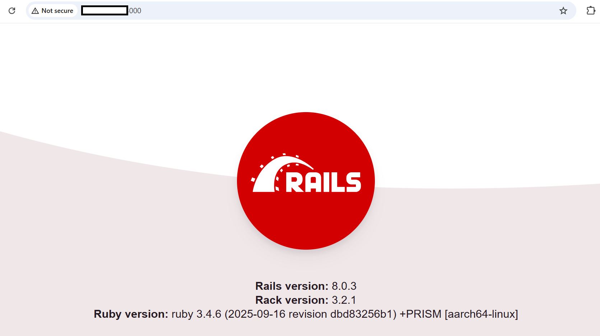

## Baseline Setup for Ruby on Rails with PostgreSQL
This section covers the installation and configuration of **PostgreSQL** and a **Rails application** on a SUSE Arm-based GCP VM. It includes setting up PostgreSQL, creating a Rails app, configuring the database, and starting the Rails server.

### Install and Configure PostgreSQL
PostgreSQL is used with Ruby on Rails as a robust, production-ready relational database that reliably stores and manages application data.

```console
sudo zypper install postgresql-devel postgresql-server
sudo systemctl start postgresql
sudo systemctl enable postgresql
```
- `postgresql-devel` is required to compile the pg gem for Rails.

Verify that the PostgreSQL service is active and running:

```console
systemctl status postgresql
```
The output should look like:
```output
● postgresql.service - PostgreSQL database server
     Loaded: loaded (/usr/lib/systemd/system/postgresql.service; enabled; vendor preset: disabled)
     Active: active (running) since Tue 2025-11-04 21:25:59 UTC; 18s ago
   Main PID: 26997 (postgres)
      Tasks: 7
        CPU: 372ms
     CGroup: /system.slice/postgresql.service
             ├─ 26997 /usr/lib/postgresql15/bin/postgres -D /var/lib/pgsql/data
             ├─ 26998 "postgres: logger " "" "" "" "" "" "" "" "" "" "" "" "" "" "" "" "" "" "" "" "" "" "" "">
             ├─ 26999 "postgres: checkpointer " "" "" "" "" "" "" "" "" "" "" "" "" "" "" "" "" "" "" "" "" "">
             ├─ 27000 "postgres: background writer " "" "" "" "" "" "" "" "" "" "" "" "" "" "" "" "" "" "" "" >
             ├─ 27002 "postgres: walwriter " "" "" "" "" "" "" "" "" "" "" "" "" "" "" "" "" "" "" "" "" "" "">
             ├─ 27003 "postgres: autovacuum launcher " "" "" "" "" "" "" "" "" "" "" "" "" "" "" "" "" "" "" ">
             └─ 27004 "postgres: logical replication launcher " "" "" "" "" "" "" "" "" "" "" "" "" "" "" "" ">
```

This command creates a new PostgreSQL role (user) named `gcpuser` with **superuser privileges**.  

```console
sudo -u postgres createuser --superuser gcpuser
```
- `sudo -u postgres` → Runs the command as the `postgres` user (default PostgreSQL superuser).
- `createuser --superuser gcpuser` → Creates a PostgreSQL role named `gcpuser` with full admin privileges.
    - Can create databases
    - Can create other roles/users
    - Can grant privileges

This role will be used by Rails to connect to the PostgreSQL database.

### Create a Rails App with PostgreSQL
Creates a new Rails application configured to use PostgreSQL as its database.

```console
rails new db_test_rubyapp -d postgresql
cd db_test_rubyapp
bundle install
```
- Creates a new Rails application called `db_test_app`.
- `d postgresql` → Tells Rails to use PostgreSQL as the database instead of the default SQLite.
- `bundle install` ensures all required gems are installed.

{}
Check `config/database.yml` to ensure the `username` and `password` match your PostgreSQL role `(gcpuser)`.
{}

### Verify and Update Database Configuration
Open the Rails database configuration file:

```console
vi config/database.yml
```
Find the `default`: and `development`: sections.
Ensure the username matches the PostgreSQL user you created (gcpuser):

You should see output similar to:
```output
default: &default
  adapter: postgresql
  encoding: unicode
  username: gcpuser
  password:
  host: localhost
  pool: 5

development:
  <<: *default
```
### Create and Initialize the Database
Initializes and creates the development and test databases for your Rails app using PostgreSQL.

```console
rails db:create
```
You should see output similar to:
```output
Created database 'db_test_rubyapp_development'
Created database 'db_test_rubyapp_test'
```
This means Rails successfully connected to PostgreSQL and created both dev and test databases.

### Generate a Scaffold for Testing
A database and Scaffold are required to create the actual PostgreSQL database for your Rails app and quickly generate the model, controller, views, and migrations for your data.
Let’s create a small test model and table — for example, a simple Task tracker:

```console
rails generate scaffold task title:string due_date:date
```
This command automatically generates:
- Database migration for the tasks table
- A model (task.rb)
- A controller and views for CRUD operations
- **Scaffold** → Automatically generates boilerplate code for CRUD operations, saving time and ensuring your app has working forms and routes.

Then apply the migration:

```console
rails db:migrate
```

You should see output similar to:
```output
== 20251006101717 CreateTasks: migrating ======================================
-- create_table(:tasks)
   -> 0.0127s
== 20251006101717 CreateTasks: migrated (0.0128s) =============================
```

Database schema successfully updated.

### Verify Table and Database Connectivity
The previous command `rails generate scaffold task title:string due_date:date` created a `tasks` table in your PostgreSQL database.

Now, verify that the table exists and has the correct structure following the steps below:

```console
sudo -u postgres psql
\c db_test_rubyapp_development
\d tasks
```
- `sudo -u postgres psql` → Launches the PostgreSQL shell as the superuser `postgres`.
- `\c db_test_rubyapp_development` → Connects to the Rails app’s development database.
- `\d tasks` → Displays the schema (columns and types) of the `tasks` table.

You should see output similar to:
```output
psql (15.10)
Type "help" for help.

postgres=# \c db_test_rubyapp_development
You are now connected to database "db_test_rubyapp_development" as user "postgres".
db_test_rubyapp_development=# \d tasks
                                          Table "public.tasks"
   Column   |              Type              | Collation | Nullable |              Default
------------+--------------------------------+-----------+----------+-----------------------------------
 id         | bigint                         |           | not null | nextval('tasks_id_seq'::regclass)
 title      | character varying              |           |          |
 due_date   | date                           |           |          |
 created_at | timestamp(6) without time zone |           | not null |
 updated_at | timestamp(6) without time zone |           | not null |
Indexes:
    "tasks_pkey" PRIMARY KEY, btree (id)
```

### Run Rails Server
Before proceeding to run the Rails server, you need to allow port 3000 from your GCP console. Below are the steps to do that:

a. On the GCP console, navigate to **Firewall** -> **Create Firewall Rule**
 
 

b. Fill in the details as below:

Give a **name** for your desired port (e.g., `allow-3000-ingress`).


 

Set **Direction of Traffic** to **"Ingress"**.

Set **Target** to **"All Instances in the Network"**. You can also choose **"Specific Tags"**.

Set the **Source IPv4 range** to **"0.0.0.0/0"**, for global access.


 
In the **"Protocols and Ports"**, click on **"TCP"**, and mention the port number **"3000"**.
 

 
 
Click on **"Create"**. The Firewall rule will be created successfully and can be viewed in the Firewall Policies Page:


 
Once done, go back to the VM, and execute the below commands to allow port 3000:
 
```console
sudo firewall-cmd --permanent --add-port=3000/tcp
sudo firewall-cmd --reload
```
Now that port 3000 is allowed in your VM’s ingress firewall rules, you can start the Rails server using the following command:

```console
rails server -b 0.0.0.0
```
- `rails server -b 0.0.0.0` → Starts the Rails server and binds it to all network interfaces, not just `localhost`.
- Binding to `0.0.0.0` allows other machines (or your local browser) to access the Rails app running on the VM using its external IP.


### Access the Application:
Open a web browser on your local machine (Chrome, Firefox, Edge, etc.) and enter the following URL in the address bar:

```console
http://[YOUR_VM_EXTERNAL_IP]:3000
```
- Replace `<YOUR_VM_PUBLIC_IP>` with the public IP of your GCP VM.

You will see a Rails welcome page in your browser if everything is set up correctly. It looks like this:



This verifies the basic functionality of the Ruby/Rails installation before proceeding to the benchmarking.
