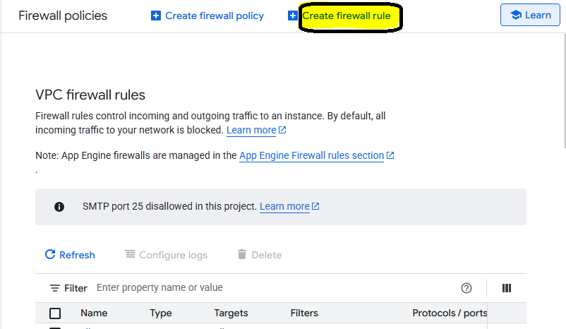
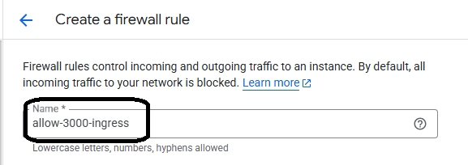
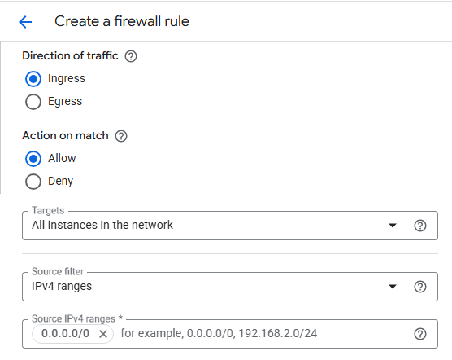
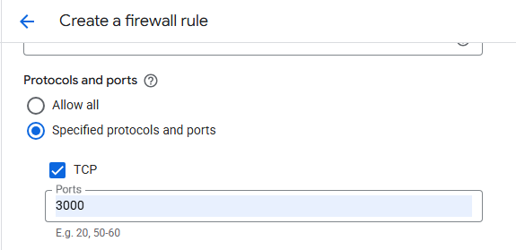
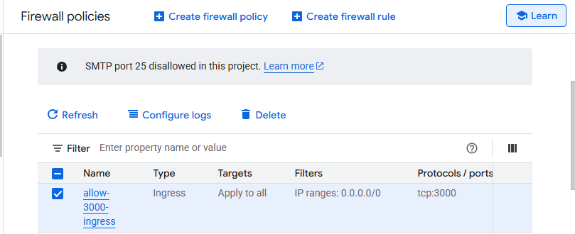

## Set up Ruby on Rails with PostgreSQL on SUSE Arm64

Follow these steps to install PostgreSQL, connect it to a Ruby on Rails app, and verify everything works on a SUSE Arm64 Google Cloud C4A VM.

## Install PostgreSQL and development headers

Install PostgreSQL and its development headers on your SUSE system:

```console
sudo zypper install postgresql-devel postgresql-server
```

This installs two packages:
- `postgresql-server` - the PostgreSQL database service
- `postgresql-devel` - development headers needed to compile the `pg` gem that connects Rails to PostgreSQL

The development headers are essential because Rails uses the `pg` gem to communicate with PostgreSQL, and this gem needs to be compiled during installation.

Start PostgreSQL and enable it to run at boot:

```console
sudo systemctl start postgresql
sudo systemctl enable postgresql
systemctl status postgresql
```
The output is similar to:

```output
● postgresql.service - PostgreSQL database server
  Loaded: loaded (/usr/lib/systemd/system/postgresql.service; enabled; vendor preset: disabled)
  Active: active (running) since Tue 2025-11-04 21:25:59 UTC; 18s ago
   Main PID: 26997 (postgres)
   Tasks: 7
     CPU: 372ms
  CGroup: /system.slice/postgresql.service
       ├─ 26997 /usr/lib/postgresql15/bin/postgres -D /var/lib/pgsql/data
       └─ ... (other postgres processes)
```
If the Active state is running, PostgreSQL is ready.

## Create a PostgreSQL user for Rails

Create a dedicated PostgreSQL user for your Rails app:

```console
sudo -u postgres psql -c "CREATE USER gcpuser WITH SUPERUSER PASSWORD 'your_password';"
```
This command creates a user named `gcpuser` with superuser privileges. You’ll use this user in your Rails configuration.

## Set environment variables

Set environment variables for Rails to connect to PostgreSQL:

```console
export PGUSER=gcpuser
export PGPASSWORD=your_password
export PGHOST=localhost
```

These variables tell Rails how to connect to your PostgreSQL database:
- `PGUSER` - the PostgreSQL username you created
- `PGPASSWORD` - the password for that user  
- `PGHOST` - tells Rails to connect to the local database server

## Create a new Rails app with PostgreSQL

Now you'll create a Rails application configured to use PostgreSQL as its database.

Generate a new Rails app:

```console
rails new db_test_rubyapp -d postgresql
```

This command creates a new Rails application named `db_test_rubyapp` with PostgreSQL as the default database adapter.

Navigate to your new app directory:

```console
cd db_test_rubyapp
```

Install the required gems:

```console
bundle install
```

The `bundle install` command downloads and installs all the gem dependencies listed in your `Gemfile`, including the `pg` gem that allows Rails to communicate with PostgreSQL.

You now have a Rails application ready to connect to your PostgreSQL database.

{}
Check `config/database.yml` and make sure `username` and `password` match your PostgreSQL user (`gcpuser`).
{}

## Update Rails database configuration

Open `config/database.yml` and confirm the credentials:

```console
sudo vi config/database.yml
```
Set these fields:

```output
default: &default
  adapter: postgresql
  encoding: unicode
  username: gcpuser
  password: your_password
  host: localhost
  pool: 5

development:
  <<: *default
```

## Change the Authentication Method
By default, PostgreSQL on many Linux distributions (including SUSE) uses the ident authentication method for local connections. This method maps Linux system usernames directly to PostgreSQL roles. While convenient for local access, it prevents password-based authentication, which is necessary for Rails and most application connections.

To allow Rails to connect using a username and password, change the authentication method in PostgreSQL’s configuration file `pg_hba.conf` from ident to md5.

Open your configuration file
```console
sudo vi /var/lib/pgsql/data/pg_hba.conf
```
The file location `/var/lib/pgsql/data/pg_hba.conf` is the default data directory path for PostgreSQL on SUSE Linux.

Find lines like the following in the file:

```output
# IPv4 local connections:
host    all             all             127.0.0.1/32            ident
# IPv6 local connections:
host    all             all             ::1/128                 ident
```
Change `ident` to `md5`:

```output
# IPv4 local connections:
host    all             all             127.0.0.1/32            md5
# IPv6 local connections:
host    all             all             ::1/128                 md5
```
Restart PostgreSQL:

```console
sudo systemctl restart postgresql
```

Verify the change:
```console
sudo systemctl status postgresql
```
The service should show as active (running).

## Create and Initialize the Database
Once PostgreSQL is configured and Rails can authenticate, you can create your application’s development and test databases.
This step verifies that Rails is correctly connected to PostgreSQL and that the pg gem is working on your Arm64 environment.

Run the following command from inside your Rails app directory:
```console
rails db:create
```
The expected output is:

```output
Created database 'db_test_rubyapp_development'
Created database 'db_test_rubyapp_test'
```
This output confirms that Rails successfully. It connected to the PostgreSQL service using the credentials from `config/database.yml` and created two new databases — one for development and one for testing.

## Generate a Scaffold for Testing
To verify your Ruby on Rails and PostgreSQL integration, you’ll create a small scaffold application.
A scaffold is a Rails generator that automatically builds a model, controller, views, and database migration, allowing you to test CRUD (Create, Read, Update, Delete) operations quickly.

For this example, you’ll create a simple Task Tracker app that manages tasks with titles and due dates.

Run the following command inside your Rails project directory:

```console
rails generate scaffold task title:string due_date:date
```
This command generates a model, controller, views, and migration for tasks.

Apply the migration:

```console
rails db:migrate
```
You’ll see output similar to:

```output
== 20251006101717 CreateTasks: migrating ======================================
-- create_table(:tasks)
   -> 0.0127s
== 20251006101717 CreateTasks: migrated (0.0128s) =============================
```

## Verify the tasks table in PostgreSQL

Check that the `tasks` table exists:

```console
sudo -u postgres psql
```
In the PostgreSQL shell, run:

```console
\c db_test_rubyapp_development
\d tasks
\q
```
- `sudo -u postgres psql` → Launches the PostgreSQL shell as the superuser `postgres`.
- `\c db_test_rubyapp_development` → Connects to the Rails app’s development database.
- `\d tasks` → Displays the schema (columns and types) of the `tasks` table.
- `\q → Exit from the PostgreSQL shell
  
You should see output similar to:
```output
psql (15.10)
Type "help" for help.

postgres=# \c db_test_rubyapp_development
You are now connected to database "db_test_rubyapp_development" as user "postgres".
db_test_rubyapp_development=# \d tasks
                                          Table "public.tasks"
   Column   |              Type              | Collation | Nullable |              Default
------------+--------------------------------+-----------+----------+-----------------------------------
 id         | bigint                         |           | not null | nextval('tasks_id_seq'::regclass)
 title      | character varying              |           |          |
 due_date   | date                           |           |          |
 created_at | timestamp(6) without time zone |           | not null |
 updated_at | timestamp(6) without time zone |           | not null |
Indexes:
    "tasks_pkey" PRIMARY KEY, btree (id)
```

## Open port 3000 in Google Cloud (VPC firewall)
Before proceeding to run the Rails server, you need to allow port 3000 from your GCP console. Below are the steps to do that:

a. On the GCP console, navigate to **Firewall** -> **Create Firewall Rule**
 
 

b. Fill in the details as below:

Give a **name** for your desired port (e.g., `allow-3000-ingress`).


 

Set **Direction of Traffic** to **"Ingress"**.

Set **Target** to **"All Instances in the Network"**. You can also choose **"Specific Tags"**.

Set the **Source IPv4 range** to **"0.0.0.0/0"**, for global access.


 
In the **"Protocols and Ports"**, click on **"TCP"**, and mention the port number **"3000"**.
 

 
 
Click on **"Create"**. The Firewall rule will be created successfully and can be viewed in the Firewall Policies Page:



 ## OS firewall (firewalld) on SUSE
Once done, go back to your VM, install FirewallD:
```console
sudo zypper install firewalld
```
Now start FirewallD and execute the commands to allow port 3000:
 
```console
sudo systemctl start firewalld
sudo systemctl enable firewalld
sudo firewall-cmd --permanent --add-port=3000/tcp
sudo firewall-cmd --reload
```

## Start Rails
Now that port 3000 is allowed in your VM’s ingress firewall rules, you can start the Rails server using the following command:

```console
rails server -b 0.0.0.0
```
- This command lets you access Rails from your browser using the VM’s external IP.


## Access the Rails application:
Open a web browser on your local machine (Chrome, Firefox, Edge, etc.) and enter the following URL in the address bar:

```
http://[YOUR_VM_EXTERNAL_IP]:3000
```
- Replace `<YOUR_VM_PUBLIC_IP>` with the public IP of your GCP VM.

You will see a Rails welcome page in your browser if everything is set up correctly. It looks like this:


With port 3000 reachable and the welcome page loading, your Rails stack on SUSE Arm64 (C4A Axion) is verified end-to-end and you can proceed to benchmarking.

## What you've accomplished

You set up a Ruby on Rails app with PostgreSQL on a Google Cloud C4A Arm-based VM running SUSE Linux. You installed and configured PostgreSQL, created a database user, connected Rails, verified connectivity, generated a scaffold, and made your app accessible over the network. Your Rails stack is now ready for benchmarking and performance testing on Arm.
