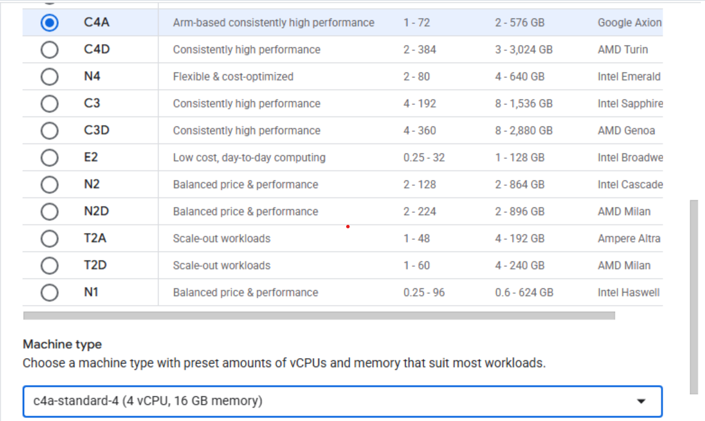

## Overview

In this section, you will learn how to provision a Google Axion C4A Arm virtual machine on Google Cloud Platform (GCP) using the `c4a-standard-4` (4 vCPUs, 16 GB memory) machine type in Google Cloud Console.  

{}
For support on GCP setup, see the Learning Path [Getting started with Google Cloud Platform](https://learn.arm.com/learning-paths/servers-and-cloud-computing/csp/google/).
{}

## Provision a Google Axion C4A Arm VM in Google Cloud Console

To create a virtual machine based on the C4A instance type:
- Navigate to [Google Cloud Console](https://console.cloud.google.com/).
- Go to **Compute Engine > VM Instances** and select **Create Instance**. 
- Under **Machine configuration**:
   - Populate fields such as **Instance name**, **Region**, and **Zone**.
      - Set **Series** to `C4A`.
      - Select `c4a-standard-4` for machine type, as shown below:

      

- Under **OS and Storage**, select **Change**, then select an Arm64-based OS image. For this Learning Path, use **SUSE Linux Enterprise Server**. Pick the preferred version for your operating system. Ensure you select the **Arm image** variant. Select **Select**.
- Under **Networking**, enable **Allow HTTP traffic**.
- Select **Create** to launch the instance.

## What you've accomplished 

You've successfully created a Google Axion C4A Arm virtual machine on GCP. Your Arm-based cloud environment is ready for Ruby on Rails development.
