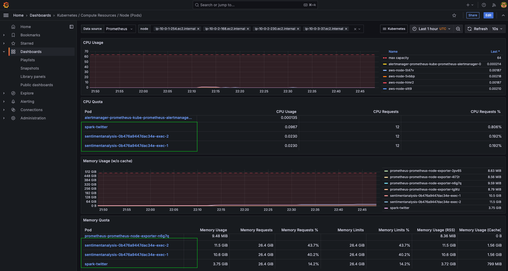

## CPU and RAM usage statistics with Prometheus and Grafana

Prometheus is a monitoring and alerting tool. It is used for collecting and querying real-time metrics in cloud-native environments like Kubernetes. Prometheus collects essential metrics (e.g., CPU, memory usage, pod counts, request latency) that help in monitoring the health and performance of Kubernetes clusters. Grafana is a visualization and analytics tool that integrates with data sources from Prometheus, to create interactive dashboards to monitor and analyze Kubernetes metrics over time. 


## Install Prometheus on Arm-based EKS cluster

This learning path uses `helm` to install prometheus on the Kubernetes cluster. Follow the [helm documentation](https://helm.sh/docs/intro/install/) to install it on your laptop.

Create a namespace in your EKS cluster to host `prometheus` pods

```console
kubectl create namespace prometheus
```

Add the following helm repo for prometheus

```console
helm repo add prometheus-community https://prometheus-community.github.io/helm-charts
```

Install `prometheus` on the cluster with the following command

```console
helm install prometheus prometheus-community/prometheus \
  --namespace prometheus \
  --set alertmanager.persistentVolume.storageClass="gp2" \
  --set server.persistentVolume.storageClass="gp2"
```

Check all pods are up and running

```console
kubectl get pods -n prometheus
```


## Install Grafana on Arm-based EKS cluster

Add the following helm repo for grafana

```console
helm repo add grafana https://grafana.github.io/helm-charts
```

Create `grafana.yaml` file with the following contents

```console
datasources:
  datasources.yaml:
    apiVersion: 1
    datasources:
    - name: Prometheus
      type: prometheus
      url: http://prometheus-server.prometheus.svc.cluster.local
      access: proxy
      isDefault: true
```

Create another namespace for `grafana` pods

```console
kubectl create namespace grafana
```

Install `grafana` on the cluster with the following command

```console
helm install grafana grafana/grafana \
  --namespace grafana \
  --set persistence.storageClassName="gp2" \
  --set persistence.enabled=true \
  --set adminPassword=‘kubegrafana’ \
  --values grafana.yaml \
  --set service.type=LoadBalancer
```
Check all pods are up and running

```console
kubectl get pods -n grafana
```

Login to the grafana dashboard using the LoadBalancer IP and click on `Dashboards` in the left navigation page. Locate a `Kubernetes / Compute Resources / Node` dashboard and click on it. You should see a dashboard like below for your Kubernetes cluster


