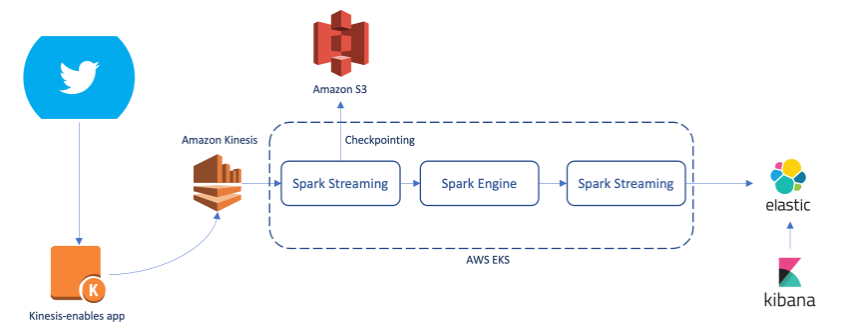

## What is Sentiment Analysis

Sentiment analysis is a natural language processing technique used to identify and categorize opinions expressed in a piece of text, such as a tweet or a product review. It can help to gauge public opinion, identify trends and patterns, and improve decision-making. Social media platforms, such as Twitter, provide a wealth of information about public opinion, trends, and events. Sentiment analysis is important because it provides insights into how people feel about a particular topic or issue, and can help to identify emerging trends and patterns.

## Real-time sentiment analysis with Arm-based Amazon EKS clusters

Real-time sentiment analysis is a compute-intensive task and can quickly drive up resources and increase costs if not managed effectively. Tracking real-time changes enables organizations to understand sentiment patterns and make informed decisions promptly, allowing for timely and appropriate actions.

The high-level technology stack for the solutions is as follows:

- Twitter(X) Developer API to fetch tweets based on certain keywords
- Captured data is processed using Amazon Kinesis
- Sentiment Analyzer model to classify the text and tone of tweets
- Process the sentiment of tweets using Apache Spark streaming API
- Elasticsearch and Kibana to store the processed tweets and showcase on dashboard
- Prometheus and Grafana to monitor the CPU and RAM resources of the Amazon EKS cluster
