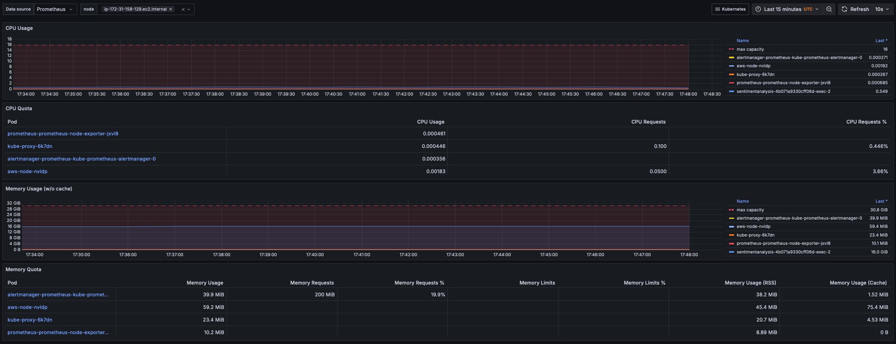

## Monitor CPU and RAM usage with Prometheus and Grafana

* Prometheus is a monitoring and alerting tool. You can use it for collecting and querying real-time metrics in cloud-native environments like Kubernetes. Prometheus collects essential metrics about CPU usage, memory usage, pod counts, and request latency. This helps you to monitor the health and performance of your Kubernetes clusters. 

* Grafana is a visualization and analytics tool. It integrates with data sources from Prometheus to create interactive dashboards to monitor and analyze Kubernetes metrics. 

{}
The terrafom script executed in the previous step automatically installs Prometheus and Grafana in the EKS cluster. However, if you wish to have more flexibility with the installable versions for both, follow the instructions below.
{}

## Install Prometheus on your EKS cluster

You can use Helm to install Prometheus on the Kubernetes cluster. 

Follow the [Helm documentation](https://helm.sh/docs/intro/install/) to install it on your computer.

Confirm Helm is installed by running the version command:

```console
helm version
```

The output is similar to:

```output
version.BuildInfo{Version:"v3.16.3", GitCommit:"cfd07493f46efc9debd9cc1b02a0961186df7fdf", GitTreeState:"clean", GoVersion:"go1.22.7"}
```

Create a namespace in your EKS cluster to host `prometheus` pods:

```console
kubectl create namespace prometheus
```

Add the following Helm repo for prometheus:

```console
helm repo add prometheus-community https://prometheus-community.github.io/helm-charts
```

Install Prometheus on the cluster with the following command:

```console
helm install prometheus prometheus-community/prometheus \
  --namespace prometheus \
  --set alertmanager.persistentVolume.storageClass="gp2" \
  --set server.persistentVolume.storageClass="gp2"
```

Check that all pods are up and running:

```console
kubectl get pods -n prometheus
```

## Install Grafana on your EKS cluster

Add the following Helm repo for Grafana:

```console
helm repo add grafana https://grafana.github.io/helm-charts
```

Use a text editor to create a `grafana.yaml` file with the following contents:

```console
datasources:
  datasources.yaml:
    apiVersion: 1
    datasources:
    - name: Prometheus
      type: prometheus
      url: http://prometheus-server.prometheus.svc.cluster.local
      access: proxy
      isDefault: true
```

Create another namespace for Grafana pods:

```console
kubectl create namespace grafana
```

Install Grafana on the cluster with the following command:

```console
helm install grafana grafana/grafana \
  --namespace grafana \
  --set persistence.storageClassName="gp2" \
  --set persistence.enabled=true \
  --set adminPassword=‘kubegrafana’ \
  --values grafana.yaml \
  --set service.type=LoadBalancer
```

Check all pods are up and running:

```console
kubectl get pods -n grafana
```

Log in to the Grafana dashboard using the LoadBalancer IP and click on **Dashboards** in the left navigation page. 

Locate a `Kubernetes/Compute Resources/Node (Pods)` dashboard and click on it. 

You should see a dashboard like below for your Kubernetes cluster:


