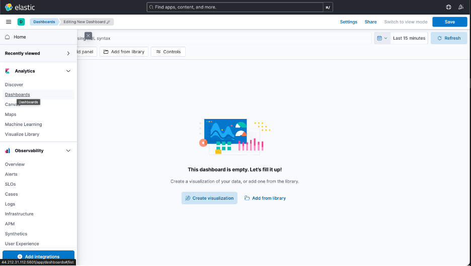
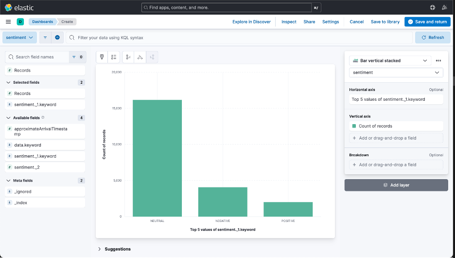

## Deploy Elasticsearch and Kibana on Arm-based EC2 instance

Elasticsearch is a NoSQL database, search, and analytics engine. It's designed to store, search and analyze large amounts of data. It has real-time indexing capability which is crucial for handling high-velocity data streams like Tweets. 

Kibana is a dashboard and visualization tool that integrates seamlessly with Elasticsearch. It provides an interface to interact with twitter data, apply filters, and receive alerts. There are multiple ways to install Elasticsearch and Kibana, one method is shown below.

Before you begin, ensure that Docker and Docker Compose have been installed on your computer. 

Use a text editor to create a `docker-compose.yml` file with the contents below:

```yml
version: '2.18.1'
services:
  elasticsearch:
    image: elasticsearch:8.15.2
    container_name: elasticsearch
    environment:
      - discovery.type=single-node
      - ES_JAVA_OPTS=-Xms512m -Xmx512m
      - xpack.security.enabled=false
      - HTTP_ENABLE=true
    ports:
      - "9200:9200"
    networks:
      - elk

  kibana:
    image: kibana:8.15.2
    container_name: kibana
    ports:
      - "5601:5601"
    environment:
      - ELASTICSEARCH_HOSTS=http://elasticsearch:9200
      - HTTP_ENABLE=true
    depends_on:
      - elasticsearch
    networks:
      - elk

networks:
  elk:
    driver: bridge
```

Use the following command to deploy Elasticsearch and Kibana Dashboard.

```console
docker compose up
```

{}
If you don't have the `docker compose` plugin already installed, you can install it via the following commands
sudo apt-get update
sudo apt-get install docker-compose-plugin
{}

After the dashboard is up, use the the public IP of your server on port `5601` to access the Kibana dashboard.


Switch to the stack management using the menu on the left side as shown in below image.


To make sure that you are receiving the data from sentiment analysis application through Elasticsearch, check whether you have Data View in Stack Management.


You can also check the types of attributes that are received as the Data Views. Now, you can switch to the dashboards on the left menu and start creating the visualizations to analyze the data.



One of the sample dashboard structures looks as below, showing the records of different sentiments.



Similarly, you can design and create dashboards to analyze a particular set of data. The screenshot below shows the dashboard designed for this learning path


Navigate to the `dashboards` directory in the cloned github repository and locate `sentiment_dashboard.ndjson` file. Import this file into Kibana dashboard and you should see a dashboard shown in previous step.