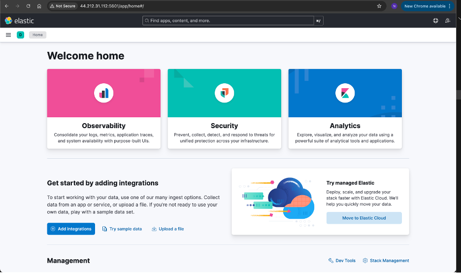
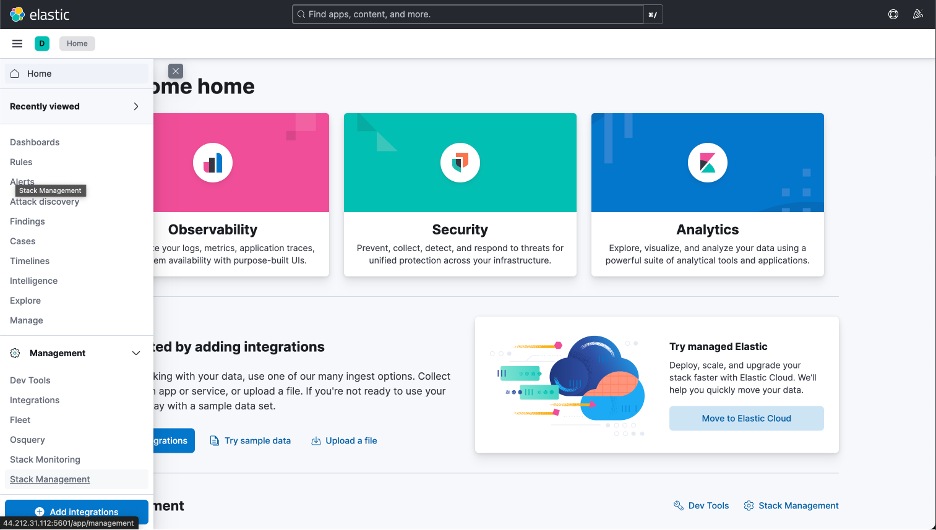
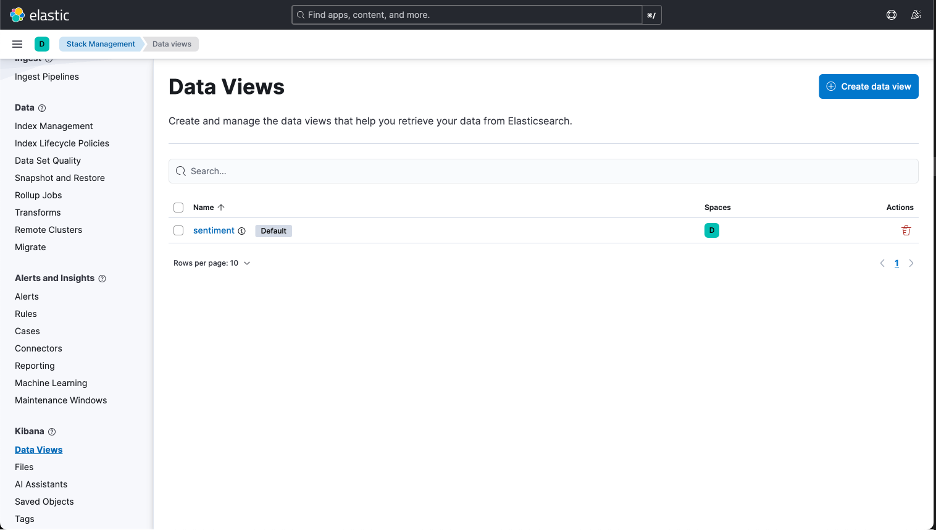
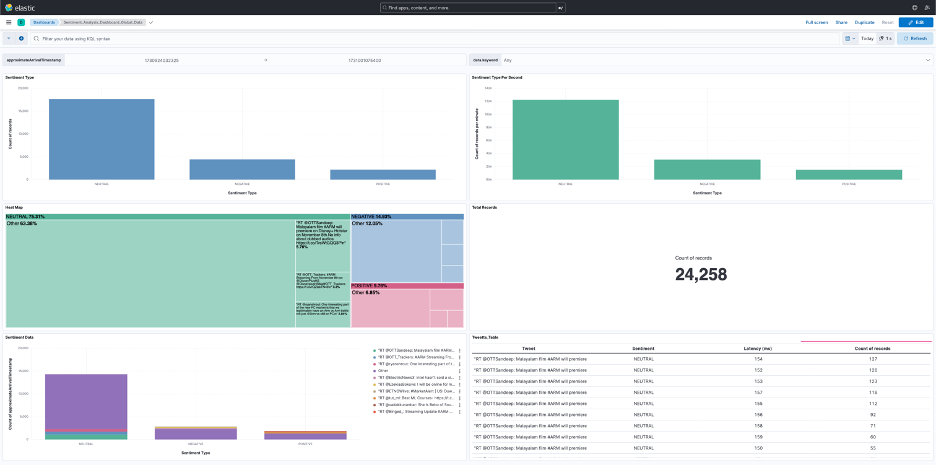

### Elasticsearch

Elasticsearch is a NoSQL database, search, and analytics engine. It is designed to store, search, and analyze large amounts of data. It has a real-time indexing capability which is crucial for handling high-velocity data streams such as X posts. 

### Kibana

Kibana is a customizable dashboard and visualization tool which integrates seamlessly with Elasticsearch. It provides valuable insights and opportunities to explore collected data by presenting it in multiple differing views. 

In this Learning Path, you will use a Kibana dashboard as an interface to interact with X data, apply filters, and receive alerts. 

### How do I install Elasticsearch and Kibana?

There are multiple ways to install Elasticsearch and Kibana. One of these methods is described here.

Before you begin, ensure that Docker and Docker Compose have been installed on your computer. 

Use a text editor to create a `docker-compose.yml` file, and copy-and-paste in the contents below:

```yml
version: '2.18.1'
services:
  elasticsearch:
    image: elasticsearch:8.15.2
    container_name: elasticsearch
    environment:
      - discovery.type=single-node
      - ES_JAVA_OPTS=-Xms512m -Xmx512m
      - xpack.security.enabled=false
      - HTTP_ENABLE=true
    ports:
      - "9200:9200"
    networks:
      - elk

  kibana:
    image: kibana:8.15.2
    container_name: kibana
    ports:
      - "5601:5601"
    environment:
      - ELASTICSEARCH_HOSTS=http://elasticsearch:9200
      - HTTP_ENABLE=true
    depends_on:
      - elasticsearch
    networks:
      - elk

networks:
  elk:
    driver: bridge
```

Use the following command to deploy Elasticsearch and the Kibana Dashboard:

```console
docker compose up
```
If you do not have the `docker compose` plugin already installed, you can install it through the following commands:

{}
sudo apt-get update
sudo apt-get install docker-compose-plugin
{}

After the dashboard is set up, use the public IP of your server on port `5601` to access the Kibana dashboard. See Figure 2.



Switch to *Stack Management* using the menu on the left side as Figure 3 shows.



To make sure that you are receiving the data from the sentiment analysis application through Elasticsearch, check whether you have the Data View enabled in Stack Management.



You can also check the types of attributes that are received as the Data Views. Now, you can switch to the dashboards on the left menu and start creating the visualizations to analyze the data.


Figure 6 shows a sample dashboard structure, displaying the records of different sentiments.


Similarly, you can design and create dashboards to analyze a particular set of data. The screenshot in Figure 7 shows the dashboard designed for this Learning Path.



Navigate to the `dashboards` directory in the cloned GitHub repository and locate the  `sentiment_dashboard.ndjson` file. 

Import this file into the Kibana dashboard and you should see a dashboard as shown in the previous step.