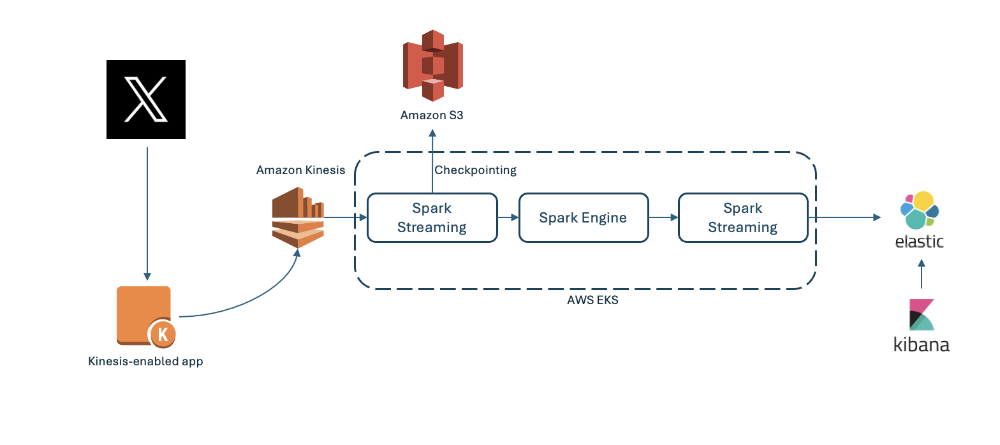

## What is sentiment analysis?

Sentiment analysis is a natural language processing technique used to identify and categorize opinions expressed in a piece of text, such as a tweet or a product review. It can help gauge public opinion, identify trends and patterns, and improve decision-making. Social media platforms, such as Twitter (X), provide a wealth of information about public opinion, trends, and events. Sentiment analysis is important because it provides insights into how people feel about a particular topic or issue, and can help to identify emerging trends and patterns.

## Can I perform real-time sentiment analysis using an Arm-based Amazon EKS cluster?

Yes, you can use EKS for sentiment analysis. 

Real-time sentiment analysis is a compute-intensive task and can quickly drive up resources and increase costs if not managed effectively. Tracking real-time changes enables you to understand sentiment patterns and make informed decisions promptly, allowing for timely and appropriate actions.

The architecture used for the solution is shown below:

The technology stack for the solution includes the following steps:

- Use the Twitter (X) developer API to fetch Tweets based on certain keywords
- Process the captured data using Amazon Kinesis
- Run a sentiment analysis model to classify the text and tone of the text
- Process the sentiment of Tweets using Apache Spark streaming API
- Use Elasticsearch and Kibana to store the processed Tweets and showcase the activity on a dashboard
- Monitor the CPU and RAM resources of the Amazon EKS cluster with Prometheus and Grafana
