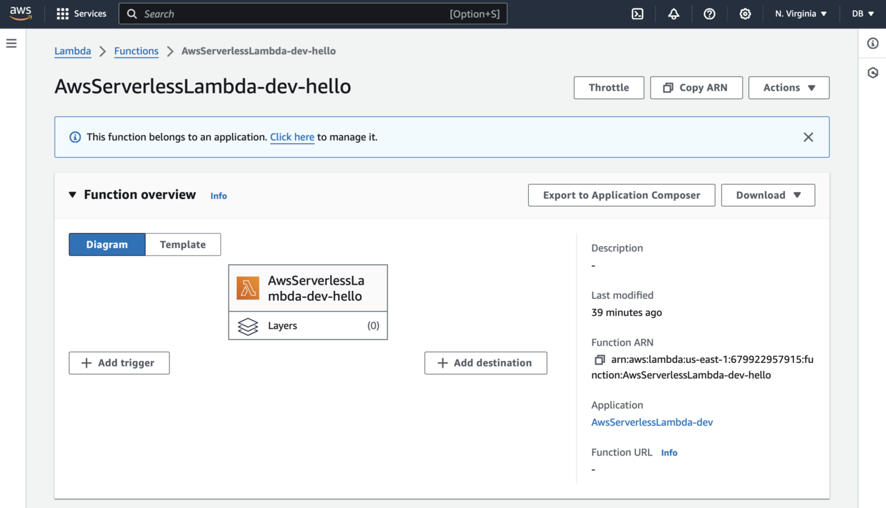

You are now ready to create a Serverless Framework and deploy the Lambda function.

## Create a project
Open the terminal or command prompt and type:

```console
serverless
```

This will start the wizard, in which you first select the Template. Use the arrow keys to select **AWS / Node.js / Simple Function** (as shown below) and then hit **Enter**:

```output
Welcome to Serverless Framework V.4

Create a new project by selecting a Template to generate scaffolding for a specific use-case.

? Select A Template: … 
  AWS / Node.js / HTTP API
  AWS / Node.js / Express API
  AWS / Node.js / Express API with DynamoDB
  AWS / Node.js / Scheduled Task
❯ AWS / Node.js / Simple Function
  AWS / Python / HTTP API
  AWS / Python / Flask API
  AWS / Python / Flask API with DynamoDB
  AWS / Python / Scheduled Task
  AWS / Python / Simple Function
```

Next, type the name for your project, e.g., **AwsServerlessLambda**. You will see the following output:

```console
Name Your Project: · AwsServerlessLambda

✔ Template Downloaded

This Template contains a Serverless Framework Service. Services are stacks of AWS resources, and can contain your entire application or a part of it (e.g. users, comments, checkout, etc.). Enter a name using lowercase letters, numbers and hyphens only.

? Serverless Framework V4 CLI is free for developers and organizations making less than $2 million annually, but requires an account or a license key.

Please login/register or enter your license key: … 
❯ Login/Register
  Get A License
  Enter A License Key
  Explain Licensing Basics
```

Select **Login/Register**. This will open the web browser where you can create a Serverless Framework account. Then use this account to login.

The wizard will display the following:
```console
Create or select an existing App below to associate with your Service, or skip.

? Create Or Select An Existing App: … 
  Create A New App
❯ Skip Adding An App
```
Select **Skip Adding An App**, and press Enter. You will see the following
```console
Your new Service "AwsServerlessLambda" is ready. Here are next steps:

• Open Service Directory: cd AwsServerlessLambda
• Install Dependencies: npm install (or use another package manager)
• Deploy & Develop Your Service: serverless dev
```

The project is now ready for deployment. Before deploying it, let's review the project files.

## Reviewing the project files
To review the project files created by the Serverless Framework CLI, navigate to the AwsServerlessLambda folder as follows:

```console
cd AwsServerlessLambda
```

Then list the directory files:
```console
ls
```

You will see the following:
```output
README.md
handler.js
serverless.yml
```

Open and view the contents of the `serverless.yml` file:
```yml
# "org" ensures this Service is used with the correct Serverless Framework Access Key.
org: <your_org>

# "service" is the name of this project. This will also be added to your AWS resource names.
service: AwsServerlessLambda

provider:
  name: aws
  runtime: nodejs20.x

functions:
  hello:
    handler: handler.hello
```

This `serverless.yml` file contains the organization or account name within the Serverless Framework's dashboard. It is used to group and manage services under a specific account in the Serverless Framework's cloud platform. This is particularly useful for managing multiple projects or teams.

The service keyword defines the name of your Serverless service. This name will be used as a prefix for all the AWS resources created by the framework. It helps in organizing and identifying resources associated with this particular service.

The provider section specifies the cloud provider and the runtime environment for your service:
* name: aws. This indicates that the service will be deployed to Amazon Web Services (AWS).
* runtime: nodejs20.x. This specifies the runtime environment for your AWS Lambda functions. Here, nodejs20.x indicates that the functions will run using Node.js version 20.x.

Next, you have the functions section, which defines the AWS Lambda functions that are part of this service: 
* hello. This is the name of the function. You can name it whatever you like, but in this case, it is named hello.
* handler: handler.hello. This specifies the handler method for the function. It follows the format file.method. **handler** is the name of the file (e.g., handler.js), and **hello** is the name of the exported function within that file.

The `serverless.yml` file defines a Serverless service named AwsServerlessLambda under the specified organization. The service is configured to run on AWS with Lambda functions using the Node.js 20.x runtime. It declares a single Lambda function named **hello**, which is handled by the hello method in the `handler.js` file.

Let's now open the handler.js:

```JavaScript
exports.hello = async (event) => {
  return {
    statusCode: 200,
    body: JSON.stringify({
      message: 'Go Serverless v4.0! Your function executed successfully!'
    })
  };
};
```

This JavaScript code defines a simple AWS Lambda function handler named **hello**. When triggered, it returns an HTTP response with a status code of 200 and a JSON-formatted message indicating that the function executed successfully. This handler function is designed to be used in a serverless environment, such as one managed by the Serverless Framework, and can be easily expanded to include more complex logic and event processing. For example, you can use Lambda to interact with other AWS resources.

## Deploy resources
After becoming familiar with the project, you can now deploy it to the AWS cloud. In the terminal or command prompt, type the following command:

```console
serverless deploy
```

You will see the following:
```console
Deploying "AwsServerlessLambda" to stage "dev" (us-east-1)
```

Let the Serverless Framework deploy the resources. After a few moments you will see the following:

```console
Service deployed to stack AwsServerlessLambda-dev (48s)

functions:
  hello: AwsServerlessLambda-dev-hello (1.5 kB)
```

To test the deployment use the following command:

```console
serverless invoke local --function hello
```

You will see the following output:
```output
{
    "statusCode": 200,
    "body": "{\"message\":\"Go Serverless v4.0! Your function executed successfully!\"}"
}
```

Finally, log into the AWS console. Change the region to us-east-1 (N. Virginia). Then, go to the Lambda dashboard to see the deployed Lambda function. It will be named *AwsServerlessLambda-dev-hello*:



## Summary
In this Learning Path, you learned about the Serverless Framework, its benefits, and its integration with Infrastructure as Code (IaC) for managing cloud resources. You set up the Serverless Framework for AWS and created a project. We explained its structure, specifically focusing on the serverless.yml file, including the structure and configuration options for setting up a basic Serverless service with AWS Lambda. Finally, we explored the Lambda handler function and deployed the resources to AWS.
