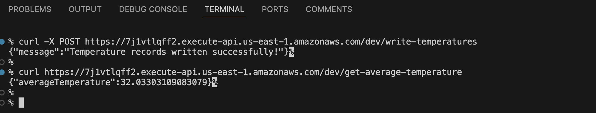

### Objective
In this section you will deploy the resources you declared earlier.

### Deployment
To deploy the resources, open the terminal or command prompt and navigate to AwsServerlessDynamoDbLambda folder. Then invoke the following command:

```console
serverless deploy
```

When you invoke the serverless deploy command, the Serverless Framework orchestrates a series of steps to deploy your serverless application to the specified cloud provider (e.g., AWS). Here’s a brief description of what happens during this process. The Serverless Framework validates your `serverless.yml` configuration file to ensure there are no syntax errors or missing information. Then, it compiles the service definition and resolves any variable references (e.g., environment variables or stage variables).

In the next step, the framework packages your application code, including all necessary dependencies, into a deployable artifact (e.g., a ZIP file). It respects any packaging configuration specified in the `serverless.yml`, such as including or excluding specific files or directories.

For AWS, the framework generates a CloudFormation template based on your service configuration, which describes the infrastructure and resources required (e.g., Lambda functions, API Gateway, DynamoDB tables). This template includes all resource definitions, IAM roles, permissions, and configuration settings.

The packaged artifact (code and configuration) is uploaded to the cloud provider’s storage (e.g., S3 for AWS). The framework handles authentication and authorization using the credentials and roles configured for the deployment.

The Serverless Framework initiates the deployment process by executing the infrastructure-as-code (IaC) template. For AWS, this involves creating or updating a CloudFormation stack, which provisions and configures all defined resources.

The cloud provider provisions the specified resources, such as Lambda functions, API Gateway endpoints, DynamoDB tables, S3 buckets, and any other services required by the application. IAM roles and permissions are configured to ensure that functions have the necessary access to interact with other resources.

Once deployment is successful, the framework outputs relevant information such as API endpoints, function ARNs, and any other specified outputs defined in your `serverless.yml`. In this case, you will see the following:

```output
endpoints:
  POST - https://7j1vtlqff2.execute-api.us-east-1.amazonaws.com/dev/write-temperatures
  GET - https://7j1vtlqff2.execute-api.us-east-1.amazonaws.com/dev/get-average-temperature
functions:
  writeTemperatures: AwsServerlessDynamoDbLambda2-dev-writeTemperatures (2.3 kB)
  getAverageTemperature: AwsServerlessDynamoDbLambda2-dev-getAverageTemperature (2.3 kB)
```

You can use the first URL to invoke the AWS Lambda that writes temperatures to the DynamoDB:
```console
curl -X POST <YOUR_URL_GOES_HERE>
```

Then, you invoke the second function that retrieves the records and averages them:
```console
curl <YOUR_URL_GOES_HERE>
```

The output of the above commands should be similar to the figure shown below:



To clean up the resources you created, you can use a single command:

```console
serverless remove
```

### Summary
In this Learning Path, you built a complete serverless application using the Serverless Framework, configured AWS resources, deployed Lambda functions, and ensured proper management and accessibility of the services. This workflow demonstrates how serverless architecture can simplify the deployment and scaling of cloud applications, allowing developers to focus on business logic rather than infrastructure management.
