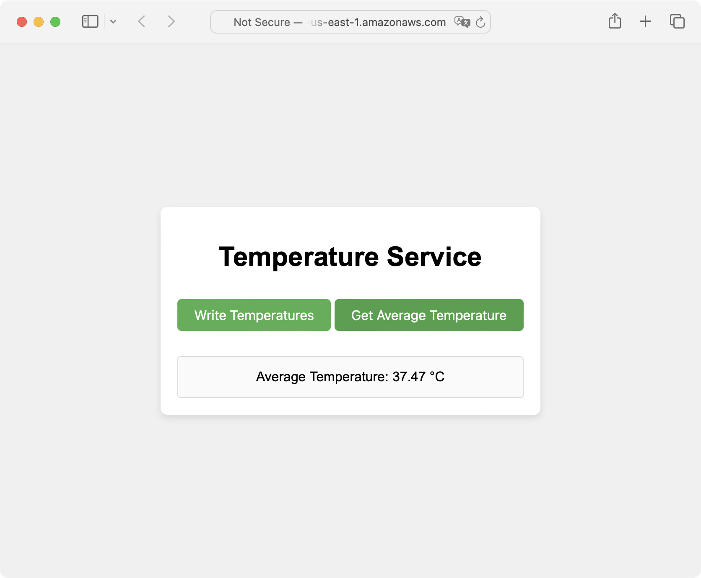

In this section you will deploy the resources you declared in the previous section.

### Deployment
To deploy the resources, open the terminal or command prompt and navigate to `AwsServerlessDynamoDbLambda` folder. Then invoke the following commands:

```console
npm install --save-dev   
serverless deploy
```

The first command will save required dependencies declared in `project.json`. The second command will deploy the AWS resources. After the deployment you will see the following output:

```output
Deploying "AwsServerlessDynamoDbLambdaS3" to stage "dev" (us-east-1)

⠹ Packaging
> aws-serverless-dynamodb-lambda-s3@1.0.0 prepare
> node prepare.js

(node:36980) [DEP0040] DeprecationWarning: The `punycode` module is deprecated. Please use a userland alternative instead.
(Use `node --trace-deprecation ...` to show where the warning was created)

1 deprecation found: run 'serverless doctor' for more details
index.js updated with dynamic endpoints successfully.
✔ Service deployed to stack AwsServerlessDynamoDbLambdaS3-dev (32s)
endpoints:
  POST - https://57vumbnapc.execute-api.us-east-1.amazonaws.com/dev/write-temperatures
  GET - https://57vumbnapc.execute-api.us-east-1.amazonaws.com/dev/get-average-temperature
functions:
  writeTemperatures: AwsServerlessDynamoDbLambdaS3-dev-writeTemperatures (83 kB)
  getAverageTemperature: AwsServerlessDynamoDbLambdaS3-dev-getAverageTemperature (83 kB)
```

Wait for the deployment to complete, and then type:

```console
serverless info --verbose
```

This command will generate the following output:
```output
service: AwsServerlessDynamoDbLambdaS3
stage: dev
region: us-east-1
stack: AwsServerlessDynamoDbLambdaS3-dev
endpoints:
  POST - https://57vumbnapc.execute-api.us-east-1.amazonaws.com/dev/write-temperatures
  GET - https://57vumbnapc.execute-api.us-east-1.amazonaws.com/dev/get-average-temperature
functions:
  writeTemperatures: AwsServerlessDynamoDbLambdaS3-dev-writeTemperatures
  getAverageTemperature: AwsServerlessDynamoDbLambdaS3-dev-getAverageTemperature
Stack Outputs:
  WriteTemperaturesEndpoint: https://57vumbnapc.execute-api.us-east-1.amazonaws.com/dev/write-temperatures
  GetAverageTemperatureEndpoint: https://57vumbnapc.execute-api.us-east-1.amazonaws.com/dev/get-average-temperature
  WriteTemperaturesLambdaFunctionQualifiedArn: arn:aws:lambda:<>:function:AwsServerlessDynamoDbLambdaS3-dev-writeTemperatures:16
  WebsiteURL: http://iot-temperature-service-dev-website.s3-website-us-east-1.amazonaws.com
  GetAverageTemperatureLambdaFunctionQualifiedArn: arn:aws:lambda:us-east-1:<>:function:AwsServerlessDynamoDbLambdaS3-dev-getAverageTemperature:16
  ServiceEndpoint: https://57vumbnapc.execute-api.us-east-1.amazonaws.com/dev
  ServerlessDeploymentBucketName: awsserverlessdynamodblamb-serverlessdeploymentbuck-jsu0xxspizjo
```

Use the `WebsiteURL` to open your website:



Click the Write Temperatures button to invoke the Lambda function that writes records to the DynamoDB. Then click the Get Average Temperature button to retrieve the average value. It will be displayed in the page.

To clean up the resources you created, you can use a single command:

```console
serverless remove
```

### Summary
In this Learning Path, you built a serverless solution that integrates AWS Lambda, DynamoDB, and S3 to create a scalable, cloud-based application with minimal operational overhead. Specifically, you configured and deployed essential AWS resources, including a DynamoDB table to store temperature data, two Lambda functions to manage this data (writing temperatures and calculating the average), and an S3 bucket to host a static website.

The Serverless Framework allowed you to automate the deployment and management of these AWS resources, reducing manual setup and ensuring consistent infrastructure as code. Using custom scripts, you dynamically updated the index.js file on the website with the actual API endpoints generated during deployment, ensuring seamless integration between the front-end and back-end services.

The S3 bucket was configured to host a static website, providing a user interface that allows interaction with the deployed Lambda functions through a web page.

By using plugins like serverless-s3-sync and serverless-plugin-scripts, you streamlined the deployment process, ensuring that local files are synced to S3 and custom scripts are executed as part of the deployment lifecycle.
