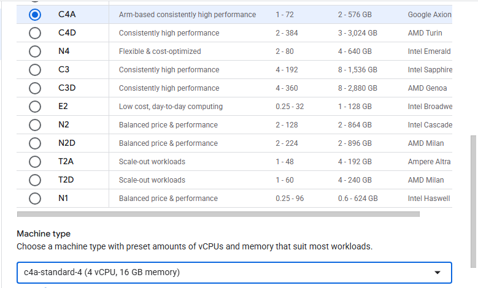

## How to create a Google Axion C4A Arm VM on Google Cloud

In this section, you learn how to provision a **Google Axion C4A Arm virtual machine** on Google Cloud Platform (GCP) using the **c4a-standard-4 (4 vCPUs, 16 GB memory)** machine type in the **Google Cloud Console**.  

For background on GCP setup, see the Learning Path [Getting started with Google Cloud Platform](/learning-paths/servers-and-cloud-computing/csp/google/).

### Create a Google Axion C4A Arm VM in Google Cloud Console

To create a virtual machine based on the C4A Arm architecture:
1. Navigate to the [Google Cloud Console](https://console.cloud.google.com/).
2. Go to **Compute Engine > VM Instances** and select **Create Instance**. 
3. Under **Machine configuration**:
   - Enter details such as **Instance name**, **Region**, and **Zone**.
   - Set **Series** to `C4A`.
   - Select a machine type such as `c4a-standard-4`.

   

4. Under **OS and Storage**, select **Change**, then choose an Arm64-based OS image.  
   For this Learning Path, use **Red Hat Enterprise Linux 9**. Ensure you select the **Arm image** variant. Click **Select**.
5. Under **Networking**, enable **Allow HTTP traffic**.
6. Click **Create** to launch the instance.
