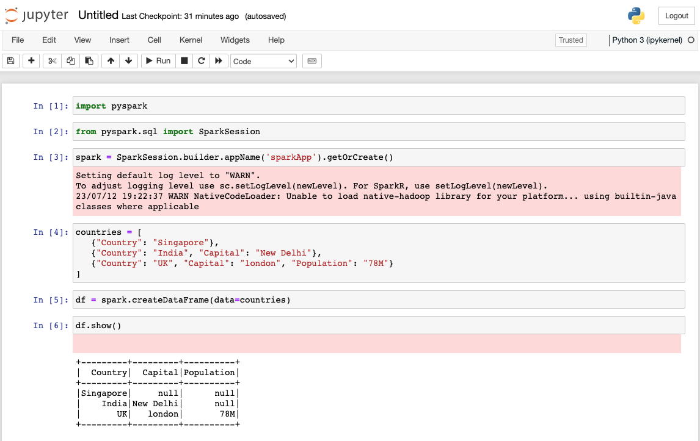

---
# User change
title: "Deploy a single node of Spark"

weight: 2 # 1 is first, 2 is second, etc.

# Do not modify these elements
layout: "learningpathall"
---

##  Deploy a single node of Spark 
Apache Spark is an open-source, distributed processing system used for big data workloads. It utilizes in-memory caching and optimized query execution for fast queries against data of any size. Spark is a fast and general engine for large-scale data processing.

You can deploy Spark on AWS Graviton processors using Terraform. 
In this learning path, you will deploy Spark on a single AWS EC2 instance. 
If you are new to Terraform, you should look at [Automate AWS EC2 instance creation using Terraform](/learning-paths/servers-and-cloud-computing/aws-terraform/terraform/) before starting this Learning Path.

## Before you begin

You should have the prerequisite tools installed before starting the learning path. 

Any computer which has the required tools installed can be used for this section. The computer can be your desktop or laptop computer or a virtual machine with the required tools. 

You will need an [AWS account](https://portal.aws.amazon.com/billing/signup?nc2=h_ct&src=default&redirect_url=https%3A%2F%2Faws.amazon.com%2Fregistration-confirmation#/start) to complete this learning path. Create an account if you don't have one.

Before you begin you will also need:
- An AWS access key ID and secret access key
- An SSH key pair

The instructions to create the keys are below.

### Acquire AWS Access Credentials 

The installation of Terraform on your desktop or laptop needs to communicate with AWS. Thus, Terraform needs to be able to authenticate with AWS.

To generate and configure the Access key ID and Secret access key, follow this [guide](/install-guides/aws_access_keys).
### Generate a SSH key-pair

Generate the SSH key-pair (public key, private key) using `ssh-keygen` to use for AWS EC2 access. To generate the key-pair, follow this [guide](/install-guides/ssh#ssh-keys).

{}
If you already have an SSH key-pair present in the `~/.ssh` directory, you can skip this step.
{}

## Create an AWS EC2 instance using Terraform

Using a text editor, save the code below in a file called `main.tf`.

```json
provider "aws" {
  region = "us-east-2" // Update AWS region if required
}

locals {
  common_tags = {
    Name = "Spark_TEST"
  }
}

resource "aws_default_vpc" "main" {
  tags = local.common_tags
}

resource "aws_instance" "Spark_TEST" {
  ami             = "ami-0ca2eafa23bc3dd01" // AMI ID for Ubuntu 22.04 on Arm in the us-east-2 region
  instance_type   = "t4g.small"             // Arm-based instance. Requires an Arm Linux distribution.
  security_groups = [aws_security_group.TerraformSecurity.name]
  key_name        = aws_key_pair.developer.key_name

  tags = local.common_tags
}

// Obtain the public IP address of the developer machine to grant access in the security group
data "http" "developer_public_ip" {
  url = "http://ipv4.icanhazip.com"
}

resource "aws_security_group" "TerraformSecurity" {
  name        = "TerraformSecurity"
  description = "Allow inbound traffic"
  vpc_id      = aws_default_vpc.main.id

  ingress {
    description = "Jupyter Notebook"
    from_port   = 8888
    to_port     = 8888
    protocol    = "tcp"
    cidr_blocks = ["${chomp(data.http.developer_public_ip.response_body)}/32"]
  }
  ingress {
    description = "SSH"
    from_port   = 22
    to_port     = 22
    protocol    = "tcp"
    cidr_blocks = ["${chomp(data.http.developer_public_ip.response_body)}/32"]
  }
  egress {
    from_port   = 0
    to_port     = 0
    protocol    = "-1"
    cidr_blocks = ["0.0.0.0/0"]
  }

  tags = local.common_tags
}

output "Master_public_IP" {
  value = [aws_instance.Spark_TEST.public_ip]
}

resource "aws_key_pair" "developer" {
  key_name   = "developer_id_rsa"
  public_key = file("~/.ssh/id_rsa.pub")
}

// Generate Ansible inventory file in tmp
resource "local_file" "inventory" {
  depends_on = [aws_instance.Spark_TEST]
  filename   = "/tmp/inventory"
  content    = << EOF
  [db_master]
  ${aws_instance.Spark_TEST.public_ip}         
  [all:vars]
  ansible_connection=ssh
  ansible_user=ubuntu
  EOF
}
```

Make the changes listed below in `main.tf` to match your account settings.

1. In the `provider` section, update the value to use your preferred AWS region.
2. (optional) In the `aws_instance` section, change the ami value to your preferred Linux distribution. The AMI ID for Ubuntu 22.04 on Arm in the us-east-2 region is `ami-0ca2eafa23bc3dd01 ` so no change is needed if you want to use Ubuntu AMI in us-east-2. The AMI ID values are region specific and need to be changed if you use another AWS region. Use the AWS EC2 console to find an AMI ID or refer to [Find a Linux AMI](https://docs.aws.amazon.com/AWSEC2/latest/UserGuide/finding-an-ami.html).

{}
The instance type is `t4g.small`. This is an Arm-based instance and requires an Arm Linux distribution.
{}

The inventory file is automatically generated and need not to be changed.

## Terraform Commands

Use Terraform to deploy the `main.tf` file.

### Create the cluster using Terraform

Run the following terraform commands to deploy the AWS cluster. `terraform init` to initialize the Terraform deployment. This command downloads the dependencies required for AWS. 

```console
terraform init    # initializes the Terraform deployment and downloads the dependencies required for AWS
terraform plan    # creates an prints execution plan
terraform apply   # applies the execution plan and creates all AWS resources
```

Answer `yes` to the prompt to confirm you want to create AWS resources.

The public IP address will be different, but the output should be similar to:

```output
Outputs:

Master_public_IP = [
  "18.217.147.103",
]
```
You can configure Spark either manually or by using Ansible. Choose one way and proceed using the steps outlined below.

## Configure Spark manually
**SSH to the instance**

Login to the deployed instance, using SSH to the public IP of the AWS EC2 instance.

``` console
ssh ubuntu@Master_public_IP
```
**Installation of required dependencies on AWS EC2 instance**

For deploying Spark on AWS graviton2, you need to install the tools and dependencies shown below on your EC2 instance:

```console
sudo apt-get update
sudo apt install openjdk-11-jdk python3-pip -y
pip3 install jupyter pyspark
export PATH=/home/ubuntu/.local/bin:$PATH
```

## Running Jupyter Notebook

Use the command below to run a Jupyter notebook on the instance:
```console
 jupyter notebook --ip="0.0.0.0"
```

For a successful launch, Jupyter prints the URLs containing a token to access the notebook. You need to replace the IP address in the URL with the external IP address of the instance (`Master_public_IP`) and paste it in your browser:

```console
    To access the notebook, open this file in a browser:
        file:///home/ubuntu/.local/share/jupyter/runtime/nbserver-15874-open.html
    Or copy and paste one of these URLs:
        http://ip-172-31-5-191:8888/?token=392463586bee6e1aa974cd254db8cee79f27ce9334ee22fa
     or http://127.0.0.1:8888/?token=392463586bee6e1aa974cd254db8cee79f27ce9334ee22fa
```

## Configure Spark by Ansible
Using a text editor, save the code below to a file called `spark.yaml`. This is the YAML file for the Ansible playbook to install Spark and the required dependencies. 

```yaml
- name: Spark config
  hosts: all
  become: true
  become_user: root
  become_method: sudo
  tasks:
    - name: Update the Instance & Install Dependencies
      apt:
        name:
          - openjdk-11-jdk
          - python3-pip
        update_cache: 'yes'
    - name: Install Jupyter and PySpark
      pip:
        name:
          - jupyter
          - pyspark
    - name: Creating a Jupyter service file
      copy:
        dest: /etc/systemd/system/jupyter.service
        content: |

          [Unit]
          Description=Jupyter Notebook Server

          [Service]
          User=ubuntu
          WorkingDirectory=/home/ubuntu/
          ExecStart= jupyter notebook --ip="0.0.0.0"
          Restart=always

          [Install]
          WantedBy=multi-user.target

    - name: Start service Jupyter
      systemd:
        name: jupyter.service
        state: restarted
    - name: Jupyter Notebook Server URL
      become_user: ubuntu
      shell: jupyter notebook list
      register: command_output
    - debug:
        var: command_output.stdout_lines
```

## Ansible Commands
Run the playbook using the `ansible-playbook` command:

```console
ANSIBLE_HOST_KEY_CHECKING=False ansible-playbook spark.yaml -i /tmp/inventory
```
Deployment may take a few minutes. For a successful launch, Ansible prints the URL containing a token to access the notebook. You need to replace the IP address in the URL with the external IP address of the instance (Master_public_IP) and paste it in your browser to connect with the Jupyter notebook:

```output
TASK [debug] *******************************************************************
ok: [34.205.127.53] => {
    "command_output.stdout_lines": [
        "Currently running servers:",
        "http://0.0.0.0:8888/?token=2df97b91c6695850cb091de073b1e1f2a4c34d81107d51db :: /home/ubuntu"
    ]
}

PLAY RECAP *********************************************************************
34.205.127.53              : ok=7    changed=2    unreachable=0    failed=0    skipped=0    rescued=0    ignored=0   
```

## Running Jupyter Notebook

Run the below code line by line in the Jupyter notebook:

```python
import pyspark
from pyspark.sql import SparkSession
spark = SparkSession.builder.appName('sparkApp').getOrCreate()
countries = [
   {"Country": "Singapore"},
   {"Country": "India", "Capital": "New Delhi"},
   {"Country": "UK", "Capital": "london", "Population": "78M"}
]
df = spark.createDataFrame(data=countries)
```
The Spark log level is set to warning by default and so you may find warnings when executing the code. Shown below is the interface of Jupyter notebook:



You have successfully deployed Spark on an AWS EC2 instance running on Graviton processors.

### Clean up resources

Run `terraform destroy` to delete all resources created.

```console
terraform destroy
```

