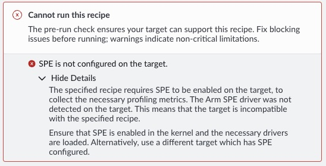

## What is Arm Statistical Profiling Extension

Arm Statistical Profiling Extension (SPE) is a hardware-assisted profiling feature in the Arm A-profile architecture. It was introduced with Armv8.2-A and has been extended in later architecture revisions. Most modern Arm-based systems will have SPE. 

Unlike traditional interrupt-driven sampling, SPE records rich metadata for sampled operations, including instruction context, memory address information, and latency-related attributes. This improves attribution accuracy and helps reduce the drift (also called skid) that can happen when mapping instructions to sampled counts.

For Arm Performix, this matters because the Memory Access recipe needs SPE data to connect memory behavior to specific instructions and code regions.

## Understand the platform layers that enable SPE

On Linux, SPE is available only when all required layers are aligned:

- **Architecture layer**: the CPU must implement SPE (common on Arm Neoverse systems and the Arm AGI CPU).
- **Firmware layer**: platform firmware must advertise the SPE PMU and its interrupt path through ACPI or Device Tree. Highly likely to be enabled.
- **Kernel layer**: the running kernel must include SPE PMU support through `CONFIG_ARM_SPE_PMU`.
- **Driver layer**: the `arm_spe_pmu` driver must initialize successfully (built-in or loaded as a module).

If any one of these layers is missing, Linux cannot expose SPE to profiling tools. Additionally, if your application runs in the cloud, your application typically runs on top of a hypervisor unless you instance type is a `metal` instance. 

{}
 
Cloud providers often disable low-level profiling features on shared (multi-tenant) instances. To use Performix memory access profiling, run your application on an Arm-based **bare-metal (metal) instance** with full hardware access. Be aware that this instance type typically incurs higher cost.

{}

## What is usually already present

On Neoverse-based systems, the architecture support is already present, and firmware support is often present as well, especially on bare-metal platforms. 

This Learning Path helps you quickly determine which case applies on your system and what action to take next. Given the plethora of linux distributions and kernel versions, this learning path is not meant as an exhaustive collection to steps but general guidance that can be applied to most configurations. 

## Check if Arm SPE is enabled

Open the Performix application from your local machine. Connect to your instance and click the `Recipes` tab, then the `Memory Access` recipe. This automatically triggers a precheck with the status printed at the bottom of the page. If you receive the **cannot run this recipe** status, we need to enable SPE to run the recipe.

If you receive a different error message, SPE is likely not the cause of your issue and we recommend to consult the Performix user guide. 

