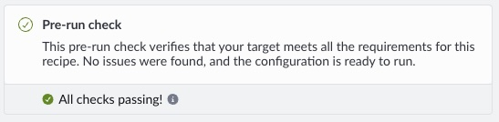
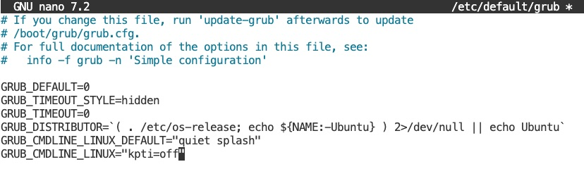

## Step 2.0 ) Install Linux Kernel Extra Modules

Typically, to reduce the size of an operating kernel and to configure a kernel to be optimized for a specific platform, the kernel modules are made available as a downloadable package. If your system outputted the following.

```output
CONFIG_ARM_SPE_PMU             = m
```

Run the following command, replacing `apt` with the package manager for your distribtion. This searches the packages index defined in your sources list for the extra modules package that matches your specific kernel version. We search first as there may be more than one result. 

```bash
sudo apt update
apt search "linux-modules-extra-$(uname -r)"
```

This shows there are 2 prebuild packages, a default version and one with `64kB page sizes`. 

```output
Sorting... Done
Full Text Search... Done
linux-modules-extra-6.17.0-1010-aws/noble-security,noble-updates,now 6.17.0-1010.10~24.04.1 arm64 [installed]
  Linux kernel extra modules for version 6.17.0 on DESC

linux-modules-extra-6.17.0-1010-aws-64k/noble-security,noble-updates 6.17.0-1010.10~24.04.1 arm64
  Linux kernel extra modules for version 6.17.0 on DESC
```

Install the version for your system, in our case we are using regular page sizes. 

```bash
sudo apt install linux-modules-extra-6.17.0-1010-aws -y 
```

Run the following command to try and extra information from the kernel module or display if it is not available.  

```bash
modinfo arm_spe_pmu 2>/dev/null || echo "arm_spe_pmu module not present"
```

```output
filename:       /lib/modules/6.17.0-1010-aws/kernel/drivers/perf/arm_spe_pmu.ko.zst
license:        GPL v2
author:         Will Deacon <will.deacon@arm.com>
description:    Perf driver for the ARMv8.2 Statistical Profiling Extension
...
```

## Step 2.1) Load the Kernel Module

Run the following command to load the kernel module and confirm it is running. 

```bash
sudo modprobe arm_spe_pmu
lsmod | grep arm_spe_pmu
```

If correctly loaded, you should see an output like the following. 

```output
arm_spe_pmu            24576  0
```

{}

To load the `arm_spe_pmu` kernel module during boot, create the `arm_spe_pmu.conf` file with the following command. This means you no longer need to manually load the module each time the system is restarted. 

```bash
echo arm_spe_pmu | sudo tee /etc/modules-load.d/arm_spe_pmu.conf
sudo systemctl restart systemd-modules-load.service
```


You do not need to reboot, but the next time you do the kernel module should automatically be loaded. When you next boot, you can confirm with the following command.

```bash
sudo dmesg | grep "arm_spe_pmu"
[    2.261719] arm_spe_pmu arm,spe-v1: probed SPEv1.1 for CPUs 0-63 [max_record_sz 64, align 64, features 0x17]
```

{}

Rerunning `sysreport` you should observe the following.

```output
  perf sampling:       SPE
```

Returning pack to performix the `memory access` recipe should now show `All checks passing!`. 



If not, there is a known limitation when running SPE on Neoverse V1 systems. 

#### (for Neoverse V1 based systems) Enabling Kernel Page Table Isolation (KPTI)

On certain Neoverse V1 systems, for example AWS Graviton 3, SPE buffer mapping can fail when Kernel Page Table Isolation (KPTI) is enabled. This issue has been observed in practice on Neoverse V1 and is not known to apply to other Neoverse cores. The `CPU types:` label in `sysreport.py` can confirm if your instance is based on Neoverse V1

If all of the following conditions are met:

	•	The system is based on Neoverse V1
	•	The kernel includes SPE PMU support
	•	The platform exposes the SPE PMU
	•	sysreport still reports `perf sampling: None`


Use an editor of your choice to update `GRUB_CMDLINE_LINUX` bootload configuration in the `/etc/default/grub` file with `kpti=off` as per the image below.  



{}

**Please Note:** Disabling KPTI has security implications and should only be done on trusted systems.

{}

Run the following command to reboot the system.

```bash
sudo update-grub
sudo reboot
```