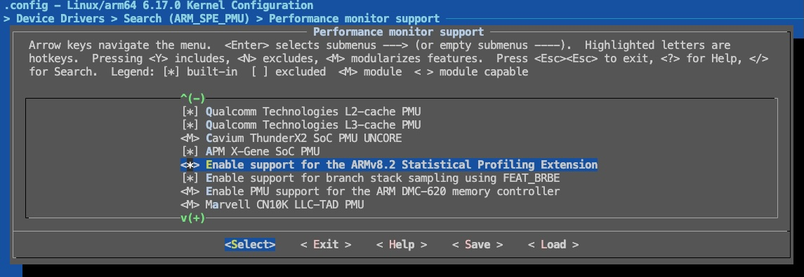

## Step 3.0) Try another Operating System / Kernel

Many applications spend the majority of their execution is user space and very little of the CPU cycles are in kernel mode, performing tasks such as handling files. Even if your application spend a significant proportion of time in kernel mode, using a newer kernel or a different kernel is unlikely to result in a material change in performance unless you are intentionally making use of a newer kernel feature. As such, we recommend trying an alternative OS/Kernel as opposed to rebuilding the kernel with SPE enabled as this is far quicker. If you are sure you want to rebuild the exact kernel with SPE enabled, proceed to step 3.1. 

{}
If you are unsure where your application is spending time, a basic command such as the one below can give you a high-level estimate of the ratio of user to kernel (also known as system) time.

```bash
/usr/bin/time -v <path to your application> 2>&1 | grep -e "User time" -e "System time"
```

In the [Mandelbrot example](https://learn.arm.com/learning-paths/servers-and-cloud-computing/cpu_hotspot_performix/how-to-3/) ~0.3% of the execution time is in kernel space. 

```output
        User time (seconds): 47.52
        System time (seconds): 0.14
```
{}

The quickest solution to run the memory access recipe on your application is to try on a difference operating system. If using a cloud-based operating system this generally trivially. The information below is only accurate as of the time of writing so support for SPE may evolve over time. If you have easy access to the following cloud service providers, we recommend running your application on the following operating systems. 




| Operating System      | Description |
| ----------- | ----------- |
| Amazon Linux 2023 AMI     | Run on a metal instance (e.g., `c<n>g.metal` where <n> corresponds to the desired the graviton generation)       |
| Paragraph   | Text        |



?? To test


?? To test



## Step 3.1) (Optional) Rebuild Kernel from Source with ARM SPE

If your current system does not provide a kernel with Statistical Profiling Extension (SPE) enabled, you can rebuild the kernel with the required configuration. This approach is more involved than switching operating systems and should only be used if necessary.

### Distribution-specific considerations

Most Linux distributions (for example Ubuntu or Debian) ship kernels with their own patches and configuration defaults. As a result, you should follow your distribution’s official kernel build guide rather than using a generic upstream process. In some environments (e.g. cloud platforms), you may also need to build against a provider-specific kernel variant.

- [Ubuntu: Build your own kernel](https://wiki.ubuntu.com/Kernel/BuildYourOwnKernel)  
- [Debian: Kernel building tutorial](https://wiki.debian.org/BuildingTutorial)

### Enabling ARM SPE in the kernel configuration

The key requirement is to ensure that the `CONFIG_ARM_SPE_PMU` option is enabled in the kernel `.config`.

If you already have a configured kernel tree, you can enable it directly using:

```bash
scripts/config --enable ARM_SPE_PMU
```

This modifies the `.config` file programmatically and sets:
```
CONFIG_ARM_SPE_PMU=y
```

After modifying the config, run:

```bash
make olddefconfig
```

to resolve any dependencies and ensure the configuration is consistent.

### Using the interactive configuration menu

Alternatively, you can enable the option via the interactive terminal UI:

```bash
make menuconfig
```

- Press `/` to search
- Enter `ARM_SPE_PMU`
- Select the option when it appears
- Press:
  - `y` to build it into the kernel (`=y`)
  - `m` to build it as a module (`=m`)

In most cases, building it into the kernel (`y`) is preferred for profiling.

