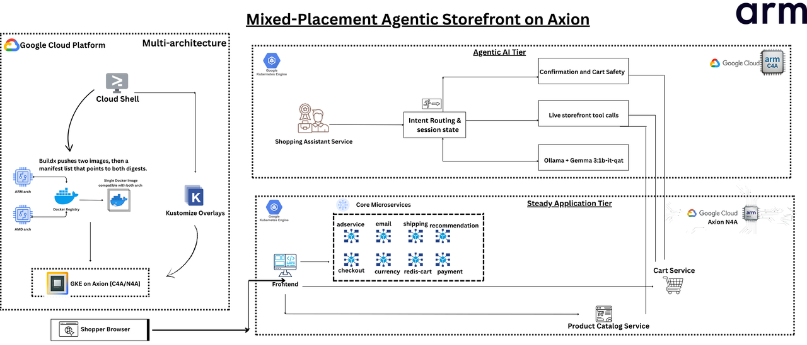

## How the application is organized

Modern AI applications often contain more than one workload shape. A storefront tier is steady, service-oriented, and always on. An AI assistant tier is burstier and more latency-sensitive because it performs reasoning work only when users ask for help.

This Learning Path uses that split in a live Online Boutique storefront on Google Kubernetes Engine (GKE). The storefront starts on N4A nodes powered by Google Axion processors. You add the missing `shoppingassistantservice`, run it on N4A first, and then move only that assistant tier to C4A.

The goal isn't to prove that one Axion-based machine series replaces the other. You use N4A for the steady storefront tier and evaluate C4A for the AI reasoning tier so you can decide which machine series fits each workload.



The diagram shows the final mixed-placement pattern you build toward. The storefront images already run on Arm nodes, and the assistant image you build later is `linux/arm64` because both target node pools are Arm-based.

## How the storefront already runs on Arm

The storefront baseline uses container images that can run on Arm nodes. A common way to publish portable container images is to use a multi-architecture image, which is one image reference that contains variants for more than one CPU architecture, such as `linux/amd64` and `linux/arm64`.

When Kubernetes schedules a pod that uses a multi-architecture image on an Arm node, the container runtime pulls the Arm-compatible variant from the same image reference. That is why the storefront can already run on Axion nodes before you build the assistant image.

This Learning Path starts with Arm-compatible storefront images already available. To learn the full build-and-publish workflow for multi-architecture images on GKE, see [Migrate x86 workloads to Arm on Google Kubernetes Engine with Axion processors](/learning-paths/servers-and-cloud-computing/gke-multi-arch-axion/).

Inspect a public multi-architecture image manifest:

```bash
docker buildx imagetools inspect docker.io/library/python:3.12-slim
```

The output is similar to:

```output
Name:      docker.io/library/python:3.12-slim
MediaType: application/vnd.oci.image.index.v1+json

Manifests:
  Platform: linux/amd64
  Platform: linux/arm64/v8
```

The exact digest values can differ. The important signal is that one image reference can include an Arm-compatible variant. You confirm the storefront image reference from the source tree in the setup step.

## How the assistant works

The `shoppingassistantservice` is the AI layer for the application. It runs as its own Kubernetes service and receives assistant requests from the storefront frontend.

The assistant uses live storefront services as tools:

- `search_catalog` queries `productcatalogservice`.
- `get_product_details` fetches a specific product from the live catalog.
- `get_cart` reads the current cart from `cartservice`.
- `add_to_cart` updates the cart only after user confirmation.

The assistant sends grounded context to a local Ollama sidecar in the same pod. The sidecar runs the `gemma3:1b-it-qat` model for the reasoning step.

This design keeps the comparison focused. You don't add a separate vector database, retrieval pipeline, or hosted large language model API. You move the assistant logic and local reasoning runtime together as one AI tier.

## How requests flow through the storefront

When a shopper uses the assistant, the request follows this path:

1. The browser sends the request to `frontend`.
2. `frontend` forwards the request to `shoppingassistantservice`.
3. The assistant calls live services such as `productcatalogservice` and `cartservice`.
4. The assistant sends grounded context to the local Ollama sidecar.
5. The assistant returns the response through `frontend`.

The assistant is agentic because it does more than generate text. It uses application tools, keeps short-lived session state, and asks for confirmation before it calls `cartservice` to update the cart.

## What you've learned and what's next

You've learned why the storefront tier and AI assistant tier use different Axion placements. You also saw how Arm-compatible image variants make the existing storefront portable to Axion nodes.

Next, you'll set up environment variables, connect to the GKE cluster, and clone the source tree that contains the assistant implementation.
