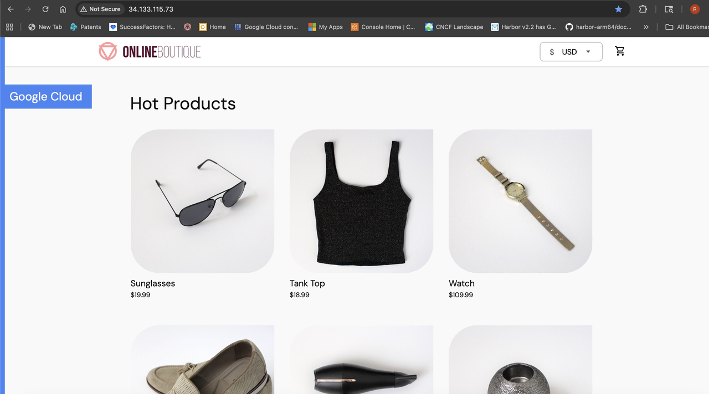

## Check the starting architecture

Before you add the assistant tier, create and confirm the starting state of the application:

- The cluster contains N4A and C4A node pools.
- The storefront baseline runs on N4A after you apply the baseline overlay.
- `shoppingassistantservice` is not running yet.

The missing assistant is intentional. It's the service you build and deploy in the next steps.

If you're running this Learning Path in a cluster that already has the assistant from an earlier run, remove the old assistant resources before you create the baseline:

```bash
kubectl delete deployment shoppingassistantservice --ignore-not-found
kubectl delete service shoppingassistantservice --ignore-not-found
kubectl delete serviceaccount shoppingassistantservice --ignore-not-found
```

## Deploy the storefront baseline

Create a Kustomize overlay that runs the baseline storefront on the N4A node pool:

```bash
mkdir -p kustomize/overlays/storefront-n4a

cat <<EOF > kustomize/overlays/storefront-n4a/kustomization.yaml
apiVersion: kustomize.config.k8s.io/v1beta1
kind: Kustomization
resources:
- ../../base
patches:
- path: node-selector.yaml
  target:
    kind: Deployment
EOF

cat <<EOF > kustomize/overlays/storefront-n4a/node-selector.yaml
- op: add
  path: /spec/template/spec/nodeSelector
  value:
    cloud.google.com/gke-nodepool: ${N4A_NODE_POOL_NAME}
- op: add
  path: /spec/template/spec/tolerations
  value:
  - key: kubernetes.io/arch
    operator: Equal
    value: arm64
    effect: NoSchedule
EOF
```

Render the overlay and confirm that the N4A node pool value is present:

```bash
sed -n '1,120p' kustomize/overlays/storefront-n4a/kustomization.yaml
sed -n '1,120p' kustomize/overlays/storefront-n4a/node-selector.yaml
kubectl kustomize kustomize/overlays/storefront-n4a | sed -n '1,240p'
```

Don't apply the overlay if the rendered node-pool value is blank.

Apply the baseline and wait for the storefront deployments:

```bash
kubectl apply -k kustomize/overlays/storefront-n4a
kubectl rollout status deployment/frontend --timeout=600s
kubectl rollout status deployment/cartservice --timeout=600s
kubectl rollout status deployment/checkoutservice --timeout=600s
kubectl rollout status deployment/productcatalogservice --timeout=600s
kubectl rollout status deployment/recommendationservice --timeout=600s
kubectl rollout status deployment/shippingservice --timeout=600s
kubectl rollout status deployment/paymentservice --timeout=600s
kubectl rollout status deployment/currencyservice --timeout=600s
kubectl rollout status deployment/emailservice --timeout=600s
kubectl rollout status deployment/adservice --timeout=600s
```

## List the cluster nodes

Show the node pool, instance type, and CPU architecture for each node:

```bash
kubectl get nodes \
  -L cloud.google.com/gke-nodepool,node.kubernetes.io/instance-type,kubernetes.io/arch
```

The output includes the N4A node pool, the C4A node pool, and `arm64` nodes in both pools.

## List the running application pods

Check the running storefront pods:

```bash
kubectl get pods -o wide
```

Filter the output to the most relevant services:

```bash
kubectl get pods -o wide | \
  grep -E 'frontend|cartservice|checkoutservice|productcatalogservice|shoppingassistantservice'
```

At this point, `frontend`, `cartservice`, `checkoutservice`, and `productcatalogservice` should be running. `shoppingassistantservice` shouldn't appear yet.

## Resolve the storefront endpoint

Capture the external storefront URL:

```bash
export FRONTEND_IP="$(kubectl get service frontend-external \
  -o jsonpath='{.status.loadBalancer.ingress[0].ip}')"
export APP_URL="http://${FRONTEND_IP}"

echo "${APP_URL}"
```

The output is similar to:

```output
http://34.x.x.x
```

If the external IP is empty, wait a minute and run the commands again.

## Verify that the storefront responds

Send a header request to the storefront:

```bash
curl --max-time 30 -I "${APP_URL}"
```

The output should include an HTTP response header. A `200 OK` or `302 Found` response confirms that the baseline storefront is reachable.

Open the printed URL in your browser to load the Online Boutique storefront.



## What you've accomplished and what's next

You've now confirmed that the storefront runs on N4A and that the assistant tier is still absent. This gives you a clean baseline before you add the AI service.

Next, you'll inspect the assistant implementation and confirm that its source files are ready to build.
