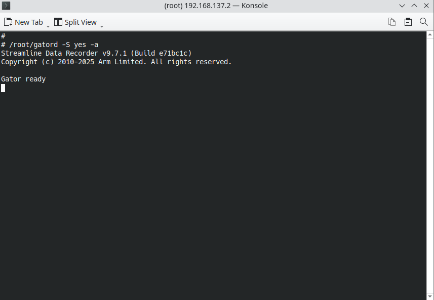
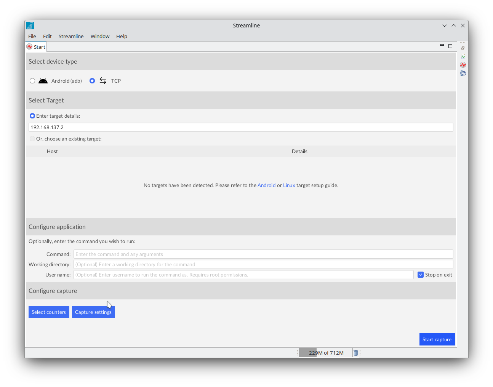
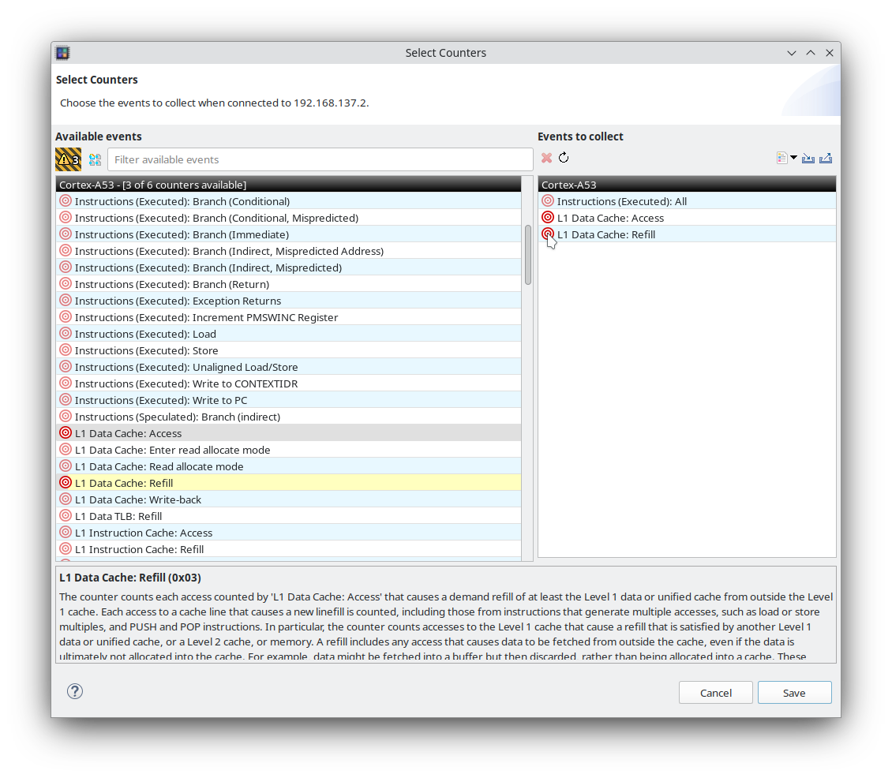
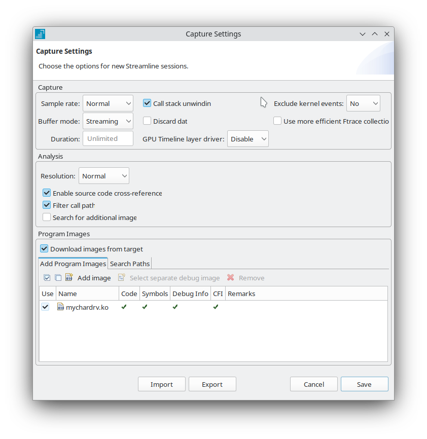
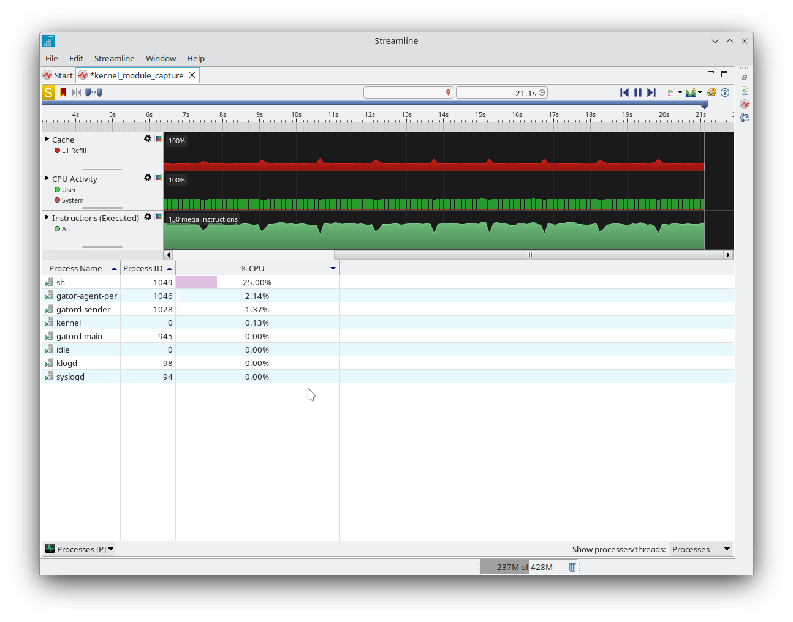
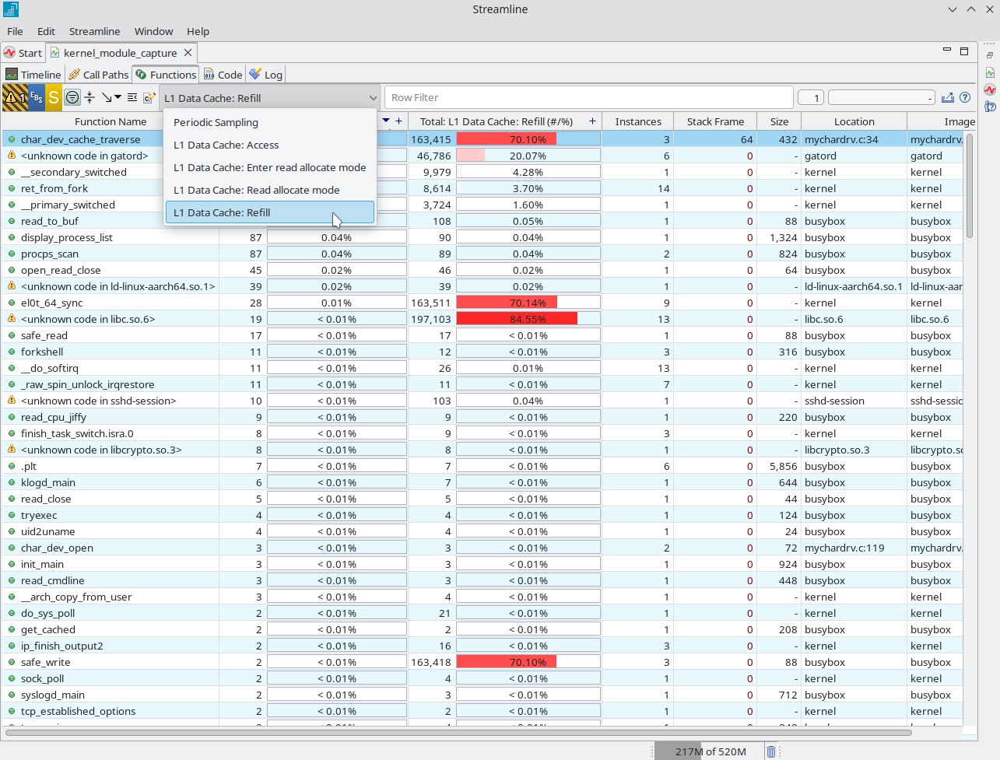
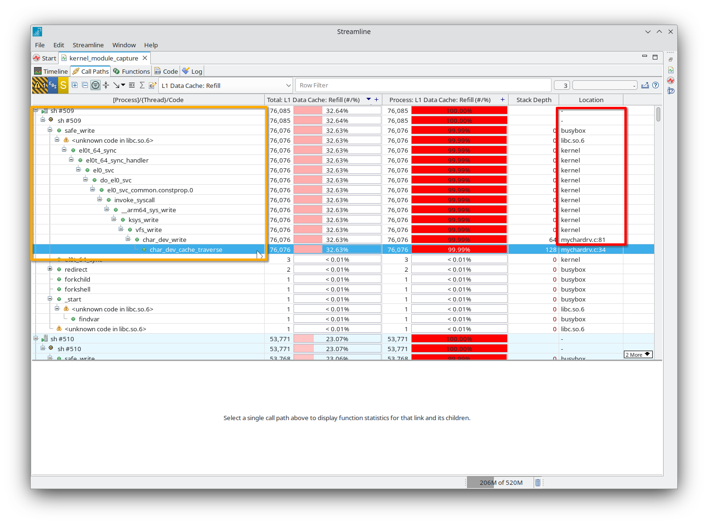

## Use Streamline to profile an out-of-tree kernel module

Arm Streamline is a tool that uses sampling to measure system performance. Instead of recording every single event (like instrumentation does, which can slow things down), it takes snapshots of hardware counters and system registers at regular intervals. This gives a statistical view of how the system runs, while keeping the overhead small.

Streamline tracks many performance metrics such as CPU usage, execution cycles, memory access, cache hits and misses, and GPU activity. By putting this information together, it helps developers see how their code is using the hardware. Captured data is presented on a timeline, so you can see how performance changes as your program runs. This makes it easier to notice patterns, find bottlenecks, and link performance issues to specific parts of your application.

For more details about Streamline and its features, refer to the [Streamline user guide](https://developer.arm.com/documentation/101816/latest/Getting-started-with-Streamline/Introduction-to-Streamline).

Streamline is included with Arm Performance Studio, which you can download and use for free from [Arm Performance Studio downloads](https://developer.arm.com/Tools%20and%20Software/Arm%20Performance%20Studio#Downloads).

For step-by-step guidance on setting up Streamline on your host machine, follow the installation instructions provided in [Streamline installation guide](https://developer.arm.com/documentation/101816/latest/Getting-started-with-Streamline/Install-Streamline).

### Pushing Gator to the Target and Making a Capture

Once Streamline is installed on the host machine, you can capture trace data of our Linux kernel module.

1. To communicate with the target, Streamline requires a daemon, called **gatord**, to be installed and running on the target. gatord must be running before you can capture trace data. There are two pre-built gatord binaries available in Streamline's install directory, one for *Armv7 (AArch32)* and one for *Armv8 or later(AArch64)*. Push **gatord** to the target device using **scp**.

    ```bash
    scp <install_directory>/streamline/bin/linux/arm64/gatord root@<target-ip>:/root/gatord
    # use arm instead of arm64, if your are using an AArch32 target
    ```

2. Run gator on the target to start system-wide capture mode.

    ```bash
    /root/gatord -S yes -a
    ```

    

3. Open Streamline and choose *TCP mode*.

4. Enter your target hostname or IP address.


5. Click on *Select counters* to open the counter configuration dialogue, to learn more about counters and how to configure them please refer to [counter configuration guide](https://developer.arm.com/documentation/101816/latest/Capture-a-Streamline-profile/Counter-Configuration)

6. Add `L1 data Cache: Refill` and `L1 Data Cache: Access` and enable Event-Based Sampling (EBS) for both of them as shown in the screenshot and click *Save*.

  {}
  To learn more about EBS, please refer to [Streamline user guide](https://developer.arm.com/documentation/101816/9-7/Capture-a-Streamline-profile/Counter-Configuration/Setting-up-event-based-sampling)
  {}

  

7. In the Command section, we will add the same shell command we used earlier to test our Linux module.

    ```bash
    sh -c "echo 10000 > /dev/mychardrv"
    ```

    

8. In the Capture settings dialog, select Add image, add your kernel module file `mychardrv.ko` and click Save.


9. Start the capture and enter a name and location for the capture file. Streamline will start collecting data and the charts will show activity being captured from the target.


### Analyze the capture and inspect the code

Once the capture is stopped, Streamline automatically analyzes the collected data and provides insights to help identify performance issues and bottlenecks. This section describes how to view these insights, starting with locating the functions related to our kernel module and narrowing down to the exact lines of code that may be responsible for the performance problems.

1. Open the *Functions tab*. In the counters list, select one of the counters we selected earlier in the counter configuration dialog, as shown:



2. In the Functions tab, observe that the function `char_dev_cache_traverse()` has the highest L1 Cache refill rate, which we already expected.
  Also notice the Image name on the right, which is our module file name `mychardrv.ko`:


3. To view the call path of this function, right click on the function name and choose *Select in Call Paths*.

4. You can now see the exact function that called `char_dev_cache_traverse()`. In the Locations column, notice that the function calls started in the userspace (echo command) and terminated in the kernel space module `mychardrv.ko`:


5. Since we compiled our kernel module with debug info, we will be able to see the exact code lines that are causing these cache misses.
  To do so, double-click on the function name and the *Code tab* opens. This view shows you how much each code line contributed to the cache misses and in bottom half of the code view, you can also see the disassembly of these lines with the counter values of each assembly instruction:


{}
You may need to configure path prefix substitution in the Code tab to view the source code correctly. For details on how to set this up and for more information about code analysis, please refer to [Streamline user guide](https://developer.arm.com/documentation/101816/latest/Analyze-your-capture/Analyze-your-code?lang=en)
{}