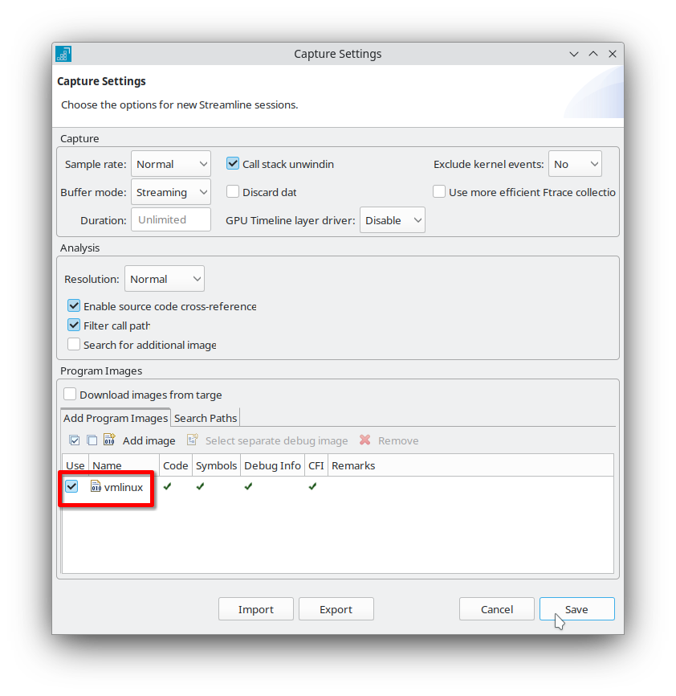
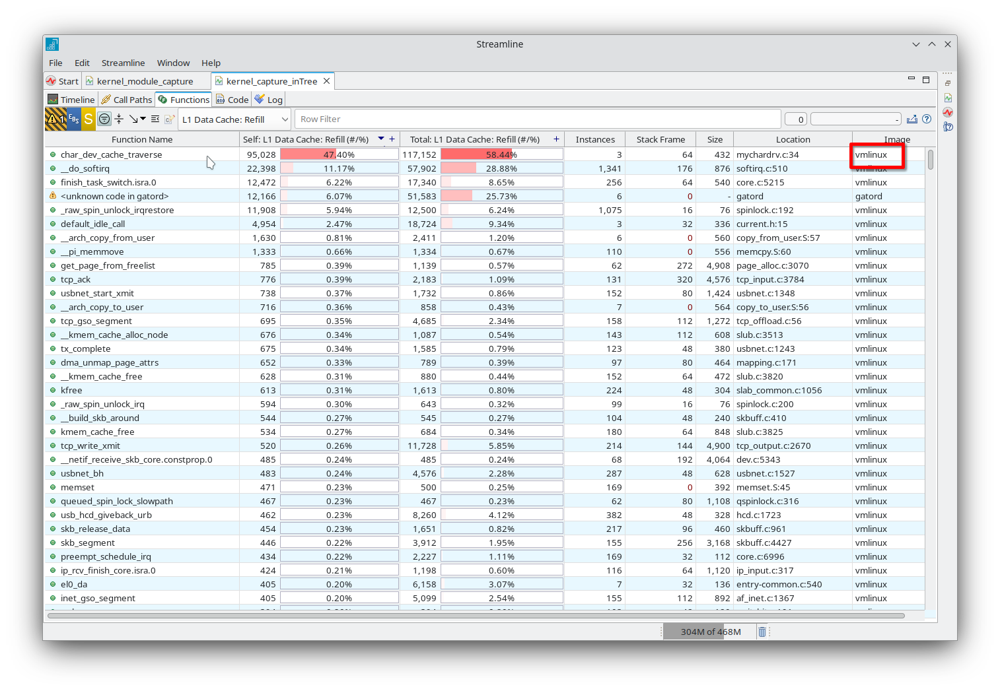
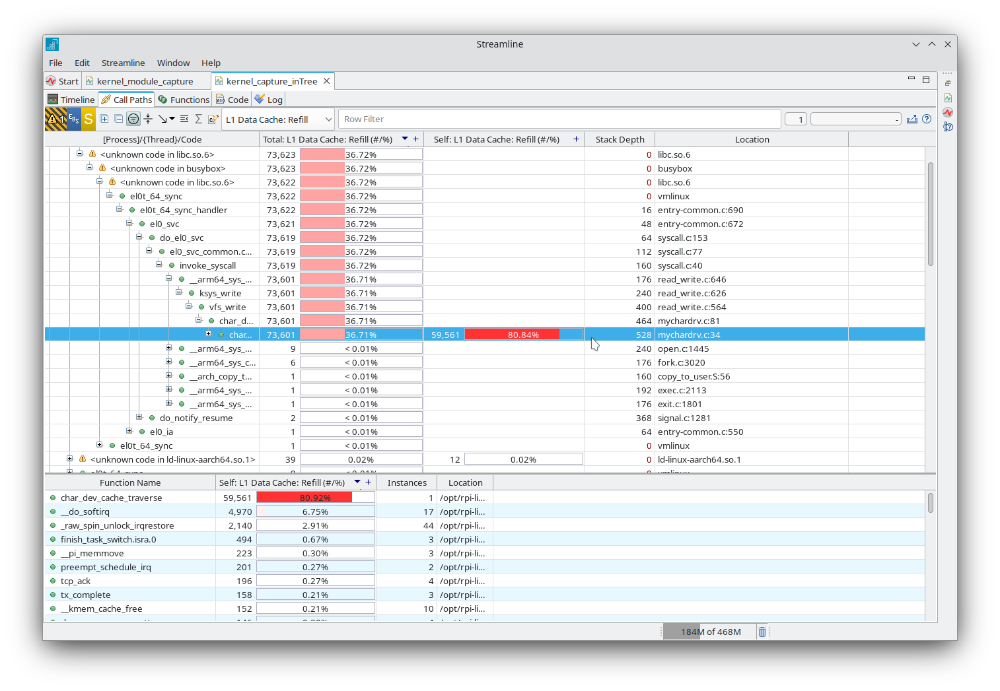

## Use Streamline to profile an in-tree kernel driver

Profiling in-tree drivers follows almost the same process as profiling an out-of-tree kernel module. The steps include:

1. Transferring gator to the target device using scp.

2. Launching Streamline, selecting TCP view, and entering the target’s IP or hostname.

3. Setting up counters and enabling Event-Based Sampling (EBS).

The main difference is that, instead of adding the kernel module’s object file as the capture image in Capture settings, we now use the Linux ELF file (vmlinux) generated by Buildroot.

After clicking Save in Capture settings dialog, you can start the capture and analyze it as we did before.

Since we used vmlinux image we can view our driver functions as well as all other kernel functions that were sampled during our capture.
You can also view the full Call path of any sampled function within the kernel.

