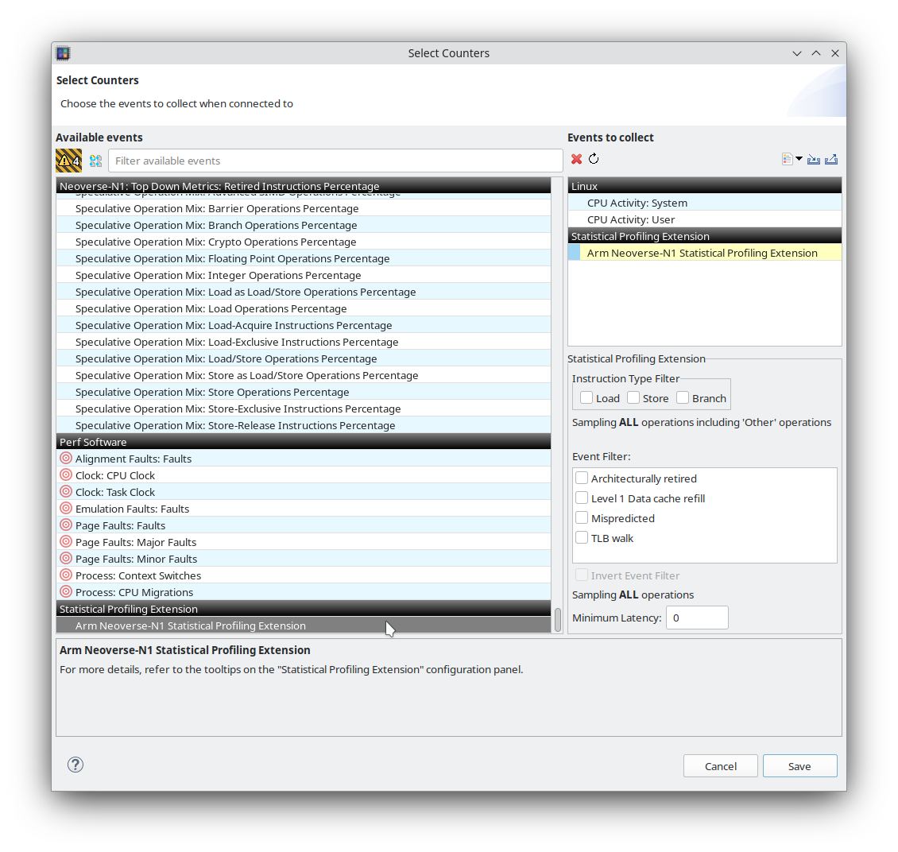

## Using the Statistical Profiling Extension (SPE) for better analysis

With periodic sampling, Streamline collects CPU performance data using hardware counters and software interrupts. Hardware counters only give totals, so you can’t see which exact instructions caused the events. At best, you can link the counts to a broad section of code. This makes it harder to pinpoint problems. Sampling the Program Counter (PC) or call stack is also limited, since software timers handle both sampling and unwinding.

The Statistical Profiling Extension (SPE) removes these limits. It samples the PC in hardware, directly inside the CPU pipeline. This adds almost no overhead, so the sampling rate can be much higher. SPE also records extra details about each sampled instruction, giving a much clearer view of how the code runs. For more details on SPE and how it works in Streamline see [this blog post](https://community.arm.com/arm-community-blogs/b/tools-software-ides-blog/posts/introduction-to-statistical-profiling-support-in-streamline).

To find out if your target supports SPE, please see [Streamline user guide](https://developer.arm.com/documentation/101816/9-7/Capture-a-Streamline-profile/Counter-Configuration/Configure-SPE-counters).

### Profiling Kernel Module Using SPE

To profile both in-tree and out-of-tree kernel modules, we can use the same setup steps as before. The only change is to add “Arm Statistical Profiling Extension” to the Events to Collect list in the Counter Configuration dialog.

After saving the counter configurations, Click Start capture to begin data collection, then wait for Streamline to analyze results.

To view SPE counter values, Select SPE in the data source drop-down in the Call paths, Functions, or Code view.

As shown in the image, SPE provides much more data about the profiled code than Event-Based Sampling (EBS), which provides us with deep insights into the CPU performance bottlenecks with very low overhead. It's also possible to view or hide columns from the table in Call paths or Functions views by menu-clicking on the table header and choosing from the list of columns.

