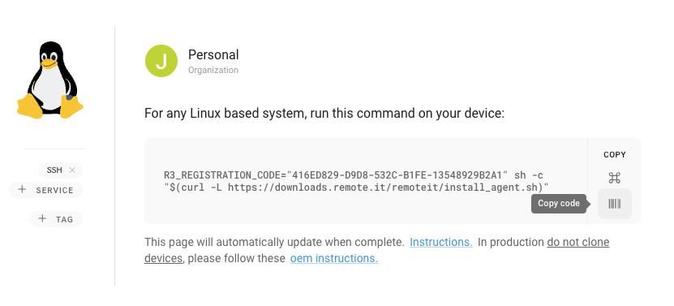
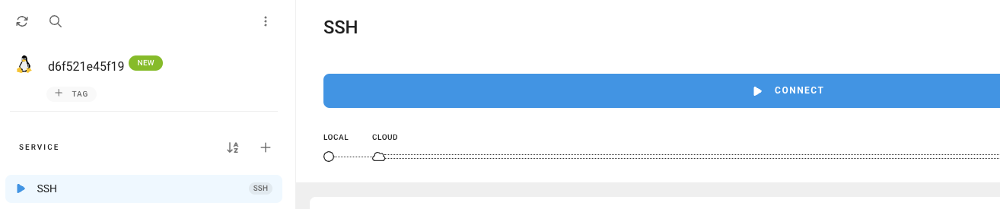
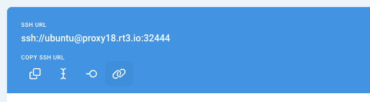

---
# User change
title: "Install Supervisor, SSH, and Remote.It"
weight: 3

layout: "learningpathall"

---

You can update the container to install Supervisor and create a container with multiple services.

The `Dockerfile` below includes some extra software for debug and test. 

Here are the changes:
- Install SSH and enable password login
- Install and configure Remote.It
- Add a Supervisor configuration file 

Use a text editor to replace your `Dockerfile` with the new file below:

```console
FROM ubuntu:24.04

RUN apt-get update && apt-get install -y curl iproute2 sudo openssh-server sudo vim apache2 supervisor procps uuid-runtime

# Configure SSH for password login
RUN mkdir -p /var/run/sshd
RUN sed -i '/PasswordAuthentication no/c\PasswordAuthentication yes' /etc/ssh/sshd_config
RUN sed 's@session\s*required\s*pam_loginuid.so@session optional pam_loginuid.so@g' -i /etc/pam.d/sshd

# Configure Remote.It
RUN mkdir -p /etc/remoteit
RUN touch /etc/remoteit/registration
RUN sh -c "$(curl -L https://downloads.remote.it/remoteit/install_agent.sh)"

# Configure Supervisor
COPY supervisord.conf /etc/supervisor/conf.d/supervisord.conf

# Setup default user
RUN useradd --create-home -s /bin/bash -m ubuntu && echo "ubuntu:ubuntu" | chpasswd && adduser ubuntu sudo
RUN echo '%sudo ALL=(ALL) NOPASSWD:ALL' >> /etc/sudoers

EXPOSE 80
CMD ["/usr/bin/supervisord"]
```

You will also need a configuration file for Supervisor. 

Use a text editor to create a file named `supervisord.conf` with the following contents:

```console
[supervisord]
user=root
nodaemon=true
logfile = /var/log/supervisord.log
pidfile=/var/run/supervisord.pid

[program:sshd]
command=/usr/sbin/sshd -D

[program:remoteit-agent]
command=/usr/share/remoteit/refresh.sh

[program:apache2]
command=/usr/sbin/apache2ctl -DFOREGROUND
```

Build the container using:

```console
docker build -t supervisord-dev  .
```

Before running the container, you need a registration code from Remote.It. 

Log in to your account at https://app.remote.it.

From the dashboard click the + icon and select the Linux icon to add a new device.

Copy the generated registration code by clicking the bar code symbol under COPY as shown below:



With this code you can launch the container. Substitute your registration code instead of the one shown below:

```console
docker run -d -e R3_REGISTRATION_CODE=416ED829-D9D8-532C-B1FE-13548929B2A1 -p 80:80 supervisord-dev
```

Once the container starts on your local machine, you can open your browser to [https://localhost](http://localhost) and see the Apache welcome screen.

You will also see the device in your Remote.It dashboard. 

In the dashboard, start the SSH connection by clicking the CONNECT bar as shown below:



Once connected, get the values for the PUBLIC ENDPOINT:



You can now SSH directly into the container. The username for the container is `ubuntu` and the password is also `ubuntu`. If desired, you can change this in the Dockerfile.

Change to your endpoint values in the command below to SSH:

```console
ssh ssh://ubuntu@proxy18.rt3.io:32443
```

You are now inside the container as the `ubuntu` user.

Notice that the SSH port was not shared by the container. 


