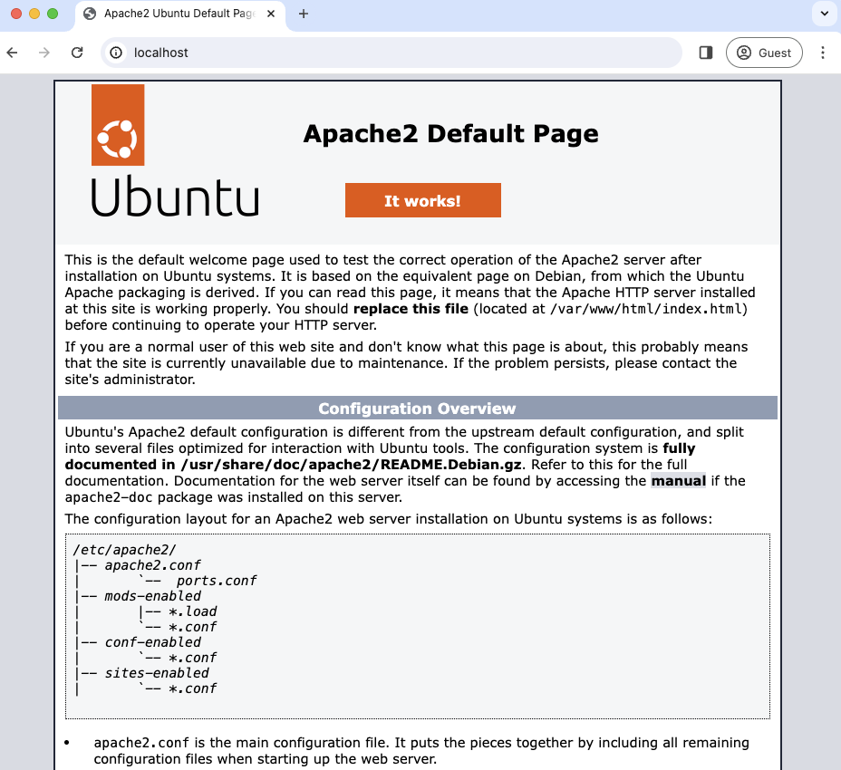

---
# User change
title: "Introduction to remote container access"

weight: 2

layout: "learningpathall"

---

## Accessing containers

As a developer, you may need to access a running container to debug problems or manually test changes. You might think you can SSH to the container and do some work at a shell prompt but opening a port for SSH is a security risk and may not be allowed in your environment.

In addition to security concerns, containers typically run the `ENTRYPOINT` or `CMD` as the last line of a Dockerfile. It's best to separate concerns and put one service in each container. This restriction makes it difficult to add another service like the SSH daemon during debug and test. 

You might be able to wrap multiple processes in a script to create a single `CMD` for your Dockerfile but that also may be hard to do. 

Another solution is to use a process manager.

This Learning Path explains how to use Supervisor, SSH, and Remote.It to access running containers. 

## Supervisor

One way to setup container access is to use [Supervisor](http://supervisord.org/), a client/server system that allows you to create a number of processes in a container.

You can use `supervisord` to run multiple services in a container and use Remote.It and SSH for debugging and testing inside a running container.

You can try it first on your local machine and then try it in a cloud service, AWS Fargate.

## Before you begin

You will need an Arm Linux computer with Docker installed and a free Remote.It account. You will also need an AWS account to try the solution in AWS Fargate. If you need an AWS account, you can sign up at https://aws.amazon.com.

To install Docker, refer to the [Docker install guide](/install-guides/docker/). [Learn how to use Docker](/learning-paths/cross-platform/docker) may also be useful if you would like more background on Docker. 

You will also use Remote.It for container access. For more background information, refer to [Access remote devices with Remote.It](/learning-paths/cross-platform/remoteit/).

## An example project

You can use an Apache web server running on Ubuntu 24.04 as an example application. It serves a simple `index.html` file which is visible in a browser.

To begin, use a text editor to copy the code below into a file named `Dockerfile`:

```console
FROM ubuntu:24.04

RUN apt-get update
RUN apt-get install -y apache2

EXPOSE 80
CMD ["/usr/sbin/apache2ctl", "-DFOREGROUND"]
```

Build the container using `docker build`:

```console
docker build -t apache -f Dockerfile .
```

Run the container on your local machine using `docker run`:

```console
docker run -d --rm --name test1 -p 80:80 apache
```

Open your browser to [https://localhost](http://localhost)

You will see the Apache welcome screen. This is the default file found at `/var/www/html/index.html`.



Imagine this is a real application and you need to debug something or you want to try a manual change.

If you are working on your local machine, you can use `docker exec` to enter the container.

Use the container name (or container id) to open a shell:

```console
docker exec -it test1 /bin/bash
```

If the container is running on a remote machine or service like AWS Fargate it will be more difficult. 

You can stop the container using:

```console
docker stop test1
```

The next section explains how to use Supervisor, SSH, and Remote.It to access the container, no matter where it is running.
