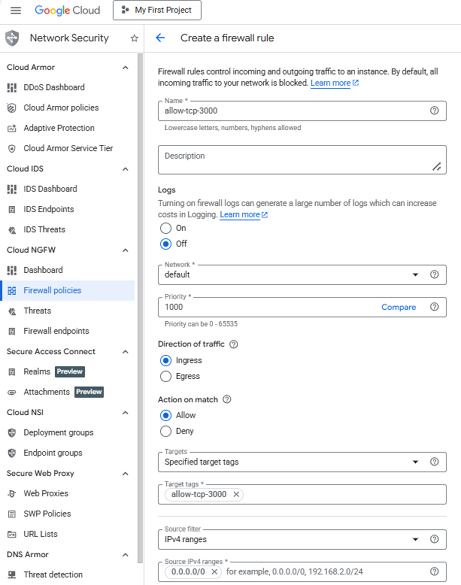
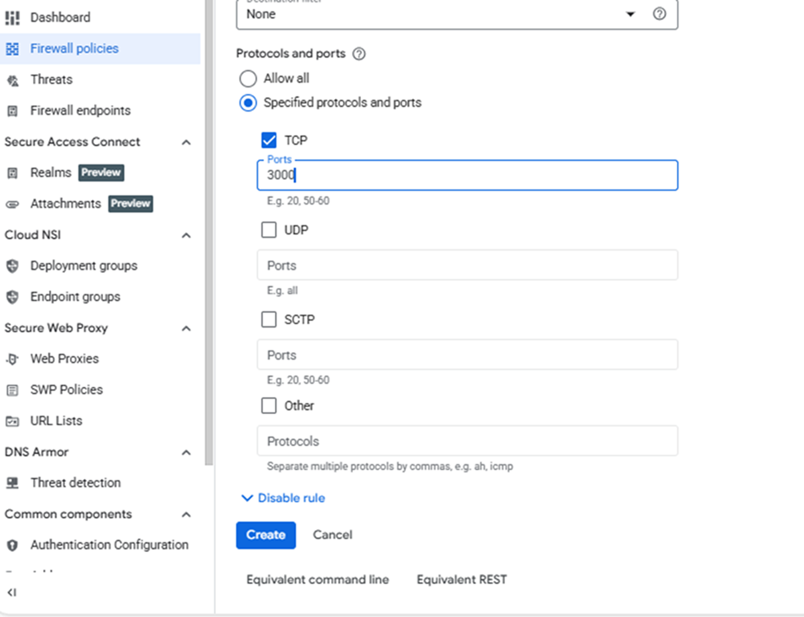

Create a firewall rule in Google Cloud Console to expose TCP port 3000 for the TimescaleDB (Grafana) management interface.

{}
For support on GCP setup, see the Learning Path [Getting started with Google Cloud Platform](/learning-paths/servers-and-cloud-computing/csp/google/).
{}

## Configure the firewall rule

Navigate to the [Google Cloud Console](https://console.cloud.google.com/), go to **VPC Network > Firewall**, and select **Create firewall rule**.

Next, create the firewall rule that exposes TCP port 3000.
Set the **Name** of the new rule to "allow-tcp-3000". Select your network that you intend to bind to your VM (default is "autoscaling-net" but your organization might have others).

Set **Direction of traffic** to "Ingress". Set **Allow on match** to "Allow" and **Targets** to "Specified target tags". Enter "allow-tcp-3000" in the **Target tags** text field. Set **Source IPv4 ranges** to "0.0.0.0/0".

Finally, select **Specified protocols and ports** under the **Protocols and ports** section. Select the **TCP** checkbox, enter "3000" in the **Ports** text field, and select **Create**.

## What you've accomplished and what's next

You've successfully:

* Created a firewall rule in Google Cloud to expose port 3000 for Grafana web interface access
* Configured network ingress rules to allow remote connections to your dashboard

Next, you'll provision a Google Axion C4A Arm virtual machine and apply this firewall rule to enable external access to Grafana.
