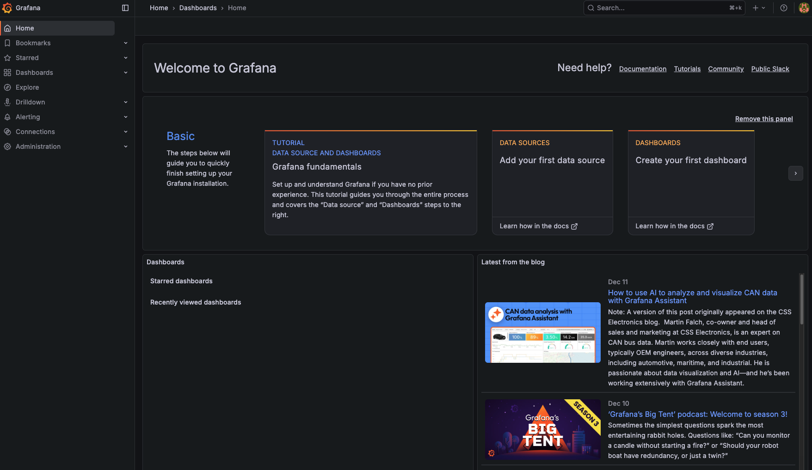

## Grafana Setup & TimescaleDB Data Source

In this section, you install Grafana on a SUSE Arm64 virtual machine, access its web interface, and connect it to TimescaleDB. Grafana acts as the visualization layer that queries TimescaleDB and displays time-series data in dashboards.

This setup enables real-time monitoring and analytics of sensor or application data stored in TimescaleDB.

## Architecture (At This Stage)

```text
Python Sensor Ingest Script
        |
        v
TimescaleDB (PostgreSQL)
        |
        v
Grafana Dashboard
```

## Install Grafana on SUSE (Arm64)

Grafana is available via RPM packages and works natively on Arm64.

```bash
cd $HOME
sudo zypper addrepo https://rpm.grafana.com grafana
sudo zypper refresh
sudo zypper install -y grafana
```

### Enable and start Grafana

```bash
sudo systemctl start grafana-server
sudo systemctl enable grafana-server
```

**Verify status:**

```bash
sudo systemctl status grafana-server
```

The output is similar to:

```output
● grafana-server.service - Grafana instance
     Loaded: loaded (/usr/lib/systemd/system/grafana-server.service; enabled; vendor preset: disabled)
     Active: active (running) since Tue 2026-02-17 08:57:45 UTC; 1h 31min ago
````

## Access Grafana Web UI

Open your browser and navigate to:

```bash
http://<VM-PUBLIC-IP>:3000
```

### Default Login Credentials

| Field    | Value |
| -------- | ----- |
| Username | admin |
| Password | admin |

You will be prompted to change the password on first login. Provide and save off a new password. Re-login if needed using the new password:


You will be presented with the main dashboard for Grafana:



## Add TimescaleDB as a Data Source

### Step 1: Open Data Sources

From the Grafana sidebar:

```bash
Connections → Data sources → Add data source
```

### Step 2: Choose PostgreSQL

Select PostgreSQL (TimescaleDB is PostgreSQL-compatible).


### Step 3: Configure Connection Settings

Fill the form exactly as below:

| Field         | Value                          |
| ------------- | ------------------------------ |
| Host URL      | `localhost:5432`               |
| Database name | `sensors`                      |
| Username      | `postgres`                     |
| Password      | `<postgres password saved>`    |
| TLS/SSL Mode  | `disable`                      |


**Scroll down and click:**

```text
Save & Test
```

You should see "Database connection OK."


## What You Have Accomplished

- Installed Grafana on SUSE Arm64
- Logged into Grafana UI
- Connected Grafana to TimescaleDB successfully

## What’s Next

In the next section, you will create a live dashboard to visualize real-time sensor temperature data.
