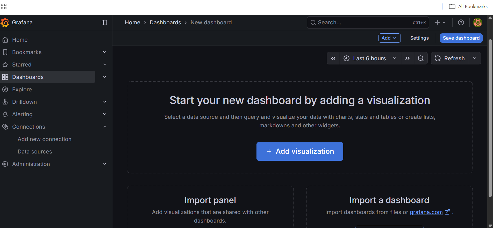
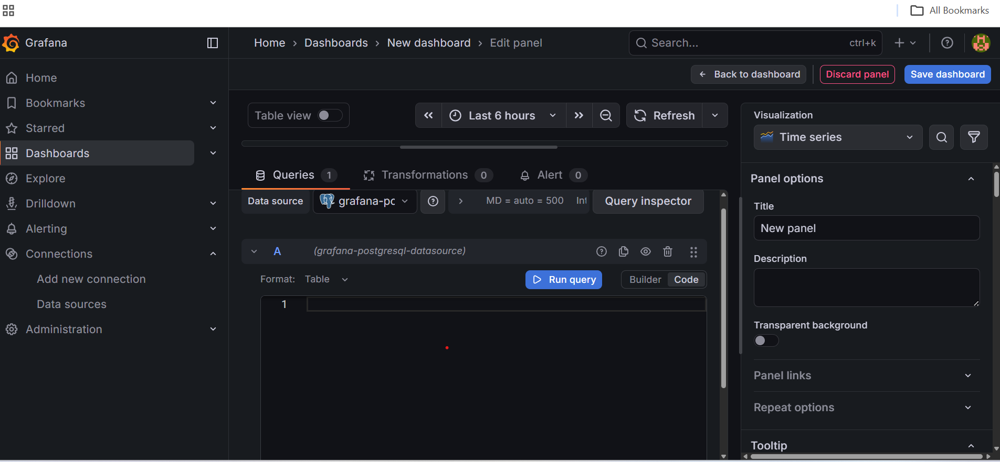
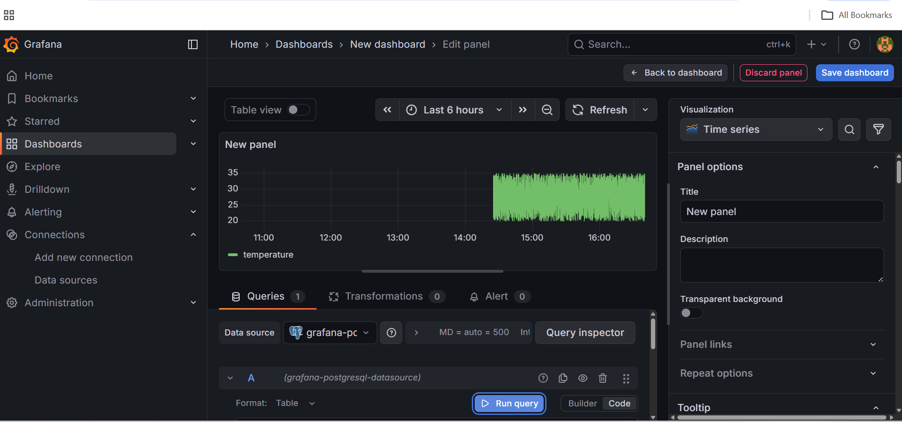

## Create a Live Sensor Temperature Dashboard

In this section, you will create a **real-time Grafana dashboard** that visualizes **live temperature data** stored in **TimescaleDB**.

This dashboard continuously updates and helps you monitor sensor temperature changes in near real time.

## Prerequisites

Before proceeding, ensure the following are already completed:

- TimescaleDB is installed and running
- Grafana is installed and accessible
- PostgreSQL (TimescaleDB) data source is configured in Grafana
- Live data ingestion into the `sensor_data` table is running

You can verify live ingestion with:

```bash
sudo -u postgres psql -c "SELECT COUNT(*) FROM sensor_data;"
```

The count should increase over time.

## Access Grafana

Open Grafana in your browser:

```bash
http://<GRAFANA_PUBLIC_IP>:3000
```

Log in using your Grafana credentials.

## Create a New Dashboard

- From the left sidebar, select** Dashboards**
- Click **New dashboard**
- Select Add a **new panel**

You will be redirected to the Edit panel screen.

## Configure the Live Sensor Query

In the Query section:

- Data source: PostgreSQL / TimescaleDB
- Query type: SQL
- Format: Time series



Paste the following query:

```sql
SELECT
  time AS "time",
  temperature
FROM sensor_data
WHERE $__timeFilter(time)
ORDER BY time;
```



This query retrieves live sensor temperature data within the selected time range.

## Configure Panel Visualization

Apply the following settings in the right-hand panel:

**Visualization Settings**

- Visualization: Time series
- Panel title: Live Sensor Temperature
- Table view: Disabled

**Time & Refresh Settings**

- Time range: Last 5 minutes
- Refresh interval: 5s

These settings ensure the panel refreshes automatically with new data.

## Validate the Live Sensor Panel

Once configured, the panel should display a continuously updating temperature graph.



## Save the Dashboard

- Click Save dashboard (top-right corner)
- Enter a name, for example: Live Sensor Monitoring Dashboard
- Click Save

The dashboard is now active.

## What You've Accomplished

You have successfully:

- Created a Grafana dashboard from scratch
- Queried live TimescaleDB data using Grafana macros
- Built a real-time time-series visualization
- Configured automatic refresh for monitoring use cases

This confirms that Grafana, TimescaleDB, and your ingestion pipeline are working end-to-end.
