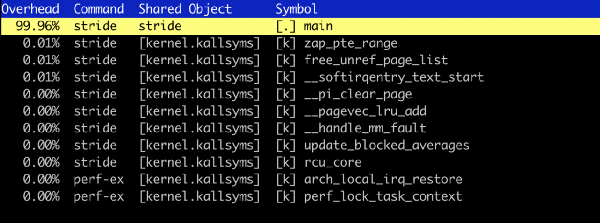
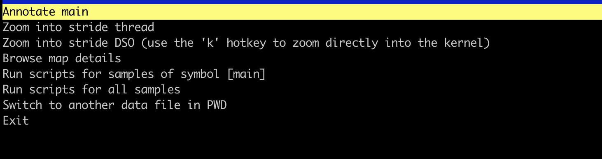
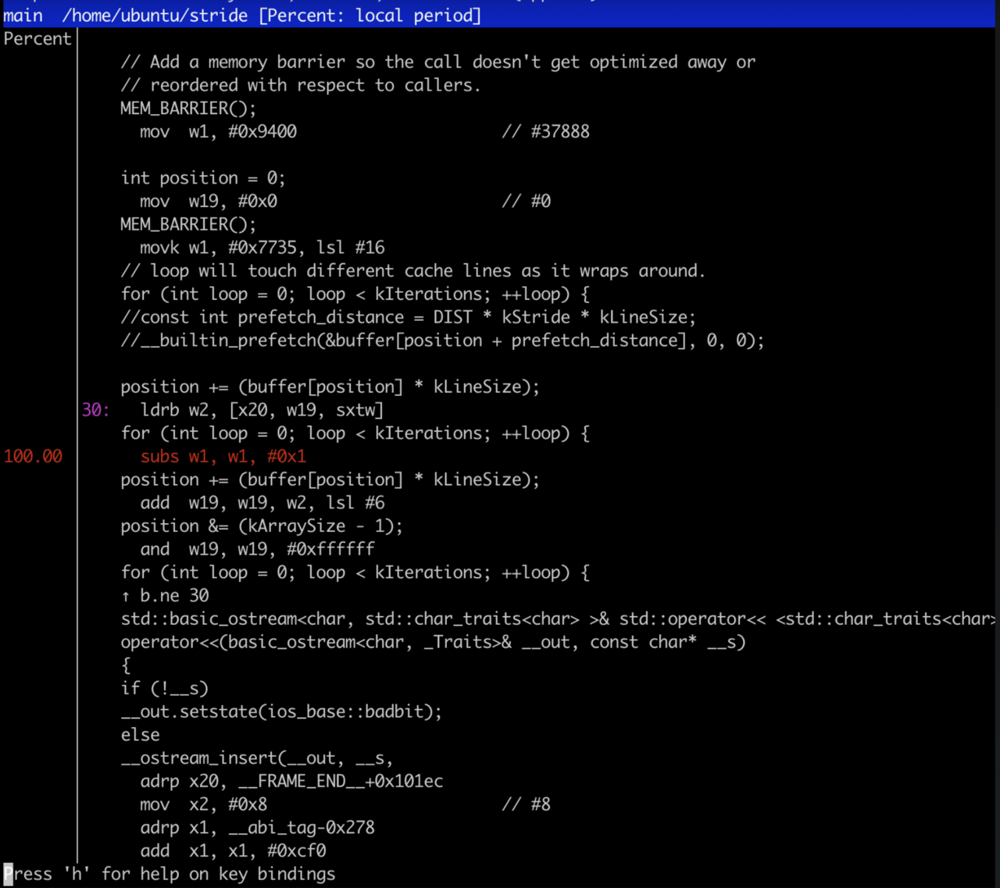

{}
The hardware used in the white paper is the [Neoverse N1 Software Development Platform (N1SDP)](https://developer.arm.com/Tools%20and%20Software/Neoverse%20N1%20SDP). This hardware is different from Neoverse N1 servers and cloud instances so your results will be different.

You can also run this Learning Path on single board computers with the Cortex-A76 processors and the results will be closer to those in the white paper. Example boards include the [Raspberry Pi 5](https://www.raspberrypi.com/products/raspberry-pi-5/), [Khadas Edge2](https://www.khadas.com/edge2), and [Orange Pi 5](http://www.orangepi.org/html/hardWare/computerAndMicrocontrollers/details/Orange-Pi-5.html).

The example output provided is from the Khadas Edge2, but yours will be different with different hardware.
{}

The white paper explains the definitions of the metrics and the performance analysis results for the stride benchmark in more detail. The section below provides the collection commands and interpretation of the metrics in the same order as the white paper.

## Workload characterization using counting

### Cycle accounting

##### Instructions per Cycle (IPC)

The first metric is instructions per cycle and uses the instruction count, clock cycle count, and calculates IPC.

To collect the IPC using `perf` run:

```console
perf stat -e instructions,cycles ./stride
```

The first lines of output display the instructions, cycles and IPC:

```output
 Performance counter stats for './stride':

    10,002,762,164      instructions:u            #    0.22  insn per cycle
    45,157,063,927      cycles:u

      20.172522129 seconds time elapsed

      20.148369000 seconds user
       0.023335000 seconds sys
```

To collect IPC using `topdown-tool` run:

```console
topdown-tool --cpu neoverse-n1 -m General ./stride
```

The output will be similar to:

```output
Stage 2 (uarch metrics)
=======================
[General]
Instructions Per Cycle 0.224 per cycle
```

##### Front end and back end stall rate

The next metrics are front end and back end stall rate.

To collect the stall information using `perf` run:

```console
 perf stat -e cycles,stalled-cycles-backend,stalled-cycles-frontend ./stride
```

The output will be similar to:

```output
 Performance counter stats for './stride':

    44,847,565,198      cycles:u
    37,845,044,034      stalled-cycles-backend:u  #   84.39% backend cycles idle
           706,422      stalled-cycles-frontend:u #    0.00% frontend cycles idle
```

To collect the stall information using `topdown-tool` run:

```console
topdown-tool --cpu neoverse-n1 -m Cycle_Accounting ./stride
```

The output will be similar to:

```output
Stage 1 (Topdown metrics)
=========================
[Cycle Accounting]
Frontend Stalled Cycles 0.00% cycles
Backend Stalled Cycles. 84.38% cycles
```

The metrics indicate the application is back end bound.

According to the methodology the next step is to investigate L1 data cache and unified L2 and last level caches, instruction mix, and data TLB.

### Data cache effectiveness

Collect the data cache related metrics using `topdown-tool`.

Collect Level 1 data cache metrics:

```console
topdown-tool --cpu neoverse-n1 -m L1D_Cache_Effectiveness ./stride
```

The output will be similar to:

```ouptput
Stage 2 (uarch metrics)
=======================
[L1 Data Cache Effectiveness]
L1D Cache MPKI............... 83.548 misses per 1,000 instructions
L1D Cache Miss Ratio......... 0.418 per cache access
```

Collect Level 2 cache metrics:

```console
topdown-tool --cpu neoverse-n1 -m L2_Cache_Effectiveness ./stride
```

The output will be similar to:

```output
Stage 2 (uarch metrics)
=======================
[L2 Unified Cache Effectiveness]
L2 Cache MPKI................... 42.865 misses per 1,000 instructions
L2 Cache Miss Ratio............. 0.102 per cache access
```

Collect last level cache metrics:

```console
topdown-tool --cpu neoverse-n1 -m LL_Cache_Effectiveness ./stride
```

The output will be similar to:

```output
Stage 2 (uarch metrics)
=======================
[Last Level Cache Effectiveness]
LL Cache Read MPKI.............. 172.029 misses per 1,000 instructions
LL Cache Read Miss Ratio........ 0.864 per cache access
LL Cache Read Hit Ratio......... 0.136 per cache access
```

The data cache metrics show misses in all levels of the data cache hierarchy with high last level cache reads misses.

This suggests the workload is memory bound.

The L2 cache is a unified cache (instructions and data), but the L1 instruction and data caches are separate. You should check the L1 instruction cache misses to understand how they contribute to the L2 and last level cache metrics, but L1 instruction cache misses are not expected because the front end stall rate is very low.

### Instruction mix

Collect the instruction mix metrics using `topdown-tool`.

```console
topdown-tool --cpu neoverse-n1 -m Operation_Mix ./stride
```

The output will be similar to:

```output
Stage 2 (uarch metrics)
=======================
[Speculative Operation Mix]
Load Operations Percentage.......... 20.00% operations
Store Operations Percentage......... 0.01% operations
Integer Operations Percentage....... 59.99% operations
Advanced SIMD Operations Percentage. 0.00% operations
Floating Point Operations Percentage 0.00% operations
Branch Operations Percentage........ 20.00% operations
Crypto Operations Percentage........ 0.00% operations
```

The instruction mix shows 60% integer operations, 20% load operations, and 20% branches.

This suggests that the application is memory bound and would benefit from improved caching.

The workload is not front end bound, but it is still useful to check the branch effectiveness as the instruction mix shows 20% branches.

### Branch prediction

Collect the branch predictor effectiveness metrics using `topdown-tool`.

```console
topdown-tool --cpu neoverse-n1 -m Branch_Effectiveness  ./stride
```

The output will be similar to:

```output
Stage 2 (uarch metrics)
=======================
[Branch Effectiveness]
Branch MPKI............... 0.002 misses per 1,000 instructions
Branch Misprediction Ratio 0.000 per branch
```

As expected, mispredicted branches are very low.

### Translation lookaside buffer (TLB)

Collect the TLB metrics using `topdown-tool`.

##### Instruction TLB

```console
topdown-tool --cpu neoverse-n1 -m ITLB_Effectiveness   ./stride
```

The output will be similar to:

```output
Stage 2 (uarch metrics)
=======================
[Instruction TLB Effectiveness]
ITLB MPKI...................... 0.000 misses per 1,000 instructions
L1 Instruction TLB MPKI........ 0.000 misses per 1,000 instructions
L2 Unified TLB MPKI............ 19.489 misses per 1,000 instructions
ITLB Walk Ratio................ 0.000 per TLB access
L1 Instruction TLB Miss Ratio.. 0.000 per TLB access
L2 Unified TLB Miss Ratio...... 0.890 per TLB access
```

##### Data TLB

```console
topdown-tool --cpu neoverse-n1 -m DTLB_Effectiveness  ./stride
```

The output will be similar to:

```output
Stage 2 (uarch metrics)
=======================
[Data TLB Effectiveness]
DTLB MPKI................ 19.493 misses per 1,000 instructions
L1 Data TLB MPKI......... 21.886 misses per 1,000 instructions
L2 Unified TLB MPKI...... 19.500 misses per 1,000 instructions
DTLB Walk Ratio.......... 0.097 per TLB access
L1 Data TLB Miss Ratio... 0.109 per TLB access
L2 Unified TLB Miss Ratio 0.891 per TLB access
```

Instruction TLB misses are very low as expected. Data TLB misses are higher. This suggests data-side page misses resulting in page table walks for some memory accesses.

## Hot spot analysis using sampling

To identify execution bottlenecks, use `perf record` to run with sampling.

There are two ways to control the sampling rate:
- counting events: record a sample every n number of events for a given event list
- frequency: record a specified number of samples per second

To record at a rate of 1000 samples per second run:

```console
perf record -F 1000 ./stride
```

The output from `perf record` is limited. The size of the `perf.data` file and the number of samples is printed:

```output
[ perf record: Captured and wrote 0.772 MB perf.data (20210 samples) ]
```

To record a sample every 100 last level cache misses run:

```console
perf record -e ll_cache_rd -c 100 ./stride
```

Because the application runs in a tight loop the sampling frequency doesn't have any impact.

To view the recorded data use `perf report`:

```console
perf report
```

When the report opens, use the down arrow key to highlight the `main` function:



Press return to annotate the main function.



You will see the source code of the `main` function with the percent of samples for each line of source code.



All the samples are on `subs` instruction which is right after the load instruction which reads the array and causes the high cache miss rate. Press the `q` key to exit the report.

The next section demonstrates an optimization to increase performance.


