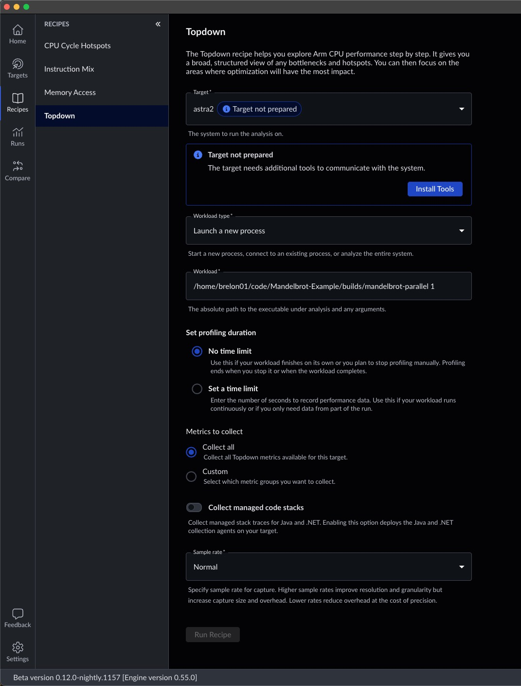
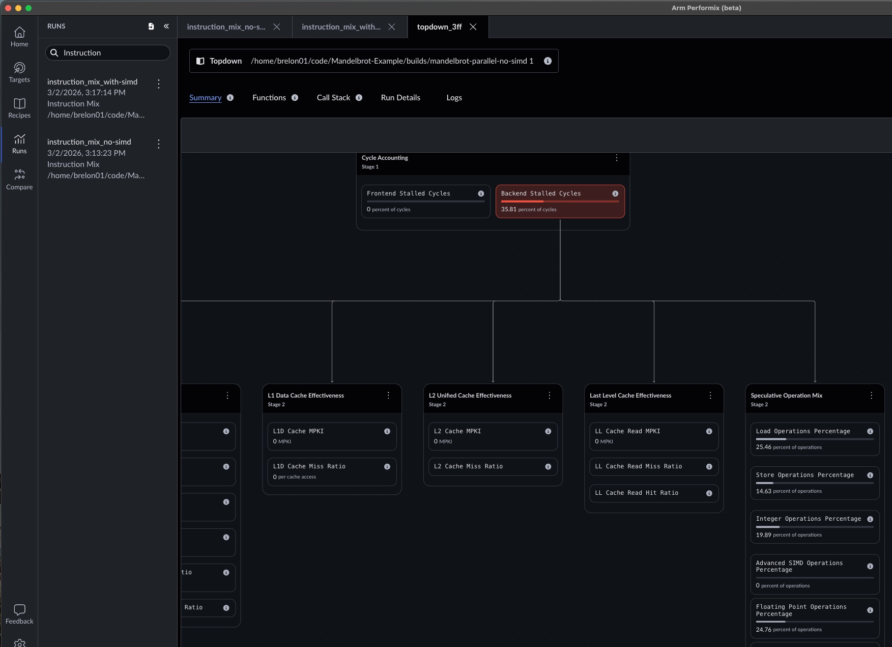
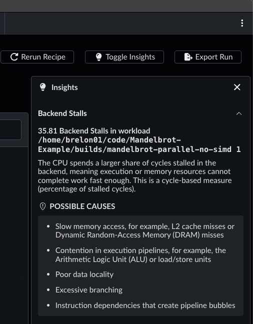

## Run Topdown Analysis

As shown in the `main.cpp` listing below, the program generates a 1920×1080 bitmap image of our fractal. To identify performance bottlenecks, we’ll run the Topdown recipe in Arm Performix (APX). APX uses microarchitectural sampling to show which stages of the instruction pipeline are dominating the program latency. APX then provides insights into ways to improve those bottlenecks.

**Please Note**: You will need to replace the first string argument in the `myplot.draw()` function with the absolute path to the image folder and rebuild the application. If not, the image will be written to the `/tmp/atperf/tools/atperf-agent` directory from where the binary is run. As the name suggests, this folder is periodically deleted. 

```cpp
#include "Mandelbrot.h"
#include <iostream>

using namespace std;

int main(){

    Mandelbrot::Mandelbrot myplot(1920, 1080);
    myplot.draw("/path/to/images/green.bmp", Mandelbrot::Mandelbrot::GREEN);

    return 0;
}
```

On your host machine, open Arm Performix and select the 'Topdown' recipe.



Select the target configured in the setup phase. Note that if it's your first time running this workload on this target, you'll likely need to click the 'Install Tools' button to move the collection tools to the target. Next, select the 'Workload type'. You can sample the whole system, or attach to an existing process, but in this exercise we'll launch a new process. You must specify the full path to your executable as Performix's 'Workload' input box doesn't do shell-like expansions at the current time.

You can set a time limit on the workload if desired, and customize the metrics to collect if you already have a good idea of what you want to investigate. 

'Collect managed code stacks' is an important toggle if your workload is Java/JVM or .NET based.

You can also select High/Normal/Low sampling rates to trade off intrusiveness for increased sampling granularity. 

Finally, clicking 'Run Recipe' at the bottom should launch the workload and measure its performance.

## View Run Results

Performix will generate a high level view of the instruction pipeline, highlighting areas where most time is spent.



In the breakdown we see that Backend Stalls dominate samples. Within that, the work is split between Load Operations and Integer and Floating point operations.
Notably, there's no measured activity in SIMD operations, even though this workload is very parallelizable.

The Insights tab on the right highlights ALU contention as a possible opportunity for improvement.



For more details on the types of instructions executed by this workload, we'll look into the Instruction Mix recipe in the next step.