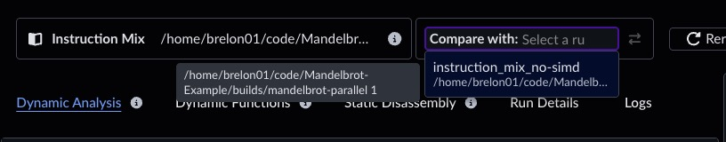
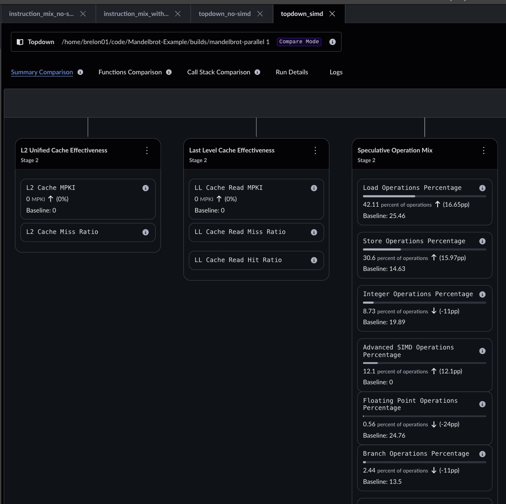
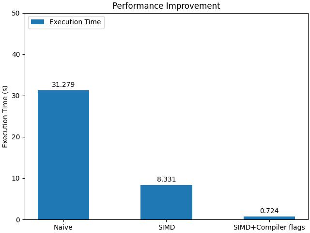

## Run Instruction Mix

The previous Topdown analysis showed that the sample application used no single instruction, multiple data (SIMD) operations, which points to an optimization opportunity. Run the Instruction Mix recipe to learn more. The Instruction Mix launch panel is similar to Topdown, but it does not include options to choose metrics. Again, enter the full path to the workload. This Mandelbrot example is native C++ code, not Java or .NET, so you do not need to collect managed code stacks.


The results below confirm a high number of integer and floating-point operations, with no SIMD operations. The **Insights** panel suggests vectorization as a path forward, lists possible root causes, and links to related Learning Paths.


## Vectorize

The CPU Hotspots recipe in [Find CPU cycle hotspots with Arm Performix](/learning-paths/servers-and-cloud-computing/cpu_hotspot_performix/) helps you identify which functions consume the most time. In this example, `Mandelbrot::draw` and its inner function `Mandelbrot::getIterations` dominate runtime. A vectorized version is available in the [instruction-mix branch](https://github.com/arm-education/Mandelbrot-Example/tree/instruction-mix). This branch uses Neon operations for Neoverse N1, while your platform might support alternatives such as SVE or SVE2.

After you rebuild the application and run Instruction Mix again, integer and floating-point operations are greatly reduced and replaced by a smaller set of SIMD instructions.


## Assess improvements

Because you are running multiple experiments, give each run a meaningful nickname to keep results organized.


Use the **Compare** feature at the top right of an entry in the **Runs** view to select another run of the same recipe for comparison.

This selection box lets you choose any run of the same recipe type. The ⇄ arrows swap which run is treated as the baseline and which is current.

After you select two runs, Performix overlays them so you can review category changes in one view.


Execution time also improves significantly, making this run nearly four times faster.

```bash { command_line="root@localhost | 2-6" }
time builds/mandelbrot-parallel-no-simd 1
Number of Threads = 1

real    0m31.326s
user    0m31.279s
sys     0m0.011s
```

```bash { command_line="root@localhost | 2-6" }
time builds/mandelbrot-parallel 1
Number of Threads = 1

real    0m8.362s
user    0m8.331s
sys     0m0.016s
```

## Topdown results comparison

The Topdown recipe also supports a **Compare** view that shows percentage-point changes in each stage and instruction type.


You can now see that Load and Store operations account for about 70% of execution time. **Insights** offers several explanations because multiple issues can contribute to the root cause.
```
The CPU spends a larger share of cycles stalled in the backend, meaning execution or memory resources cannot complete work fast enough. This is a cycle-based measure (percentage of stalled cycles).

POSSIBLE CAUSES

- Slow memory access, for example, L2 cache misses or Dynamic Random-Access Memory (DRAM) misses
- Contention in execution pipelines, for example, the Arithmetic Logic Unit (ALU) or load/store units
- Poor data locality
- Excessive branching
- Instruction dependencies that create pipeline bubbles
```

Next, add optimization flags to the compiler to enable more aggressive loop unrolling.
```bash
    # build.sh
    CXXFLAGS=(
        --std=c++11
        -O3
        -mcpu=neoverse-n1+crc+crypto
        -ffast-math
        -funroll-loops
        -flto
        -DNDEBUG
    )
```

Runtime improves again, with an additional 11x speedup over the SIMD build that uses default compiler flags.


printf 'HelloWorld\n%.0s' {1..5}


```bash { command_line="root@localhost | 2-6" }
time ./builds/mandelbrot-parallel 1
Number of Threads = 1

real    0m0.743s
user    0m0.724s
sys     0m0.014s
```

Another Topdown measurement shows that Load and Store bottlenecks are almost eliminated. SIMD floating-point operations now dominate execution, which indicates the application is better tuned to feed floating-point execution units.
The program still generates the same output, and runtime drops from 31 s to less than 1 s, a 43x speedup.

