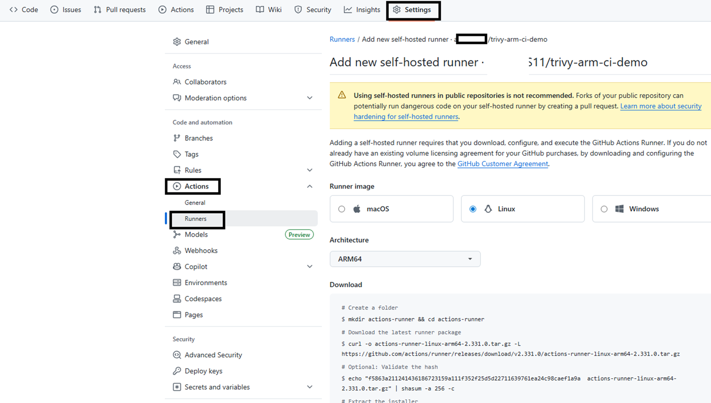
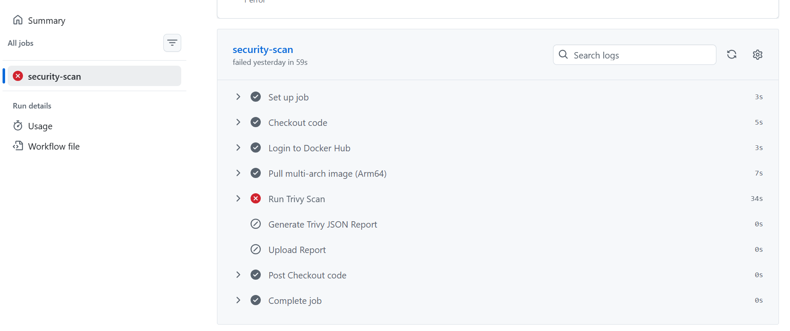

## Overview

In this module, you will integrate Trivy into a CI pipeline using a self-hosted Arm64 GitHub Actions runner on Azure Cobalt 100.

You will:

- Set up an Arm-based GitHub runner
- Securely configure secrets
- Run Trivy scans automatically in CI
- Enforce security gates on vulnerable images
- Upload vulnerability reports for auditing

This demonstrates a real-world DevSecOps workflow running natively on Arm infrastructure.

You will move from local scanning to fully automated security enforcement in CI.

## Prerequisites

Ensure that you have:

- Completed the local Trivy scanning module  
- Created a GitHub account and are able to log into it.
- Created a Docker hub account and are able to log into it.
- An Azure Cobalt 100 Arm64 Ubuntu VM running  
- A multi-architecture container image pushed to Docker Hub  
 
These components are required for building a secure CI pipeline.


## Create a New GitHub Repository

Open in your browser: [https://github.com/new](https://github.com/new)

**Fill in:**

- Repository name: **trivy-arm-ci-demo**
- Visibility: Public or Private
- Do NOT initialize with README (keep it empty)

**Click:**

- Create repository

You now have an empty GitHub repository ready to receive your project files. Next lets push our local repo up to github.com.

## Initialize Git Repository Locally

On your Azure Arm64 VM:

```bash
cd ~/trivy-multiarch-demo
git init
```

Turns your local project folder into a Git repository.

**Add and Commit Project Files:**

```bash
git add .
git commit -m "Multi-arch nginx image for Trivy scan"
```

Stage and save your Dockerfile and demo files into Git history.

**Link Local Repo to GitHub:**

Link your local repo to your github.com repo that you have created. Replace <YOUR_GITHUB_USERNAME> with your GitHub username:

```bash
git branch -M main
git remote add origin https://github.com/<YOUR_GITHUB_USERNAME>/trivy-arm-ci-demo.git
```

**Push Code to GitHub:**

Finally, push your local repo up to github.com:

```bash
git push -u origin main
```

Uploads your project files to GitHub and sets the main branch for future pushes.

## Setup GitHub Actions Arm Runner

Navigate in the github.com dashboard for your newly created repo:

```text
Settings → Actions → Runners → Add Runner  
```

Choose:

Linux → ARM64  

GitHub will display setup commands.

This prepares GitHub to register a self-hosted Arm64 runner.



Lets step through the steps outlined by the GitHub self-hosted runner setup has provided.

## Create Runner Directory on VM

Create a workspace for the GitHub runner software.

```bash
cd $HOME
mkdir actions-runner
cd actions-runner
```

## Download Runner Package

Use the download command provided by GitHub:

```bash
curl -o actions-runner-linux-arm64.tar.gz -L https://github.com/actions/runner/releases/download/v2.331.0/actions-runner-linux-arm64-2.331.0.tar.gz
tar xzf actions-runner-linux-arm64.tar.gz
rm ./actions-runner-linux-arm64.tar.gz
```

Downloads and extracts the Arm64-compatible runner.

**Configure Runner:**

Run the configuration script to configure the Runner. This command is also shown in the GitHub runner setup page and can be simply copied/pasted:

```bash
./config.sh --url https://github.com/<USERNAME>/<REPO> --token <TOKEN>
```

Press "Enter" when asked during the configuration steps to choose the defaults.

**Start Runner:**

Lets run the runner now!

```bash
./run.sh
```

```output
√ Connected to GitHub

Current runner version: '2.331.0'
2026-01-28 05:30:41Z: Listening for Jobs
```

## Configure GitHub Secrets

**In your GitHub repository:**

```text
Settings → Secrets and Variables → Actions → New repository secret
```

Add the following secrets using your Docker Hub username Docker Hub generated personal access token with "RO" authorization:

| Name              | Value                            |
| ----------------- | -------------------------------- |
| `DOCKER_USERNAME` | Your Docker Hub username         |
| `DOCKER_PASSWORD` | Docker Hub personal access token |
| `IMAGE_NAME`      | trivy-multiarch-nginx            |
| `IMAGE_TAG`       | latest                           |


## Create CI Workflow

In an additional SSH shell, create a Workflow directory:

```bash
mkdir -p $HOME/trivy-multiarch-demo/.github/workflows
cd $HOME/trivy-multiarch-demo
```

Edit a file named **$HOME/trivy-multiarch-demo/.github/workflows/trivy-scan.yml** with the following content:

```yaml
name: Trivy Scan on Arm Runner

on:
  push:
    branches: [ "main" ]

jobs:
  security-scan:
    runs-on: self-hosted

    env:
      DOCKER_USER: ${{ secrets.DOCKER_USERNAME }}
      DOCKER_PASS: ${{ secrets.DOCKER_PASSWORD }}
      IMAGE_NAME: ${{ secrets.IMAGE_NAME }}
      IMAGE_TAG: ${{ secrets.IMAGE_TAG }}

    steps:
    - name: Checkout code
      uses: actions/checkout@v4

    - name: Login to Docker Hub
      run: |
        echo "$DOCKER_PASS" | docker login -u "$DOCKER_USER" --password-stdin

    - name: Pull multi-arch image
      run: |
        docker pull $DOCKER_USER/$IMAGE_NAME:$IMAGE_TAG

    - name: Run Trivy Scan
      run: |
        trivy image \
          --severity HIGH,CRITICAL \
          --exit-code 1 \
          $DOCKER_USER/$IMAGE_NAME:$IMAGE_TAG

    - name: Generate Trivy JSON Report
      run: |
        trivy image \
          --format json \
          -o trivy-report.json \
          $DOCKER_USER/$IMAGE_NAME:$IMAGE_TAG

    - name: Upload Report
      uses: actions/upload-artifact@v4
      with:
        name: trivy-report
        path: trivy-report.json
```

## Trigger the CI Pipeline

```bash
git add .
git commit -m "Add Trivy scan on Arm runner"
git push origin main
```

Push triggers GitHub Actions automatically. You should also see output from the ./run.sh command running in the other SSH shell that resembles:

```output
026-02-17 16:09:52Z: Listening for Jobs
2026-02-17 16:15:27Z: Running job: security-scan
2026-02-17 16:15:35Z: Job security-scan completed with result: Failed
```

## Verify CI Execution (Trivy Security Gate on Arm Runner)

After pushing your code to GitHub, on the github web dashboard, navigate to:

```text
GitHub → Actions → Trivy Scan on Arm Runner
```

Select the latest workflow run.

Expected Results:



You should observe the following:

- The multi-architecture container image is pulled successfully on the Arm-based Azure Cobalt 100 runner
- Trivy performs a full vulnerability scan of the container image layers and installed packages
- The pipeline fails when HIGH or CRITICAL vulnerabilities are detected

This failure is intentional and indicates that the security scan is functioning correctly.

## How Trivy Works in This CI Pipeline

Trivy is a container vulnerability scanner that:

- Analyzes OS packages inside the image (like zlib, openssl, libc, etc.)
- Scans application dependencies (npm, pip, maven, etc. if present)
- Compares components against known CVE databases
- Assigns severity levels (LOW, MEDIUM, HIGH, CRITICAL)

In this workflow:

```bash
--severity HIGH,CRITICAL
--exit-code 1
```

This means:

- If Trivy finds any HIGH or CRITICAL vulnerability, it returns a non-zero exit code
- GitHub Actions marks the job as FAILED
- The image is blocked from moving forward in the pipeline

This is known as a security gate.

## Understanding the CI Scan Result

### Is This Behavior Good or Bad?

This behavior is GOOD and expected in real-world CI/CD pipelines.

Modern DevSecOps practices integrate security tools like Trivy directly into Continuous Integration to automatically detect vulnerabilities.

The pipeline is designed to:

- Stop insecure container images early in the development lifecycle
- Prevent vulnerable software from reaching staging or production environments
- Enforce security and compliance policies automatically

### What a Failing Pipeline Means

When the Trivy scan fails the job:

- Trivy successfully detected HIGH or CRITICAL vulnerabilities in the container image
- The security gate blocked the insecure image
- The CI pipeline protected downstream environments

### Why This Matters in Enterprise CI/CD

In enterprise environments, automated security enforcement is mandatory.

Failing fast on vulnerabilities ensures:

- Faster remediation
- Reduced security risk
- Strong compliance posture

This behavior confirms that your Arm-based CI pipeline is working correctly.

## What you've accomplished and what's next

You've successfully:

- Set up a self-hosted GitHub Actions runner on Azure Cobalt 100 Arm64
- Configured GitHub secrets for secure authentication
- Created a CI/CD pipeline that automatically scans container images with Trivy
- Implemented security gates that fail builds when HIGH or CRITICAL vulnerabilities are detected
- Generated and uploaded vulnerability reports as CI artifacts

You now have a complete DevSecOps workflow that runs natively on Arm infrastructure. This setup enables you to shift security left in your development process, catching vulnerabilities before they reach production environments. You can extend this workflow by adding remediation steps, integrating with notification systems, or customizing the security policies to match your organization's requirements.
