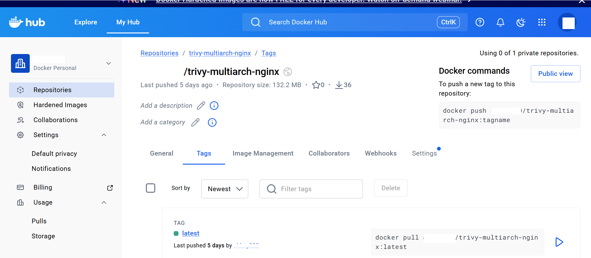

## Overview

In this module, you will build a multi-architecture container image and perform vulnerability scanning using Trivy on an Azure Cobalt 100 Arm64 Ubuntu VM.

You will:

- Install Docker on Arm64
- Build and push multi-arch container images
- Install Trivy on Arm64
- Scan container images locally
- Generate vulnerability reports

## Prerequisites

Ensure:

- Azure Cobalt 100 Arm64 Ubuntu VM
- Docker Hub account
- Internet connectivity

Verify architecture:

```bash
uname -m
```

## Install Docker on Arm64 VM
Update your system and install required tools for Docker installation.

```bash
sudo apt update
sudo apt install -y ca-certificates curl gnupg lsb-release
```

**Add Docker GPG key:**

Adds Docker’s official signing key so packages are trusted.

```bash
sudo mkdir -p /etc/apt/keyrings
curl -fsSL https://download.docker.com/linux/ubuntu/gpg | sudo gpg --dearmor -o /etc/apt/keyrings/docker.gpg
```

**Add repository:**

Register Docker’s package source for Arm64 Ubuntu.

```bash
echo "deb [arch=$(dpkg --print-architecture) signed-by=/etc/apt/keyrings/docker.gpg] https://download.docker.com/linux/ubuntu \
$(lsb_release -cs) stable" | sudo tee /etc/apt/sources.list.d/docker.list > /dev/null
```

**Install Docker:**

Install Docker Engine and Buildx for multi-architecture builds.

```bash
sudo apt update
sudo apt install -y docker-ce docker-ce-cli containerd.io docker-buildx-plugin
```

**Enable Docker without sudo:**

```bash
sudo usermod -aG docker $USER
newgrp docker
```
Adds the user to the docker group and applies the new group permissions immediately, enabling non-root access to Docker.

**Verify:**

Confirm Docker is running natively on Arm64.

```bash
docker info | grep Architecture
```

## Configure Docker Buildx for Multi-Architecture Builds

**Create builder:**

Create a special Docker builder capable of building images for multiple CPU architectures.

```bash
docker buildx create --name multiarch-builder --use
```

**Initialize:**

Prepare the builder to support multi-platform builds.

```bash
docker buildx inspect --bootstrap
```

## Create Demo Application

Creates a workspace for the demo container application.

```bahs
mkdir trivy-multiarch-demo
cd trivy-multiarch-demo
```

## Create Dockerfile:

```bash
nano Dockerfile
```

**Add:**

Use NGINX as the base image and copy a custom webpage.

```bash
FROM nginx:latest
COPY index.html /usr/share/nginx/html/index.html
```

## Create HTML file:

```bash
nano index.html
```

**Add:**

Create a simple webpage to confirm the container runs correctly.

```bash
<h1>Multi-Architecture NGINX on Azure Cobalt Arm64</h1>
```

## Login to Docker Hub

**Run the login command:**

```bash
docker login
```

- Docker will display a one-time device code and a login URL:

```text
https://login.docker.com/activate
```

**Steps to complete login:**

- Open the displayed URL in your web browser
- Sign in to your Docker Hub account (or create one if you don’t have it)
- Enter the one-time confirmation code shown in the terminal
- Click Confirm / Activate

Once authentication completes, the terminal will show:

```output
WARNING! Your credentials are stored unencrypted in '/home/azureuser/.docker/config.json'.
Configure a credential helper to remove this warning. See
https://docs.docker.com/go/credential-store/

Login Succeeded
```
This confirms your system is now authenticated with Docker Hub and ready to push or pull container images.

## Build and Push Multi-Architecture Image

```bash
docker buildx build \
  --platform linux/amd64,linux/arm64 \
  -t <DOCKER_USERNAME>/trivy-multiarch-nginx:latest \
  --push .
```

- Builds the container for both amd64 and arm64
- Pushes the multi-arch image to Docker Hub

This allows the same image to run on different CPU architectures.



## Install Trivy on Arm64

**Download:**

Download the Arm64-compatible Trivy scanner.

```bash
wget https://github.com/aquasecurity/trivy/releases/download/v0.68.1/trivy_0.68.1_Linux-ARM64.deb
```
{}
The [Arm Ecosystem Dashboard](https://developer.arm.com/ecosystem-dashboard/) recommends Trivy 0.29.0 or later for Arm platforms.
{}

**Install:**

Install Trivy on your system.

```bash
sudo dpkg -i trivy_0.68.1_Linux-ARM64.deb
```

**Verify:**

```bash
trivy version
```

```output
Version: 0.68.1
```

## Scan Image Locally

**Run scan:**

```bash
trivy image <DOCKER_USERNAME>/trivy-multiarch-nginx:latest
```
Trivy analyzes the container image and lists security vulnerabilities.

## Generate JSON report

```bash
trivy image \
  --format json \
  -o trivy-report.json \
  <DOCKER_USERNAME>/trivy-multiarch-nginx:latest
```

Create a machine-readable vulnerability report for audits and CI pipelines.

```output
2026-01-23T06:42:30Z    INFO    [vuln] Vulnerability scanning is enabled
2026-01-23T06:42:30Z    INFO    [secret] Secret scanning is enabled
2026-01-23T06:42:30Z    INFO    [secret] If your scanning is slow, please try '--scanners vuln' to disable secret scanning
2026-01-23T06:42:30Z    INFO    [secret] Please see https://trivy.dev/docs/v0.68/guide/scanner/secret#recommendation for faster secret detection
2026-01-23T06:42:32Z    INFO    Detected OS     family="debian" version="12.5"
2026-01-23T06:42:32Z    INFO    [debian] Detecting vulnerabilities...   os_version="12" pkg_num=149
2026-01-23T06:42:33Z    INFO    Number of language-specific files       num=0
2026-01-23T06:42:33Z    WARN    Using severities from other vendors for some vulnerabilities. Read https://trivy.dev/docs/v0.68/guide/scanner/vulnerability#severity-selection for details.
```

## Outcome

You have:

- Installed Docker on Arm64
- Built multi-architecture container images
- Pushed images to Docker Hub
- Installed Trivy on Azure Cobalt 100
- Scanned images for vulnerabilities
- Generated security reports
