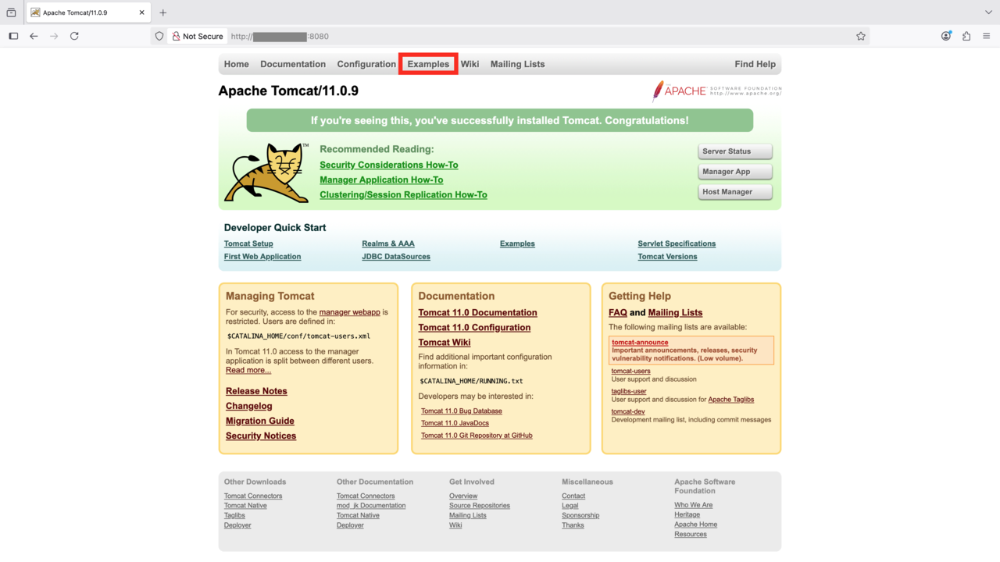
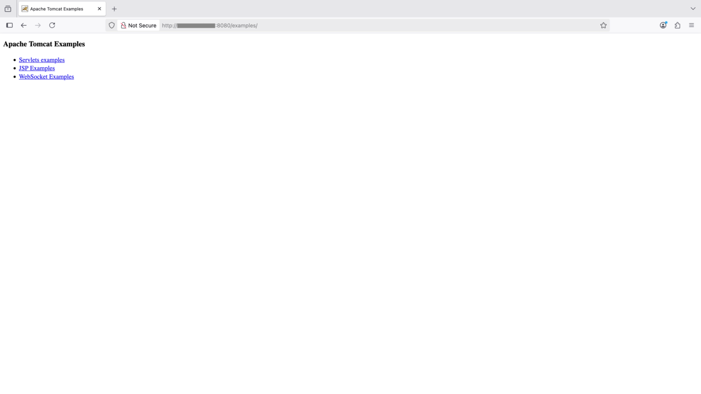

## Overview

Tomcat is a common client–server web workload that serves HTTP/HTTPS requests. In this section, you will set up a benchmarking environment using Apache Tomcat (server) and `wrk2` (client) to generate load and measure performance on an Arm-based bare‑metal instance. This Learning Path was validated on an AWS `c8g.metal‑48xl` instance running Ubuntu 24.04.

## Set up the Tomcat benchmark server

[Apache Tomcat](https://tomcat.apache.org/) is an open‑source Java Servlet container for running Java web applications, handling HTTP requests, and serving dynamic content. It supports Servlet, JSP, and WebSocket.

## Install the Java Development Kit (JDK)

Install OpenJDK 21 on your Arm‑based Ubuntu 24.04 bare‑metal instance:

```bash
sudo apt update
sudo apt install -y openjdk-21-jdk
```

## Install Tomcat

Download and extract Tomcat:

```bash
wget -c https://dlcdn.apache.org/tomcat/tomcat-11/v11.0.10/bin/apache-tomcat-11.0.10.tar.gz
tar xzf apache-tomcat-11.0.10.tar.gz
```

Alternatively, you can build Tomcat [from source](https://github.com/apache/tomcat).

## Enable access to Tomcat examples

To access the built‑in examples from your local network or external IP, modify the `context.xml` file and update `RemoteAddrValve` to allow your clients.

The file is located at:

```bash
~/apache-tomcat-11.0.10/webapps/examples/META-INF/context.xml
```

Replace the existing value:

```xml
<Valve className="org.apache.catalina.valves.RemoteAddrValve" allow="127\.\d+\.\d+\.\d+|::1|0:0:0:0:0:0:0:1" />
```

With:

```xml
<Valve className="org.apache.catalina.valves.RemoteAddrValve" allow=".*" />
```

{}
Allowing `.*` permits access from all IP addresses and should be used only in isolated lab environments. Restrict this setting to trusted CIDR ranges for production or shared networks.
{}

## Start the Tomcat server

{}
For maximum performance, ensure the per‑process limit for open file descriptors is sufficient.
{}

Start the server:

```bash
ulimit -n 65535 && ~/apache-tomcat-11.0.10/bin/startup.sh
```

You should see output similar to:

```output
Using CATALINA_BASE:   /home/ubuntu/apache-tomcat-11.0.10
Using CATALINA_HOME:   /home/ubuntu/apache-tomcat-11.0.10
Using CATALINA_TMPDIR: /home/ubuntu/apache-tomcat-11.0.10/temp
Using JRE_HOME:        /usr
Using CLASSPATH:       /home/ubuntu/apache-tomcat-11.0.10/bin/bootstrap.jar:/home/ubuntu/apache-tomcat-11.0.10/bin/tomcat-juli.jar
Using CATALINA_OPTS:
Tomcat started.
```

## Confirm server access

Replace `${tomcat_ip}` with the public or private IP address of your Arm server and open:

```
http://${tomcat_ip}:8080/examples
```

You should see the Tomcat welcome page and examples, as shown below:





{}
Ensure port **8080** is open in the security group or firewall for your Arm‑based Linux machine.
{}

## Set up the benchmarking client using wrk2
[Wrk2](https://github.com/giltene/wrk2) is a high-performance HTTP benchmarking tool specialized in generating constant throughput loads and measuring latency percentiles for web services. `wrk2` is an enhanced version of `wrk` that provides accurate latency statistics under controlled request rates, ideal for performance testing of HTTP servers.

{}
Currently, `wrk2` is only supported on x86_64 machines. Run the client steps below on a bare‑metal x86_64 server running Ubuntu 24.04.
{}

## Install dependencies

Install the required packages:

```bash
sudo apt-get update
sudo apt-get install -y build-essential libssl-dev git zlib1g-dev
```

## Clone and build wrk2

Clone the repository and compile the tool:

```bash
git clone https://github.com/giltene/wrk2.git
cd wrk2
make
```

Move the binary to a directory in your system’s `PATH`:

```bash
sudo cp wrk /usr/local/bin
```

## Run the benchmark

{}
As with Tomcat, set a high open‑files limit to avoid hitting FD caps during the run.
{}

Benchmark the `HelloWorld` servlet running on Tomcat:

```bash
ulimit -n 65535 && wrk -c32 -t16 -R50000 -d60 http://${tomcat_ip}:8080/examples/servlets/servlet/HelloWorldExample
```

**Flags explained:**

- `-c32` — 32 open connections  
- `-t16` — 16 threads  
- `-R50000` — constant 50,000 requests/second  
- `-d60` — run for 60 seconds

You should see output similar to:

```console
Running 1m test @ http://172.31.46.193:8080/examples/servlets/servlet/HelloWorldExample
  16 threads and 32 connections
  Thread calibration: mean lat.: 3.381ms, rate sampling interval: 10ms
  Thread calibration: mean lat.: 3.626ms, rate sampling interval: 10ms
  Thread calibration: mean lat.: 3.020ms, rate sampling interval: 10ms
  Thread calibration: mean lat.: 3.578ms, rate sampling interval: 10ms
  Thread calibration: mean lat.: 3.166ms, rate sampling interval: 10ms
  Thread calibration: mean lat.: 3.275ms, rate sampling interval: 10ms
  Thread calibration: mean lat.: 3.454ms, rate sampling interval: 10ms
  Thread calibration: mean lat.: 3.655ms, rate sampling interval: 10ms
  Thread calibration: mean lat.: 3.334ms, rate sampling interval: 10ms
  Thread calibration: mean lat.: 3.089ms, rate sampling interval: 10ms
  Thread calibration: mean lat.: 3.365ms, rate sampling interval: 10ms
  Thread calibration: mean lat.: 3.382ms, rate sampling interval: 10ms
  Thread calibration: mean lat.: 3.342ms, rate sampling interval: 10ms
  Thread calibration: mean lat.: 3.349ms, rate sampling interval: 10ms
  Thread calibration: mean lat.: 3.023ms, rate sampling interval: 10ms
  Thread calibration: mean lat.: 3.275ms, rate sampling interval: 10ms
  Thread Stats   Avg      Stdev     Max   +/- Stdev
    Latency     1.02ms  398.88us   4.24ms   66.77%
    Req/Sec     3.30k   210.16     4.44k    70.04%
  2999776 requests in 1.00m, 1.56GB read
Requests/sec:  49996.87
Transfer/sec:     26.57MB
```
