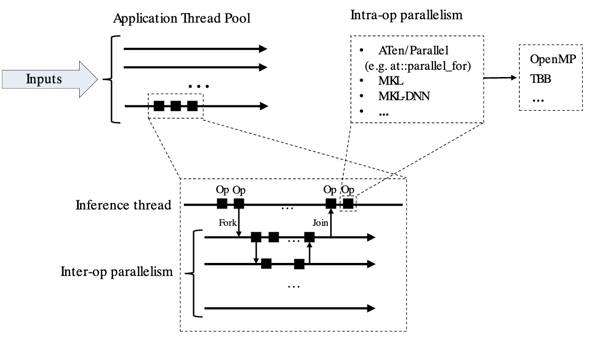

A well-known challenge in parallel programming is choosing the right number of threads for a given amount of work. When multiple threads are created to perform a task, the actual computation must be large enough to justify the overhead of coordinating those threads.

If a computation is split across many threads, the costs of creating the threads and synchronizing their results through shared memory can easily outweigh any performance gains from parallel execution. The same principle applies to generative AI workloads running on CPU.

When work is distributed across multiple threads, communication and synchronization overhead increases the total amount of work the system must perform. This creates a trade-off between latency (the time to process a single request) and throughput (the number of requests processed per unit time).

PyTorch attempts to automatically choose an appropriate number of threads. However, as you will learn, in some cases you can manually tune this configuration to improve performance.

## Multithreading with PyTorch on CPU

When running inference, PyTorch uses an Application Thread Pool. PyTorch supports two types of parallelism: inter-op parallelism spawns threads to run separate operations in a graph in parallel (for example, one thread for a matmul and another thread for a softmax), while intra-op parallelism spawns multiple threads to work on the same operation.

The diagram below is taken from the [PyTorch documentation](https://docs.pytorch.org/docs/stable/index.html). 



The `torch.set_num_threads()` [API](https://docs.pytorch.org/docs/stable/generated/torch.set_num_threads.html) sets the maximum number of threads to spawn in the Application Thread Pool.

As of PyTorch 2.8.0, the default number of threads equals the number of CPU cores (see [PyTorch CPU Threading Documentation](https://docs.pytorch.org/docs/2.8/notes/cpu_threading_torchscript_inference.html) for more detail). PyTorch determines the ideal number of threads based on the workload size, as shown in this code snippet from [ParallelOpenMP.h](https://github.com/pytorch/pytorch/blob/main/aten/src/ATen/ParallelOpenMP.h):

```cpp
int64_t num_threads = omp_get_num_threads();
    if (grain_size > 0) {
      num_threads = std::min(num_threads, divup((end - begin), grain_size));
    }

...
inline int64_t divup(int64_t x, int64_t y) {
  return (x + y - 1) / y;
}
```
 
In PyTorch builds that use OpenMP, the maximum size of the application's thread pool can be configured at runtime using the `OMP_NUM_THREADS` environment variable. The actual number of threads used scales up to this limit depending on the workload and the `grain_size`.

The example below demonstrates that the default settings on many-core systems might not provide optimal performance for all workloads.

## Basic PyTorch example

Create a new file named `pytorch_omp_example.py` with the following Python script. The script performs a matrix multiplication in eager mode on two 256×256 random matrices, showing the default performance of PyTorch's parallelism and printing the parallel configuration:

```python
import os
import time
import torch


def main():
    print(f"PyTorch version: {torch.__version__}")

    # Read OMP_NUM_THREADS from the environment
    omp_threads = os.environ.get("OMP_NUM_THREADS")
    print(f"OMP_NUM_THREADS in environment: {omp_threads}")

    # If it's set and looks like a number, use it to set PyTorch's intra-op threads
    if omp_threads and omp_threads.isdigit():
        torch.set_num_threads(int(omp_threads))

    # Show how many threads PyTorch will actually use for intra-op parallelism
    print(f"torch.get_num_threads(): {torch.get_num_threads()}\n")

    # A simple operation to illustrate parallelism:
    size = 256  
    a = torch.randn(size, size)
    b = torch.randn(size, size)

    start = time.time()
    c = a @ b  # matrix multiplication (runs in a parallel region on CPU)
    end = time.time()

    print(f"Result shape: {c.shape}")
    print(f"Matrix multiply time: {end - start:.5f} seconds")
    print(f"\nThreading Information = {torch.__config__.parallel_info()}")

if __name__ == "__main__":
    main()
```

Run the Python script:

```bash
python pytorch_omp_example.py
```

The output is similar to: 


```output
PyTorch version: 2.10.0.dev20251124
OMP_NUM_THREADS in environment: None
torch.get_num_threads(): 96

Result shape: torch.Size([256, 256])
Matrix multiply time: 0.00224 seconds

Threading Information = ATen/Parallel:
        at::get_num_threads() : 96
        at::get_num_interop_threads() : 96
OpenMP 201511 (a.k.a. OpenMP 4.5)
        omp_get_max_threads() : 96
Intel(R) MKL-DNN v3.11.0 (Git Hash 0b8a866c009b03f322e6526d7c33cfec84a4a97a)
std::thread::hardware_concurrency() : 96
Environment variables:
        OMP_NUM_THREADS : [not set]
ATen parallel backend: OpenMP
```

The number of threads is set to the core count of 96, and the execution time is 2.24 ms.

Reduce the number of OpenMP threads using the `OMP_NUM_THREADS` environment variable: 

```bash
OMP_NUM_THREADS=16 python pytorch_omp_example.py
```

The output shows a different `Matrix multiply time` of of 0.64 ms. 

```output
PyTorch version: 2.10.0.dev20251124
OMP_NUM_THREADS in environment: 16
torch.get_num_threads(): 16

Result shape: torch.Size([256, 256])
Matrix multiply time: 0.00064 seconds

Threading Information = ATen/Parallel:
        at::get_num_threads() : 16
        at::get_num_interop_threads() : 96
OpenMP 201511 (a.k.a. OpenMP 4.5)
        omp_get_max_threads() : 16
Intel(R) MKL-DNN v3.11.0 (Git Hash 0b8a866c009b03f322e6526d7c33cfec84a4a97a)
std::thread::hardware_concurrency() : 96
Environment variables:
        OMP_NUM_THREADS : 16
ATen parallel backend: OpenMP
```

The time varies with the number of threads and type of processor in your system. 

In the next section, you'll apply these concepts to a much larger workload using a large language model (LLM). 